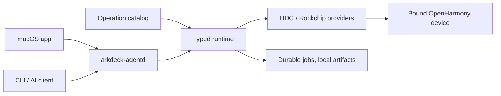

<p align="center">
  <strong>English</strong> · <a href="./README.zh-CN.md">简体中文</a>
</p>

<p align="center">
  
</p>

<h1 align="center">ArkDeck</h1>

<p align="center">
  Debug, trace, and flash real OpenHarmony devices from a macOS app, a CLI, or an AI agent.
</p>

<p align="center">
  <a href="https://github.com/ArkDeck/ArkDeck/actions/workflows/swift-ci.yml"></a>
  
  
  <a href="./LICENSE"></a>
</p>

<!-- TODO: screenshot placeholder — add a capture of the app here once one exists,
     e.g. <p align="center"></p> -->

ArkDeck is a workbench for OpenHarmony development boards. Plug one in and you can install and debug HAPs, capture logs, screenshots, UI dumps and traces, deploy native libraries, and — when a board stops booting — flash a DAYU200 back to a known-good image.

The unusual part is how it talks to the device. Nothing in ArkDeck runs raw `hdc` or shell commands on your behalf: callers submit typed operations from a versioned catalog, and a local daemon resolves the actual executables, arguments and device paths, checks the device's identity, and refuses to continue when something doesn't line up. That is what makes it reasonable to let an AI agent loose on real hardware: the worst a confused agent can do is submit an operation the runtime rejects.

## What it does

- Adopts one specific device by identity, rather than whatever happens to be plugged in, and keeps that binding across restarts.
- Installs, launches and inspects HAPs end to end, with results collected into a local artifact store.
- Captures HiLog, screenshots, ArkUI component trees, traces and crash records on demand.
- Deploys app-owned native libraries atomically and rolls back when verification fails.
- Flashes a DAYU200 (RK3568) from a verified image bundle, then reboots and re-adopts it.
- Runs an AI debug loop that reads the evidence, patches in an isolated workspace, and retests through the same typed operations, stopping at success or at a declared budget.

Three surfaces drive the same runtime:

| Surface | What it is |
| --- | --- |
| macOS app | Workspaces for device setup, Flash, Debug, UI Dump, Trace, Automation, History and Settings |
| `arkdeck` | The CLI: daemon setup, device adoption, operations, jobs, artifacts and harness tasks |
| `arkdeck-agentd` | The per-user daemon that owns execution, recovery, and the private control socket |

## Why it's built this way

Boards get bricked by honest mistakes: a flash aimed at the wrong serial number, a cleanup that removes the wrong remote directory, a script that keeps going after a step silently failed. ArkDeck's answer is to move responsibility from the caller into the runtime:

- Mutating work requires a confirmed, persisted device binding; a transport address alone is never treated as an identity.
- Intent is journaled before each external effect, so a daemon crash or restart never loses track of what was in flight.
- Flashing runs under a short-lived capability tied to one device, one plan and one toolchain.
- When facts are stale or an outcome is unknown, the runtime stops instead of guessing.

Raw artifacts stay on your machine and are immutable once written; exporting anything is an explicit step.

## Status

ArkDeck is an early preview (`0.1.0`). Current limitations:

- macOS 14 or later on Apple silicon is the only supported host.
- Flashing supports exactly one board today: the DAYU200 (RK3568).
- Interfaces, catalog schemas and setup steps may change before a first stable release.

Progress is measured by five journeys that must pass on a physical board (the repo calls them Golden Journeys): device observation, HAP debugging, native library deployment, flash recovery, and an autonomous AI debug loop. Mocks and simulators don't count. Definitions and current state live in [PRODUCT-LOOP.md](./PRODUCT-LOOP.md).

## Architecture



Module boundaries are documented in [Architecture Rules](./docs/ArchitectureRules.md).

## Building from source

You need:

- macOS 14 or later on Apple silicon
- Xcode with a Swift 6 toolchain
- an OpenHarmony `hdc` executable, for real-device work
- a USB-connected device with first-use trust already granted

Build and test the Swift package:

```bash
git clone https://github.com/ArkDeck/ArkDeck.git
cd ArkDeck
swift build --package-path Packages/ArkDeckKit
swift test --package-path Packages/ArkDeckKit --parallel
```

For the desktop app, open `ArkDeck.xcodeproj` in Xcode and run the shared `ArkDeck` scheme. The Debug configuration covers app and runtime development; actually flashing a DAYU200 additionally needs the reviewed Rockchip component and the release packaging path.

### Starting the runtime

Install the per-user daemon, pointing it at your `hdc`:

```bash
Packages/ArkDeckKit/.build/debug/arkdeck agentd install --hdc /absolute/path/to/hdc
```

Then check that everything is wired up:

```bash
Packages/ArkDeckKit/.build/debug/arkdeck agentd status
Packages/ArkDeckKit/.build/debug/arkdeck doctor
Packages/ArkDeckKit/.build/debug/arkdeck device list
```

`agentd install` verifies and pins both the daemon and the `hdc` binary. Workspace layout, local HAP signing, diagnostics and uninstall are covered in the [headless runtime guide](./Packages/ArkDeckKit/LaunchAgents/README.md).

## Repository map

- [`ArkDeckApp/`](./ArkDeckApp/) — the SwiftUI desktop app
- [`Packages/ArkDeckKit/`](./Packages/ArkDeckKit/) — runtime, providers, storage, daemon, CLI and harness
- [`Catalog/`](./Catalog/) — published operations, profiles and schemas
- [`docs/`](./docs/) — architecture notes, ADRs and product design
- [`openspec/`](./openspec/) — product contracts, safety invariants and change history
- [`scripts/`](./scripts/) — repository checks and tooling

## Contributing

Start with [AGENTS.md](./AGENTS.md); it explains how work is organized and which checks to run before handing off a change. The safety invariants under [`openspec/`](./openspec/) are contracts, not suggestions; changes that weaken them won't be merged.

## License

[MIT](./LICENSE)
