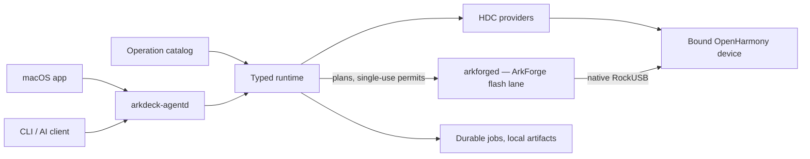

<p align="center">
  <strong>English</strong> · <a href="./README.zh-CN.md">简体中文</a>
</p>

<p align="center">
  
</p>

<h1 align="center">ArkDeck</h1>

<p align="center">
  Debug, trace, and flash real OpenHarmony devices from a macOS app, a CLI, or an AI agent.
</p>

<p align="center">
  <a href="https://github.com/ArkDeck/ArkDeck/actions/workflows/swift-ci.yml"></a>
  
  
  
  <a href="./LICENSE"></a>
</p>

<!-- TODO: screenshot placeholder — add a capture of the app here once one exists,
     e.g. <p align="center"></p> -->

ArkDeck is a local-first workbench for real OpenHarmony development boards. Its macOS app, CLI and per-user daemon share one runtime for adopting a specific device, running versioned operations, keeping durable job history and collecting artifacts. The current catalog covers HAP debugging, diagnostics, native-library deployment and DAYU200 recovery flashing.

Callers cannot submit arbitrary `hdc` or shell command strings, executable paths, remote paths or trusted device facts. They submit a published operation and typed inputs; the daemon materializes the executable, argument array and provider-owned paths, checks the bound device and stops when required facts are missing or have drifted. AI agents use the same bounded operation surface as the app and CLI.

## What it does

- Observes HDC and adopts one exact device by durable identity instead of selecting whichever device is currently connected.
- Installs, starts, verifies and cleans up HAPs from leased artifacts, with optional bounded diagnostics.
- Captures bounded HiLog, screenshots, ArkUI component trees, traces and crash records into an immutable local artifact store.
- Creates verified, target-bound port forwards and atomically deploys app-owned native libraries with rollback.
- Flashes a DAYU200 (RK3568) from a verified image bundle, then rebinds the device and verifies the resulting system.
- Lets an external agent close a budgeted debug loop: it analyzes artifacts, patches a runtime-owned isolated workspace, rebuilds, signs, redeploys and verifies — every side effect through the same typed admission as any other caller.

Three surfaces drive the same runtime:

| Surface | What it is |
| --- | --- |
| macOS app | Overview and device views, plus Flash, Debug, UI Dump, Trace, Automation and History workspaces; app settings live in the standard Settings window |
| `arkdeck` | Daemon and signing setup, device adoption, operation and job control, artifact access, typed agent runs and bounded debug tasks |
| `arkdeck-agentd` | The per-user daemon that owns execution, recovery, and the private control socket |

## Why it's built this way

Boards get bricked by honest mistakes: a flash aimed at the wrong serial number, a cleanup that removes the wrong remote directory, a script that keeps going after a step silently failed. ArkDeck's answer is to move responsibility from the caller into the runtime:

- Mutating work requires a confirmed, persisted device binding; a transport address alone is never treated as an identity.
- Intent is journaled before each external effect, so a daemon crash or restart never loses track of what was in flight.
- Destructive work runs under a short-lived Runtime-owned capability tied to the exact operation, device, inputs, plan, artifacts and toolchain.
- When facts are stale or an outcome is unknown, the runtime stops instead of guessing.

Raw artifacts stay on your machine and are immutable once written; exporting anything is an explicit step.

## Status

ArkDeck is an early preview (`0.1.0`). Current limitations:

- macOS 26 on Apple silicon is the only supported host.
- Flashing supports exactly one board today: the DAYU200 (RK3568).
- Windows and Linux ports have not started, and interfaces, catalog schemas and setup steps may change before a first stable release.

Progress is measured by five journeys that must pass on a physical board (the repo calls them Golden Journeys): device observation, HAP debugging, native library deployment, flash recovery, and an autonomous AI debug loop. Mocks and simulators don't count. Their definitions and status rules live in [PRODUCT-LOOP.md](./PRODUCT-LOOP.md).

## Architecture



Flash execution lives in `arkforged`, an identity-bound daemon built in the
sibling [ArkForge repository](https://github.com/ArkDeck/ArkForge) and spawned
by `arkdeck-agentd`. The split is by authority, not by convenience: ArkDeck
decides who may do what to which bound device — it materializes the plan
through the daemon, signs single-use step permits, answers the daemon's
device-control requests with observations, and never hands over HDC or the
connect key. `arkforged` owns how that authorized plan lands on the device —
the RockUSB protocol is implemented natively in-process, and no vendor
flashing tool runs on the product path.

Module boundaries are documented in [Architecture Rules](./docs/ArchitectureRules.md).

## Building from source

You need:

- macOS 26 on Apple silicon
- Xcode 26.6 with Swift 6.3
- an OpenHarmony `hdc` executable, for real-device work
- a USB-connected device with first-use trust already granted

Build and test the Swift package:

```bash
git clone https://github.com/ArkDeck/ArkDeck.git
cd ArkDeck
sh Packages/ArkDeckKit/Scripts/run-swiftpm.sh build
sh Packages/ArkDeckKit/Scripts/run-swiftpm.sh test --parallel
```

Repository contributors can run the same path-aware plan used by GitHub CI.
It always checks SDD/catalog consistency, then selects only the compiled lanes
affected by the branch plus current worktree. Missing comparison facts select
all lanes rather than silently skipping validation:

```bash
python3 scripts/ci/plan.py \
  --repo-root . \
  --base-revision origin/main \
  --head-revision HEAD \
  --merge-base \
  --include-worktree \
  --run-local
```

ArkDeckKit and Xcode builds use checksum-synchronized source mirrors at stable
paths outside individual worktrees. Identical files retain their cache identity
when switching worktrees; only changed targets/files are recompiled. To run the
App/UI-test build directly:

```bash
sh scripts/ci/run-xcodebuild.sh
```

For a locally signed, optimized Release app (without installing it):

```bash
sh scripts/ci/run-xcodebuild.sh --release
```

The app is built at
`~/Library/Caches/com.arkdeck.ArkDeck/Xcode/Shared/DerivedData/Build/Products/Release/ArkDeck.app`
by default. Both modes explicitly build **arm64 only**, including SwiftPM
dependencies, and print Xcode's build timing summary. Release uses the project's
Developer ID signing settings; it does not notarize or install the app. Keep
the stable cache between runs: a new worktree-specific DerivedData path discards
incremental reuse, and Debug products cannot replace optimized Release objects.
The runner also enables Xcode's local content-addressed compilation cache, so
identical compiler inputs can reuse prior results even after build-graph
invalidation. Cache hit/miss diagnostics remain visible in the build log.
To bound parallel build tasks on a memory-constrained host, set
`ARKDECK_XCODE_JOBS` (1–64), for example:

```bash
ARKDECK_XCODE_JOBS=4 sh scripts/ci/run-xcodebuild.sh --release
```

This limits build-system tasks, not Swift's internal compiler threads. Keep the
same limit and toolchain when comparing build timings; do not benchmark while
another Xcode or SwiftPM build is running. An unchanged Release skips resource
repackaging and signing, while a changed helper or declared resource still
regenerates the bundled manifest before the app is signed.

The CI classifier sends only the Package targets linked by the desktop app to
the Xcode lane; CLI, Agent, LaunchAgent, fixture, and Package-test-only changes
stay on the Swift lane. App and UI-test changes use `build-for-testing`; this
does not launch a simulator or claim device acceptance.

For the desktop app, open `ArkDeck.xcodeproj` in Xcode and run the shared `ArkDeck` scheme. This is enough for app development and host-side tests. Installing the background runtime is a separate signed-helper flow; flashing a DAYU200 also requires the signed `arkforged` daemon from the sibling [ArkForge repository](https://github.com/ArkDeck/ArkForge) — the flash path is native RockUSB inside that daemon, with no vendor flashing tool on the product path.

### Installing the runtime

The bare SwiftPM executables are development artifacts and cannot be installed as the production LaunchAgent. `runtime service install` accepts only an `ArkDeckAgent.app` helper with the expected Developer ID, hardened runtime, embedded provisioning profile and shared Keychain entitlement. Build that helper with team-authorized signing and notarization inputs as described in the [headless runtime guide](./Packages/ArkDeckKit/LaunchAgents/README.md), or use a signed project release package when one is available.

From a signed `ArkDeckCLI.app`, install the per-user daemon and point it at your `hdc`:

```bash
/absolute/path/to/ArkDeckCLI.app/Contents/MacOS/arkdeck \
  runtime service install --hdc /absolute/path/to/hdc
```

Then check that everything is wired up:

```bash
/absolute/path/to/ArkDeckCLI.app/Contents/MacOS/arkdeck runtime service status
/absolute/path/to/ArkDeckCLI.app/Contents/MacOS/arkdeck doctor
/absolute/path/to/ArkDeckCLI.app/Contents/MacOS/arkdeck device list
/absolute/path/to/ArkDeckCLI.app/Contents/MacOS/arkdeck operation list
```

`runtime service install` verifies and pins both the daemon and the `hdc` binary. Use `arkdeck device adopt --candidate <connect-key>` after reviewing the candidate reported by `device list`; ArkDeck will not guess when the choice is absent or ambiguous. Workspace setup, local HAP signing, diagnostics and uninstall are also covered in the headless runtime guide.

## Repository map

- [`ArkDeckApp/`](./ArkDeckApp/) — the SwiftUI desktop app
- [`Packages/ArkDeckKit/`](./Packages/ArkDeckKit/) — runtime, providers, storage, daemon and CLI
- [`Catalog/`](./Catalog/) — published operations, profiles and schemas
- [`docs/`](./docs/) — architecture notes, ADRs and product design
- [`openspec/`](./openspec/) — product contracts, safety invariants and change history
- [`scripts/`](./scripts/) — repository checks and tooling

## Contributing

Start with [AGENTS.md](./AGENTS.md); it explains how work is organized and which checks to run before handing off a change. The safety invariants under [`openspec/`](./openspec/) are contracts, not suggestions; changes that weaken them won't be merged.

## License

[MIT](./LICENSE)
