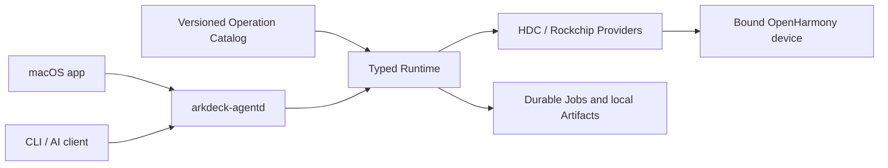

<p align="center">
  <strong>English</strong> · <a href="./README.zh-CN.md">简体中文</a>
</p>

<p align="center">
  
</p>

<h1 align="center">ArkDeck</h1>

<p align="center">
  Local-first, typed automation for real OpenHarmony devices.
</p>

> [!IMPORTANT]
> ArkDeck is an active development preview. The current host target is macOS 14 or later on Apple silicon, and the app version is `0.1.0`. Interfaces and setup may change before the first stable release.

ArkDeck gives engineers and AI agents one controlled path to observe, debug, recover, and iterate on OpenHarmony devices. Callers submit a versioned Operation, typed inputs, a target, and bounded budgets. The Runtime—not the caller—selects the executable, arguments, remote paths, safety checks, and recovery behavior.

## What ArkDeck can do

- Discover and adopt an exact HDC device, then keep a durable binding across Runtime restarts.
- Observe device, firmware, tool, and binding facts without exposing raw HDC commands.
- Debug HAPs end to end: verify an Artifact lease, transfer, install or replace, launch, read back state, collect diagnostics, and clean up.
- Capture bounded HiLog, ArkUI UI dumps, screenshots, component trees, traces, and crash records into a structured local Artifact store.
- Atomically deploy app-owned native libraries with ABI, hash, and Build ID verification plus declared rollback behavior.
- Flash a bound DAYU200 (RK3568) from a verified image bundle, then reboot, rebind, and run post-flash checks.
- Run bounded AI repair loops that inspect evidence, patch an isolated workspace, build and test, deploy through typed Operations, and stop on success or a safety limit.

## Product surfaces

| Surface | Purpose |
| --- | --- |
| macOS app | Device setup, Flash, Debug, UI Dump, Trace, Automation, History, and Settings workspaces |
| `arkdeck` | Typed CLI for daemon setup, device adoption, Operations, Jobs, Artifacts, and Harness tasks |
| `arkdeck-agentd` | User-scoped local daemon that owns Runtime execution, durable recovery, and the private control socket |
| Operation Catalog | Versioned definitions for inputs, effects, steps, Artifacts, budgets, and supported profiles |

## Safety model

- **Exact target first.** A transport address is not a device identity. Mutation requires a confirmed, persisted binding.
- **Typed effects only.** The app, CLI, and agent surfaces do not accept raw shell commands, raw HDC arguments, or caller-selected remote paths.
- **Fail closed.** Identity drift, stale facts, an unknown side-effect outcome, or missing verification stops further mutation.
- **Durable and auditable.** Intent is stored before an external effect; outcome, cleanup debt, and recovery state survive daemon restarts.
- **Local-first evidence.** Raw Artifacts are immutable and stay local by default. Export is explicit and sensitive data remains marked.
- **Bounded destructive work.** Flash execution is tied to a short-lived Runtime-owned capability for one exact target, input set, plan, and toolchain.

## Architecture



The detailed module boundaries are documented in [Architecture Rules](./docs/ArchitectureRules.md).

## Build from source

### Requirements

- macOS 14 or later on Apple silicon
- An Xcode toolchain with Swift 6 support
- A compatible OpenHarmony HDC executable for real device workflows
- A USB-connected device with its first-use trust and platform permissions completed

Clone and build the Swift package:

```bash
git clone https://github.com/ArkDeck/ArkDeck.git
cd ArkDeck
swift build --package-path Packages/ArkDeckKit
swift test --package-path Packages/ArkDeckKit --parallel
```

Open the desktop app in Xcode:

```bash
open ArkDeck.xcodeproj
```

Select the shared `ArkDeck` scheme and run it. The Debug configuration is suitable for app and Runtime development; real DAYU200 flashing additionally requires the reviewed Rockchip component and release packaging path.

### Start the local Runtime

After building, install the user-scoped daemon with the canonical path to HDC:

```bash
Packages/ArkDeckKit/.build/debug/arkdeck agentd install \
  --hdc /absolute/path/to/hdc

Packages/ArkDeckKit/.build/debug/arkdeck agentd status
Packages/ArkDeckKit/.build/debug/arkdeck doctor
Packages/ArkDeckKit/.build/debug/arkdeck operation list
Packages/ArkDeckKit/.build/debug/arkdeck device list
```

The install command verifies and pins both the daemon and HDC executable. See [headless Runtime setup](./Packages/ArkDeckKit/LaunchAgents/README.md) for workspace, local HAP signing, model producer, diagnostics, and uninstall options.

## Product milestones

ArkDeck measures progress through five real-device Golden Journeys. A schema, mock, or simulated pass does not count as real-device completion.

1. **Device Observe** — discover, trust, adopt, observe, capture bounded diagnostics, and read the result after a daemon restart.
2. **HAP Debug** — import, transfer, install, start, verify, capture, stop, and clean up a HAP.
3. **Native Debug** — verify and publish a native library, restart, observe, and roll back on failure.
4. **Flash Recovery** — verify identity and an exact plan, flash, reboot, rebind, and return to the normal Debug Runtime.
5. **Bounded AI Debug Loop** — observe, analyze, patch, build, deploy, and verify until success or a declared stop condition.

The authoritative definitions and reporting rules live in [PRODUCT-LOOP.md](./PRODUCT-LOOP.md).

## Repository map

- [`ArkDeckApp/`](./ArkDeckApp/) — SwiftUI desktop application
- [`Packages/ArkDeckKit/`](./Packages/ArkDeckKit/) — Runtime, providers, storage, daemon, CLI, and Harness
- [`Catalog/`](./Catalog/) — published Operations, profiles, schema, and generated matrices
- [`docs/`](./docs/) — architecture, ADRs, product design, and release documentation
- [`openspec/`](./openspec/) — product contracts, safety invariants, and historical change records
- [`scripts/`](./scripts/) — repository checks and scoped product tooling

## Contributing

Read [AGENTS.md](./AGENTS.md) before changing the repository. Product work is organized around one vertical problem and one Golden Journey, while the Constitution safety invariants remain non-negotiable. Before handing off a change, run the repository gates documented there.
