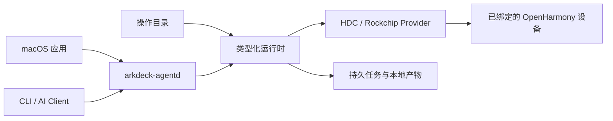

<p align="center">
  <a href="./README.md">English</a> · <strong>简体中文</strong>
</p>

<p align="center">
  
</p>

<h1 align="center">ArkDeck</h1>

<p align="center">
  用 macOS 应用、CLI 或 AI Agent，调试、跟踪、刷写真实的 OpenHarmony 设备。
</p>

<p align="center">
  <a href="https://github.com/ArkDeck/ArkDeck/actions/workflows/swift-ci.yml"></a>
  
  
  <a href="./LICENSE"></a>
</p>

<!-- TODO: 截图占位——有应用截图后放在这里，
     例如 <p align="center"></p> -->

ArkDeck 是一个面向 OpenHarmony 开发板的工作台。插上设备，你就可以安装和调试 HAP，采集日志、截图、UI Dump 和 Trace，部署 native 库；板子起不来的时候，还能把 DAYU200 刷回一个已知可用的镜像。

它不寻常的地方在于和设备打交道的方式。ArkDeck 中没有任何环节会替你执行裸 `hdc` 或 shell 命令：调用方从版本化的操作目录里提交类型化操作（typed operation），由本地守护进程决定实际的可执行文件、参数和设备路径，先核对设备身份，一旦对不上就拒绝继续。正因为如此，把 AI Agent 放到真实硬件上反复调试才是一件可以放心的事：一个犯糊涂的 Agent 最多也就是提交一个会被运行时拒绝的操作。

## 它能做什么

- 按身份接管一台确定的设备，而不是碰巧插在 USB 口上的那台；绑定关系在重启后依然保留。
- 端到端地安装、启动和检查 HAP，结果统一收进本地产物库（artifact store）。
- 按需采集 HiLog、截图、ArkUI 组件树、Trace 和崩溃记录。
- 原子化部署应用自有的 native 库，校验失败时自动回滚。
- 用已验证的镜像包刷写 DAYU200（RK3568），随后重启并重新接管。
- 运行 AI 调试循环：读取证据、在隔离工作区中修改，再经由同样的类型化操作重新部署验证，直到成功或触及声明的预算上限。

三个入口共用同一个运行时：

| 入口 | 是什么 |
| --- | --- |
| macOS 应用 | 设备配置、Flash、Debug、UI Dump、Trace、Automation、History 和 Settings 工作区 |
| `arkdeck` | 命令行工具：配置守护进程、接管设备、提交操作、管理任务和产物 |
| `arkdeck-agentd` | 用户级本地守护进程：负责实际执行、故障恢复和私有控制 socket |

## 为什么这样设计

开发板往往毁于无心之失：刷机刷错了序列号、清理时删掉了别的目录、某一步悄悄失败之后脚本还在往下跑。ArkDeck 的做法是把责任从调用方挪进运行时：

- 任何写操作都要求已确认并持久化的设备绑定，传输地址本身从不被当作设备身份。
- 每个外部副作用之前先落盘意图，守护进程崩溃或重启后仍然知道刚才做到了哪一步。
- 刷机只能通过一个短时效的能力（capability）执行，它绑定唯一的设备、计划和工具链。
- 事实过期或结果未知时，运行时选择停下，而不是猜。

原始产物始终留在本机，写入后不可修改；导出永远是一个显式动作。

## 当前状态

ArkDeck 目前是早期预览版（`0.1.0`）。已知的边界：

- 唯一支持的宿主环境是 Apple 芯片上的 macOS 14 及以上。
- 刷机目前只支持一块板子：DAYU200（RK3568）。
- 首个稳定版发布前，接口、目录 schema 和配置步骤都可能变化。

进度以五条必须在真机上跑通的旅程来衡量（仓库里称为 Golden Journey）：设备观察、HAP 调试、native 库部署、刷机恢复、自主 AI 调试循环。Mock 和模拟器都不算数。定义与当前状态见 [PRODUCT-LOOP.md](./PRODUCT-LOOP.md)。

## 架构



详细模块边界见 [Architecture Rules](./docs/ArchitectureRules.md)。

## 从源码构建

你需要：

- Apple 芯片上的 macOS 14 或更高版本
- 带 Swift 6 工具链的 Xcode
- 一个 OpenHarmony `hdc` 可执行文件（真机工作流需要）
- 一台已完成首次信任授权的 USB 直连设备

构建并测试 Swift Package：

```bash
git clone https://github.com/ArkDeck/ArkDeck.git
cd ArkDeck
swift build --package-path Packages/ArkDeckKit
swift test --package-path Packages/ArkDeckKit --parallel
```

桌面应用方面，用 Xcode 打开 `ArkDeck.xcodeproj`，运行共享的 `ArkDeck` scheme。Debug 配置足够进行应用和运行时开发；真正刷写 DAYU200 还需要经过评审的 Rockchip 组件和 Release 打包路径。

### 启动运行时

安装用户级守护进程，并把它指向你的 `hdc`：

```bash
Packages/ArkDeckKit/.build/debug/arkdeck agentd install --hdc /absolute/path/to/hdc
```

然后确认一切就绪：

```bash
Packages/ArkDeckKit/.build/debug/arkdeck agentd status
Packages/ArkDeckKit/.build/debug/arkdeck doctor
Packages/ArkDeckKit/.build/debug/arkdeck device list
```

`agentd install` 会校验并固定守护进程和 `hdc` 二进制。工作区布局、本地 HAP 签名、诊断与卸载方式见[无头运行时指南](./Packages/ArkDeckKit/LaunchAgents/README.md)。

## 仓库结构

- [`ArkDeckApp/`](./ArkDeckApp/) — SwiftUI 桌面应用
- [`Packages/ArkDeckKit/`](./Packages/ArkDeckKit/) — 运行时、Provider、存储、守护进程、CLI 与 Harness
- [`Catalog/`](./Catalog/) — 已发布的操作、Profile 与 Schema
- [`docs/`](./docs/) — 架构笔记、ADR 与产品设计
- [`openspec/`](./openspec/) — 产品契约、安全不变量与变更历史
- [`scripts/`](./scripts/) — 仓库检查与工具脚本

## 参与贡献

先读 [AGENTS.md](./AGENTS.md)：它说明了工作如何组织、交付前要跑哪些检查。[`openspec/`](./openspec/) 下的安全不变量是契约而不是建议，削弱它们的改动不会被合入。

## 协议

本项目以 [MIT](./LICENSE) 协议开源。
