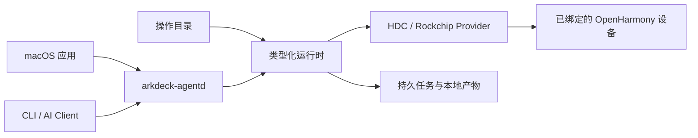

<p align="center">
  <a href="./README.md">English</a> · <strong>简体中文</strong>
</p>

<p align="center">
  
</p>

<h1 align="center">ArkDeck</h1>

<p align="center">
  用 macOS 应用、CLI 或 AI Agent，调试、跟踪、刷写真实的 OpenHarmony 设备。
</p>

<p align="center">
  <a href="https://github.com/ArkDeck/ArkDeck/actions/workflows/swift-ci.yml"></a>
  
  
  
  <a href="./LICENSE"></a>
</p>

<!-- TODO: 截图占位——有应用截图后放在这里，
     例如 <p align="center"></p> -->

ArkDeck 是一个面向真实 OpenHarmony 开发板的本地优先工作台。macOS 应用、CLI 和用户级守护进程共用同一套运行时，用于接管一台确定的设备、执行版本化操作、持久保存任务历史并采集产物。当前操作目录覆盖 HAP 调试、诊断、native 库部署和 DAYU200 恢复刷机。

调用方不能提交任意 `hdc` 或 shell 命令字符串、可执行文件路径、远端路径，也不能提供可信设备事实。调用方只能提交已发布的操作和类型化输入；守护进程负责生成可执行文件、参数数组和 Provider 管理的路径，核对已绑定设备，在必要事实缺失或漂移时停止。AI Agent 与应用和 CLI 共用这一套有界操作面。

## 它能做什么

- 观察 HDC，并按持久设备身份接管一台确定的设备，而不是选择当前碰巧连接的设备。
- 从带租约的产物安装、启动、验证并清理 HAP，可选采集有界诊断信息。
- 把有界 HiLog、截图、ArkUI 组件树、Trace 和崩溃记录收进不可变的本地产物库。
- 创建经过验证、绑定目标设备的端口转发，并原子化部署应用自有的 native 库，失败时回滚。
- 用已验证的镜像包刷写 DAYU200（RK3568），随后重新绑定设备并验证刷机后的系统。
- 运行带预算的 AI 调试循环：分析产物，在声明的隔离工作区中修改、重新构建、签名和复验，达到成功、安全边界或预算上限时停止。

三个入口共用同一个运行时：

| 入口 | 是什么 |
| --- | --- |
| macOS 应用 | Overview 与设备视图，以及 Flash、Debug、UI Dump、Trace、Automation 和 History 工作区；应用设置位于标准 Settings 窗口 |
| `arkdeck` | 配置守护进程与签名、接管设备、控制操作与任务、访问产物、发起类型化 Agent 运行和有界调试任务 |
| `arkdeck-agentd` | 用户级本地守护进程：负责实际执行、故障恢复和私有控制 socket |

## 为什么这样设计

开发板往往毁于无心之失：刷机刷错了序列号、清理时删掉了别的目录、某一步悄悄失败之后脚本还在往下跑。ArkDeck 的做法是把责任从调用方挪进运行时：

- 任何写操作都要求已确认并持久化的设备绑定，传输地址本身从不被当作设备身份。
- 每个外部副作用之前先落盘意图，守护进程崩溃或重启后仍然知道刚才做到了哪一步。
- 破坏性操作只能通过运行时拥有的短时效能力（capability）执行，它精确绑定操作、设备、输入、计划、产物和工具链。
- 事实过期或结果未知时，运行时选择停下，而不是猜。

原始产物始终留在本机，写入后不可修改；导出永远是一个显式动作。

## 当前状态

ArkDeck 目前是早期预览版（`0.1.0`）。已知的边界：

- 唯一支持的宿主环境是 Apple 芯片上的 macOS 26。
- 刷机目前只支持一块板子：DAYU200（RK3568）。
- Windows 和 Linux 端口尚未开始；首个稳定版发布前，接口、目录 schema 和配置步骤都可能变化。

进度以五条必须在真机上跑通的旅程来衡量（仓库里称为 Golden Journey）：设备观察、HAP 调试、native 库部署、刷机恢复、自主 AI 调试循环。Mock 和模拟器都不算数。定义与状态规则见 [PRODUCT-LOOP.md](./PRODUCT-LOOP.md)。

## 架构



详细模块边界见 [Architecture Rules](./docs/ArchitectureRules.md)。

## 从源码构建

你需要：

- Apple 芯片上的 macOS 26
- Xcode 26.6 与 Swift 6.3
- 一个 OpenHarmony `hdc` 可执行文件（真机工作流需要）
- 一台已完成首次信任授权的 USB 直连设备

构建并测试 Swift Package：

```bash
git clone https://github.com/ArkDeck/ArkDeck.git
cd ArkDeck
swift build --package-path Packages/ArkDeckKit
swift test --package-path Packages/ArkDeckKit --parallel
```

仓库贡献者可以运行与 GitHub CI 共用的路径感知验证入口。它始终检查 SDD 与 Catalog 一致性，再只选择受当前分支和工作区改动影响的编译车道；比较事实缺失时会运行全部车道，而不是静默跳过验证：

```bash
python3 scripts/ci/plan.py \
  --repo-root . \
  --base-revision origin/main \
  --head-revision HEAD \
  --merge-base \
  --include-worktree \
  --run-local
```

ArkDeckKit 测试使用 worktree 之外的稳定缓存。App 与 UI 测试改动会通过 `build-for-testing` 编译 Xcode scheme；这不会启动模拟器，也不构成真机验收。

桌面应用方面，用 Xcode 打开 `ArkDeck.xcodeproj`，运行共享的 `ArkDeck` scheme。这足以进行应用开发和宿主侧测试。安装后台 Runtime 需要单独构建已签名的 helper；真正刷写 DAYU200 还需要经过评审的 Rockchip 组件和 Release 打包路径。

### 安装运行时

SwiftPM 直接生成的可执行文件只用于开发，不能作为生产 LaunchAgent 安装。`agentd install` 只接受具备预期 Developer ID、hardened runtime、内嵌 provisioning profile 和共享 Keychain entitlement 的 `ArkDeckAgent.app`。请按[无头运行时指南](./Packages/ArkDeckKit/LaunchAgents/README.md)使用团队授权的签名与公证输入构建 helper，或在项目提供已签名发布包后使用发布包。

从已签名的 `ArkDeckCLI.app` 安装用户级守护进程，并把它指向你的 `hdc`：

```bash
/absolute/path/to/ArkDeckCLI.app/Contents/MacOS/arkdeck \
  agentd install --hdc /absolute/path/to/hdc
```

然后确认一切就绪：

```bash
/absolute/path/to/ArkDeckCLI.app/Contents/MacOS/arkdeck agentd status
/absolute/path/to/ArkDeckCLI.app/Contents/MacOS/arkdeck doctor
/absolute/path/to/ArkDeckCLI.app/Contents/MacOS/arkdeck device list
/absolute/path/to/ArkDeckCLI.app/Contents/MacOS/arkdeck operation list
```

`agentd install` 会校验并固定守护进程和 `hdc` 二进制。检查 `device list` 返回的候选设备后，使用 `arkdeck device adopt --candidate <connect-key>` 完成接管；没有候选或存在歧义时，ArkDeck 不会猜测。工作区配置、本地 HAP 签名、诊断与卸载方式也见无头运行时指南。

## 仓库结构

- [`ArkDeckApp/`](./ArkDeckApp/) — SwiftUI 桌面应用
- [`Packages/ArkDeckKit/`](./Packages/ArkDeckKit/) — 运行时、Provider、存储、守护进程、CLI 与 Harness
- [`Catalog/`](./Catalog/) — 已发布的操作、Profile 与 Schema
- [`docs/`](./docs/) — 架构笔记、ADR 与产品设计
- [`openspec/`](./openspec/) — 产品契约、安全不变量与变更历史
- [`scripts/`](./scripts/) — 仓库检查与工具脚本

## 参与贡献

先读 [AGENTS.md](./AGENTS.md)：它说明了工作如何组织、交付前要跑哪些检查。[`openspec/`](./openspec/) 下的安全不变量是契约而不是建议，削弱它们的改动不会被合入。

## 协议

本项目以 [MIT](./LICENSE) 协议开源。
