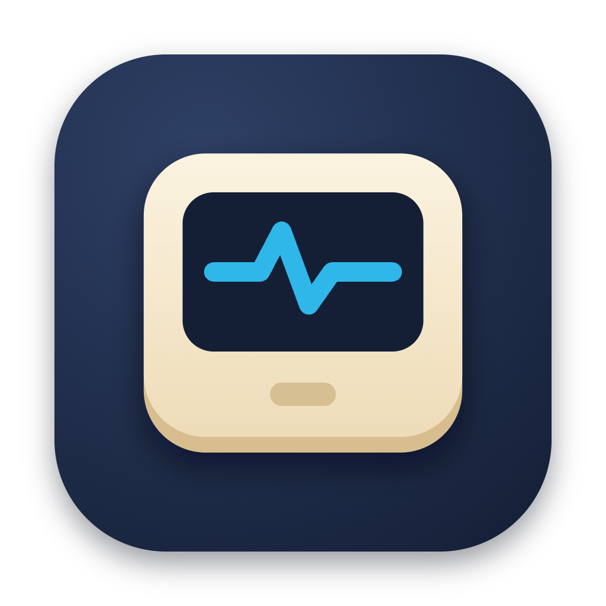
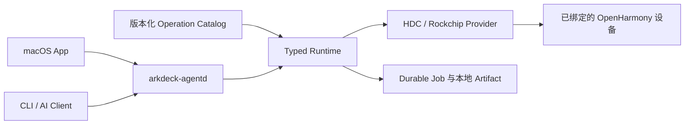

<p align="center">
  <a href="./README.md">English</a> · <strong>简体中文</strong>
</p>

<p align="center">
  
</p>

<h1 align="center">ArkDeck</h1>

<p align="center">
  面向真实 OpenHarmony 设备的本地优先 typed 自动化运行时。
</p>

> [!IMPORTANT]
> ArkDeck 目前是持续开发中的预览版本。当前 Host 目标为 Apple 芯片上的 macOS 14 及更高版本，App 版本为 `0.1.0`。首个稳定版本发布前，接口和配置方式仍可能调整。

ArkDeck 为工程师和 AI Agent 提供一条受控路径，用于观察、调试、恢复和迭代 OpenHarmony 设备。调用方只提交版本化 Operation、typed inputs、目标设备和有界预算；可执行文件、参数、远端路径、安全检查与恢复行为均由 Runtime 决定，而不是由调用方自由指定。

## ArkDeck 能做什么

- 发现并接管精确的 HDC 设备，在 Runtime 重启后继续保留 durable binding。
- 在不暴露 raw HDC 命令的前提下，读取设备、固件、工具和 binding 事实。
- 完成 HAP 端到端调试：校验 Artifact lease、传输、安装或替换、启动、状态回读、诊断采集和清理。
- 采集有界 HiLog、ArkUI UI Dump、截图、组件树、Trace 和崩溃记录，并写入结构化本地 Artifact Store。
- 原子部署 App-owned native library，校验 ABI、Hash 和 Build ID，并按声明的策略执行回滚。
- 使用已验证镜像包刷写已绑定的 DAYU200（RK3568），随后重启、重新绑定并完成刷机后检查。
- 运行有界 AI 修复循环：分析证据、在隔离 Workspace 中修改、构建和测试、通过 typed Operation 部署，并在成功或触发安全边界时停止。

## 产品入口

| 入口 | 用途 |
| --- | --- |
| macOS App | 设备配置、Flash、Debug、UI Dump、Trace、Automation、History 和 Settings 工作区 |
| `arkdeck` | 配置 daemon、接管设备、提交 Operation、管理 Job、Artifact 和 Harness Task 的 typed CLI |
| `arkdeck-agentd` | 用户级本地 daemon，负责 Runtime 执行、durable recovery 和私有控制 socket |
| Operation Catalog | 对输入、effect、step、Artifact、预算与支持 profile 进行版本化定义 |

## 安全模型

- **先确认精确目标。** 传输地址不等于设备身份；任何 mutation 都要求已确认并持久化的 binding。
- **只允许 typed effect。** App、CLI 和 Agent surface 不接受 raw shell、raw HDC 参数或由调用方指定的远端路径。
- **不确定时 fail closed。** 身份漂移、事实过期、副作用结果未知或缺少验证时，Runtime 停止后续 mutation。
- **持久且可审计。** 外部 effect 前先写 intent；outcome、cleanup debt 与 recovery 状态在 daemon 重启后仍保留。
- **Artifact 默认留在本机。** Raw Artifact 不可原地修改；导出必须显式触发，敏感数据保持分类标记。
- **Destructive 工作有严格边界。** Flash 只消费 Runtime 为精确 target、inputs、plan 和 toolchain 生成的短期 capability。

## 架构



详细模块边界见 [Architecture Rules](./docs/ArchitectureRules.md)。

## 从源码构建

### 环境要求

- Apple 芯片上的 macOS 14 或更高版本
- 支持 Swift 6 的 Xcode toolchain
- 真实设备工作流需要兼容的 OpenHarmony HDC 可执行文件
- USB 连接的设备，并已完成首次信任与必要的平台授权

克隆仓库并构建 Swift Package：

```bash
git clone https://github.com/ArkDeck/ArkDeck.git
cd ArkDeck
swift build --package-path Packages/ArkDeckKit
swift test --package-path Packages/ArkDeckKit --parallel
```

在 Xcode 中打开桌面 App：

```bash
open ArkDeck.xcodeproj
```

选择共享的 `ArkDeck` Scheme 后运行。Debug 配置可用于 App 和 Runtime 开发；真实 DAYU200 刷机还需要经过 review 的 Rockchip 组件与 Release 打包路径。

### 启动本地 Runtime

构建完成后，使用 HDC 的 canonical 绝对路径安装用户级 daemon：

```bash
Packages/ArkDeckKit/.build/debug/arkdeck agentd install \
  --hdc /absolute/path/to/hdc

Packages/ArkDeckKit/.build/debug/arkdeck agentd status
Packages/ArkDeckKit/.build/debug/arkdeck doctor
Packages/ArkDeckKit/.build/debug/arkdeck operation list
Packages/ArkDeckKit/.build/debug/arkdeck device list
```

安装命令会校验并固定 daemon 与 HDC executable。Workspace、本地 HAP 签名、模型 producer、诊断和卸载方式见[无头 Runtime 配置说明](./Packages/ArkDeckKit/LaunchAgents/README.md)。

## 产品里程碑

ArkDeck 只用五条真实设备 Golden Journey 衡量进度。Schema、Mock 或 Simulation 通过都不能代替真实设备完成。

1. **Device Observe** — 发现、信任、接管、观察、采集有界诊断，并在 daemon 重启后读回结果。
2. **HAP Debug** — 导入、传输、安装、启动、验证、采集、停止并清理 HAP。
3. **Native Debug** — 校验并发布 native library，重启和观察目标，失败时回滚。
4. **Flash Recovery** — 校验身份和精确计划，刷机、重启、重新绑定并回到正常 Debug Runtime。
5. **Bounded AI Debug Loop** — 观察、分析、修改、构建、部署与复验，直到成功或命中声明的停止条件。

权威定义与汇报规则见 [PRODUCT-LOOP.md](./PRODUCT-LOOP.md)。

## 仓库结构

- [`ArkDeckApp/`](./ArkDeckApp/) — SwiftUI 桌面应用
- [`Packages/ArkDeckKit/`](./Packages/ArkDeckKit/) — Runtime、Provider、Storage、Daemon、CLI 与 Harness
- [`Catalog/`](./Catalog/) — 已发布 Operation、Profile、Schema 与生成矩阵
- [`docs/`](./docs/) — 架构、ADR、产品设计与发布文档
- [`openspec/`](./openspec/) — 产品 contract、安全不变量与历史 change 记录
- [`scripts/`](./scripts/) — 仓库检查与限定范围的产品工具

## 参与贡献

修改仓库前请先阅读 [AGENTS.md](./AGENTS.md)。产品工作围绕“一个垂直问题 + 一条 Golden Journey”组织，同时 Constitution 的安全不变量不可放宽。交付改动前，请运行该文件规定的本地检查。
