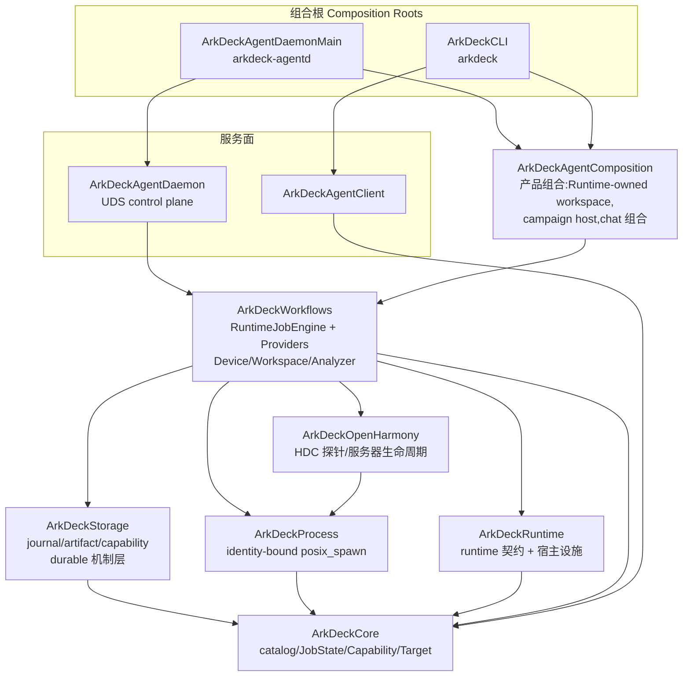

# ArkDeck Architecture Rules

> Status: current(2026-08-19 CHG-2026-064 起进程内决策平面移除;2026-08-02 架构边界
> 治理与 ADR-0008 typed-only agent surface 同一世界观)。
> 执法点:`Packages/ArkDeckKit/Package.swift` 的依赖声明(编译器强制)+
> `Tests/ArkDeckContractTests/ArchitectureBoundaryContractTests.swift`(结构测试)。
> 本文只描述**模块边界**;设备安全边界与 E0/E1/E2 授权见 Constitution 与 ADR。

ArkDeck 的长期形态不是 Agent Framework,而是被外部 agent 调用的权威执行层
(CHG-2026-064 移除了进程内决策平面):

```text
External agent decides   (Claude Code / codex / 任意已发布面调用方)
    ↓
Runtime executes        (admission / job / journal / capability)
    ↓
Provider operates       (hdc / build.sh / git / analyzer lowering)
    ↓
Artifact proves
```

## 1. 模块分层(现状即规范)



要点:

- **不存在进程内决策平面**(CHG-2026-064)。`ArkDeckHarness` target 已删除;
  架构测试断言它不得以任何名义回归,任何调用方(人、App、外部 agent)进入
  执行的唯一门是「已发布 operation reference + typed inputs 经 admission」。
- `ArkDeckRuntime` 是**共享契约层**(v2 请求 DTO、`HumanActionRequired`、
  crash-ledger 分析 schema、AgentStrictJSON)加宿主设施(clock/power/
  single-instance),它不依赖任何上层。
- `ArkDeckAgentComposition` 物理上位于
  `Sources/ArkDeckWorkflows/AgentComposition/`(目录内嵌 target;
  PRODUCT-LOOP §20 冻结大规模目录搬迁,目录外提是解冻后的一次纯 `git mv`),
  承载 Runtime-owned isolated workspace、flash campaign host 与 chat 组合;
  chat 的模型网关只在此与 `ArkDeckCLI` 可见,其一切副作用仍逐一经 admission。

## 2. Dependency Rules(允许的 import 上限)

一个 target 可以少 import,不可多 import。完整矩阵以
`ArchitectureBoundaryContractTests.allowedImports` 为准本,这里给方向语义:

```text
Workflows    → Core, Process, Runtime, OpenHarmony, Storage, ArkForgeIPC
AgentComposition → Core, Process, Runtime, Storage, Workflows, AgentClient
Storage      → Core
OpenHarmony  → Core, Process
Process      → Core
Runtime      → Core
Core         → (nothing)
AgentClient  → Core
AgentDaemon  → Core, Storage, Workflows
CLI / AgentDaemonMain(可执行组合根)→ 宽,但仍在矩阵内
```

## 3. Ownership Rules(事实源唯一)

| 事实 | Owner | 载体 |
|---|---|---|
| Runtime Job 状态与时间线 | Runtime(RuntimeJobEngine) | `jobs/<jobID>/journal.jsonl` + `record.json` 快照 |
| Artifact 字节与元数据 | RuntimeArtifactStore | `artifacts/<jobID>/index.json`;调用方只经 lease/ID 引用 |
| Capability(E0/E1/E2) | Runtime | `RuntimeCapabilityStore`(唯一 enforcement:engine 三相 preauthorize/consume/recordOutcome) |
| Recovery(runtime job) | Runtime | engine 的 `recoverPersistedJobs`/`reconcile`(Storage 只出机制原语) |
| Evolution 隔离工作区 | EvolutionWorkspaceManager(组合层) | `evolution-workspaces/<id>`,按值拷贝、路径必须窄于源 profile |

引用链:`jobID → journal/artifacts`。外部 agent 对 job/artifact 只持引用,
补丁向主树的晋升走维护者 review PR。历史 `harness/` SQLite 目录为只读遗留,
不再有 owner(CHG-2026-064)。

## 4. Forbidden Rules(结构测试逐条钉死)

```text
任何 target 名为/依赖 ArkDeckHarness                   (决策平面不得回归)
任何生产源码 import ArkDeckHarness                     (同上,按文件点名)
Storage / RuntimeArtifactStore -> 任务身份(HTASK)      (存储层任务无知)
任何模块公开 API -> command: String / shell script     (typed argv-only)
chat 模型符号(HarnessAgentModelGateway/OpenAIGateway/AgentLoop/ARKDECK_HARNESS_MODEL_)
          -> 只准出现在 AgentComposition 与 ArkDeckCLI
git 可执行 -> 只有 WorkspaceOperationsProvider 与 EvolutionCandidatePipeline
          两个声明点,且 push/merge/commit/checkout/clone/… 写动词为字面量违规
```

对应测试(`ArchitectureBoundaryContractTests`):manifest 依赖矩阵(含
「无 ArkDeckHarness target」断言)、逐文件 import 矩阵、决策平面移除保持、
raw-command 公开 API 扫描、chat 模型面隔离、git 执行点收敛、存储任务无知、
carve-out `exclude:` 防回流。
文件级扫描不是 manifest 检查的冗余:SwiftPM 允许同包未声明依赖的 import
通过编译,测试是那个洞的唯一护栏。

## 5. Evolution 边界

Evolution 可以:隔离工作区内 patch/build/test/deploy/verify(全部走
catalog typed operation + RuntimeJobEngine admission)。

Evolution 不能:碰 primary tree 的 ref(派生 profile `sourceControlPreset: nil`,
git 面只有 status/diff/stash-create + 只读 plumbing)、自动 merge/push、
绕过 review(晋升 = 维护者 review PR)、扩权
(`EvolutionWorkspacePolicy` 拒绝可破坏操作,scope 必须窄于源 profile)。

## 6. 判例(遇到边界问题先查这里)

1. **一个类型被组合层与 Workflows 同时需要** → 下沉到 ArkDeckRuntime
   (契约)或 ArkDeckCore(全局模型),不要制造反向 import。
   判例:crash-ledger schema、`HumanActionRequired`。
2. **想给 ArkDeck 加"决策能力"** → 不加。决策属于外部 agent;ArkDeck 提供
   已发布 operation、admission 与证据(CHG-2026-064 判例:整个任务平面)。
3. **Provider 想读调用方上下文** → 不读。provider 只见 Operation/Input/
   Target/Effect/Policy。
4. **新的跨面适配器** → 进 AgentComposition,保持薄。
5. **矩阵需要放宽** → 那是架构决策:与需要它的代码同 PR,由维护者 review;
   先自问是否其实该走 1/2/3。
