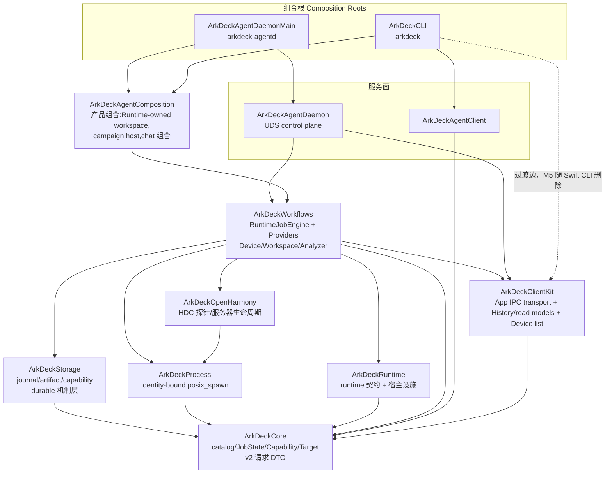

# ArkDeck Architecture Rules

> Status: current(2026-08-19 CHG-2026-064 起进程内决策平面移除;2026-08-02 架构边界
> 治理与 ADR-0008 typed-only agent surface 同一世界观)。
> 执法点:`Packages/ArkDeckKit/Package.swift` 的依赖声明(编译器强制)+
> `Tests/ArkDeckContractTests/ArchitectureBoundaryContractTests.swift`(结构测试)。
> 本文只描述**模块边界**;设备安全边界与 E0/E1/E2 授权见 Constitution 与 ADR。

ArkDeck 的长期形态不是 Agent Framework,而是被外部 agent 调用的权威执行层
(CHG-2026-064 移除了进程内决策平面):

```text
External agent decides   (Claude Code / codex / 任意已发布面调用方)
    ↓
Runtime executes        (admission / job / journal / capability)
    ↓
Provider operates       (hdc / build.sh / git / analyzer lowering)
    ↓
Artifact proves
```

## 1. 模块分层(现状即规范)



要点:

- **不存在进程内决策平面**(CHG-2026-064)。`ArkDeckHarness` target 已删除;
  架构测试断言它不得以任何名义回归,任何调用方(人、App、外部 agent)进入
  执行的唯一门是「已发布 operation reference + typed inputs 经 admission」。
- `ArkDeckRuntime` 是**共享契约层**(`HumanActionRequired`、crash-ledger 分析 schema、
  AgentStrictJSON)加宿主设施(clock/power/single-instance),它不依赖任何上层。
  v2 请求 DTO(`RuntimeOperationRequest` 及其组成部分、`RuntimeOperationFailure` 投影)
  在 ArkDeckCore:App 的客户端库 ClientKit 只依赖 Core,也要构造这些请求,而 M5 删除
  Swift Runtime 后 App 仍要构造 v2 请求(§6 判例 1)。
- `ArkDeckAgentComposition` 物理上位于
  `Sources/ArkDeckWorkflows/AgentComposition/`(目录内嵌 target;
  PRODUCT-LOOP §20 冻结大规模目录搬迁,目录外提是解冻后的一次纯 `git mv`),
  承载 Runtime-owned isolated workspace、flash campaign host 与 chat 组合;
  chat 的模型网关只在此与 `ArkDeckCLI` 可见,其一切副作用仍逐一经 admission。

## 2. Dependency Rules(允许的 import 上限)

一个 target 可以少 import,不可多 import。完整矩阵以
`ArchitectureBoundaryContractTests.allowedImports` 为准本,这里给方向语义:

```text
Workflows    → Core, ClientKit, Process, Runtime, OpenHarmony, Storage, ArkForgeIPC
ClientKit    → Core
AgentComposition → Core, Process, Runtime, Storage, Workflows, AgentClient
Storage      → Core
OpenHarmony  → Core, Process
Process      → Core
Runtime      → Core
Core         → (nothing)
AgentClient  → Core
AgentDaemon  → Core, ClientKit, Storage, Workflows
CLI / AgentDaemonMain(可执行组合根)→ 宽,但仍在矩阵内(CLI → ClientKit 是过渡边,见下)
```

CHG-2026-074 迁移期间，ClientKit 持有 App 的 IPC transport、History/filter/Artifact 只读展示、Device list 展示模型与客户端 JobControl，
不依赖 Workflows、Runtime 或 Storage；旧 façade 和 Swift daemon 暂时消费这些共享类型。
App 侧的 Import 上传助手 `RuntimeAppArtifactUpload`（Debug 与 Flash 两个 façade 共用，只依赖 Core）也在 ClientKit，
以 `package` 访问级别供同包的 Workflows 使用。
JobControl 仍受 daemon 的 typed App job ownership gate 约束，不增加取消权限。
此提取不代表所有 App façade 已脱钩或 Swift Runtime 已退役。
Trace cache 维护的 App 侧模型、XPC provider 与应答解码也在 ClientKit；守护进程侧的
`RuntimeTraceCacheMaintaining` 协议留在 Workflows，`AgentDaemonMain` 组合它的实现，因此也 import ClientKit。
Overview 能力矩阵的展示模型、在线目标投影、读请求与应答解码也在 ClientKit；证明 hidumper 行的只读
`debug.template@1` 窗口清单 Job 仍由 Workflows 的 `DebugWindowInventoryJobRunner` 按 Debug 工作区的 typed 请求提交，
ClientKit 只声明 `OverviewWindowInventoryJobRunning`，由 App 组合，不新增依赖边。
Settings 的展示模型、provider 协议、facade 与 `runtime.storage.*` 请求及精确形状校验也在 ClientKit；本地诊断包导出
（经 Storage 读本机文件，CLI 共用）与 `--ui-test-runtime-history` 启动时代替 daemon 应答的存储 owner 仍在 Workflows，
ClientKit 只声明 `SettingsDiagnosticBundleExporting` 与 `SettingsRuntimeStorageFixture`，由 App 组合
`RuntimeSupportBundleSettingsExporter` 与 `SettingsStorageUIFixture.runtimeStorage()`，不新增依赖边。
App 侧 SSH 远程构建源（`RemoteBuildSourceApplicationFacade`：Keychain 凭据、SFTP 只读浏览与有界拉取）整体在 ClientKit，
Citadel/NIOSSH/NIOCore/swift-crypto/swift-log 随之由 ClientKit 而非 Workflows 链接（外部包，不是 ArkDeck 依赖边）；
Workflows 的 Debug facade 经既有的 Workflows → ClientKit 边使用它。远程构建源用到的 `DebugTypedValueValidator`
（Catalog 标识符与原生库文件名规则）也随之移到 ClientKit，Workflows、daemon 与 App 共用这一份，不另抄规则。
Overview 运行记录与「开始新一次」行的投影（`OverviewRunRecordProjection`、`OverviewActionProjection`）是只读展示逻辑，也在 ClientKit；
只读延续——`RuntimeWorkspaceContinuation`（从历史 Job 重建一份新的请求草稿）、提交并运行它的 XPC provider 与 `make()`——
也在 ClientKit，CLI 经过渡边使用；它构造的 v2 请求 DTO 在 Core（§1）。
设备控制面（`DeviceControlFacade`：按需截图、三种手势、录屏与帧归档，以及录制预算/合成/校验/导出、帧活性与手势分类、UI fixture）整体在 ClientKit，
它的生产 provider 只经 ClientKit 的 XPC transport 说话；随之移入的还有工作区线程标识 `RuntimeWorkspaceThread` 与 typed 采集预设 `DiagnosticCapturePreset`，
Workflows 的 Debug/Flash/Trace/UIDump facade 与 CLI 经既有边共用这一份。
App 与 CLI 共用的自动更新（feed 解析与验签、下载、状态/制品/重放文件存储、服务状态机、`RuntimeUpdateApplicationFacade` 与 UI fixture）也在 ClientKit；
依赖 ArkDeckRuntime `SystemLogger` 的生产装配——`SystemAutoUpdateEventLogger` 与 `AutoUpdateApplicationFacade.make()`——留在 Workflows。
CLI 因此直接 import ClientKit：CLI → ClientKit 是 CHG-2026-074 的过渡边，随第一个需要它的 CLI 代码（自动更新）同 PR 加入（§6 判例 5），
Swift CLI 在 M5 删除时随之消失；本地诊断包导出与只读延续移入后也经这条边供 CLI 使用。
ClientKit 仍只依赖 Core，依赖图保持无环。CLI 经 Workflows → ClientKit 本就链接 ClientKit，这条边不给可执行文件增加库，只放开 CLI 源码直接点名它的类型。
本地诊断包导出的契约（`RuntimeSupportBundlePreview`、`RuntimeSupportBundleExportReceipt`、`RuntimeSupportBundleServiceError`、
`RuntimeSupportBundleProviding`）也在 ClientKit，CLI 经这条边直接用；经 Storage 读本机文件的生产 provider 与
`RuntimeSupportBundleApplicationFacade.make()` 留在 Workflows。
诊断会话的只读读取器（`DiagnosticSessionReading` 的展示模型、`DiagnosticSessionApplicationReader` 与离线巡检 `DiagnosticSessionOfflineInspector`）
也在 ClientKit，CLI 经过渡边共用；hilog 摘要的展示模型在 ClientKit，而校验它的 `DiagnosticHilogSummaryReader` 留在 Workflows——
它要用 analyzer provider 的 `HilogSummaryDerivedAnalyzer` 验报告，ClientKit 够不着。
Debug 工作区的 facade（`DebugApplicationFacade`）与 App 的产品能力登记（`AppProductCapabilityRegistry`）也在 ClientKit；
原生库校验器（读 ELF 与代码签名事实，App 选库时先校验）随之移入，部署用的 restart/verification/rollback profile 与描述符留 Workflows；
debug 探针只把 App 要的读模型移过来，探针本体 `FoundationDebugRuntimeProbe` 与 daemon 组合用的类型不动。

## 3. Ownership Rules(事实源唯一)

| 事实 | Owner | 载体 |
|---|---|---|
| Runtime Job 状态与时间线 | Runtime(RuntimeJobEngine) | `jobs/<jobID>/journal.jsonl` + `record.json` 快照 |
| Artifact 字节与元数据 | RuntimeArtifactStore | `artifacts/<jobID>/index.json`;调用方只经 lease/ID 引用 |
| Capability(E0/E1/E2) | Runtime | `RuntimeCapabilityStore`(唯一 enforcement:engine 三相 preauthorize/consume/recordOutcome) |
| Recovery(runtime job) | Runtime | engine 的 `recoverPersistedJobs`/`reconcile`(Storage 只出机制原语) |
| Evolution 隔离工作区 | EvolutionWorkspaceManager(组合层) | `evolution-workspaces/<id>`,按值拷贝、路径必须窄于源 profile |

引用链:`jobID → journal/artifacts`。外部 agent 对 job/artifact 只持引用,
补丁向主树的晋升走维护者 review PR。历史 `harness/` SQLite 目录为只读遗留,
不再有 owner(CHG-2026-064)。

## 4. Forbidden Rules(结构测试逐条钉死)

```text
任何 target 名为/依赖 ArkDeckHarness                   (决策平面不得回归)
任何生产源码 import ArkDeckHarness                     (同上,按文件点名)
Storage / RuntimeArtifactStore -> 任务身份(HTASK)      (存储层任务无知)
任何模块公开 API -> command: String / shell script     (typed argv-only)
任何模型面(模型网关符号/ARKDECK_HARNESS_MODEL_/厂商端点/Bearer 凭据)
          -> 全仓零出现,白名单为空(不是"限制在某目录",是不存在)
git 可执行 -> 只有 WorkspaceOperationsProvider 一个声明点(集合精确相等:
          未登记的新引用与已失效的旧登记同样违规),且
          push/merge/commit/checkout/clone/… 写动词为字面量违规
```

对应测试(`ArchitectureBoundaryContractTests`):manifest 依赖矩阵(含
「无 ArkDeckHarness target」断言)、逐文件 import 矩阵、决策平面移除保持、
raw-command 公开 API 扫描、全仓零模型面(空白名单)、chat 组合体保持删除、
git 执行点收敛、存储任务无知、
carve-out `exclude:` 防回流、v2 请求契约声明在 Core 而非 Runtime。
文件级扫描不是 manifest 检查的冗余:SwiftPM 允许同包未声明依赖的 import
通过编译,测试是那个洞的唯一护栏。

## 5. Evolution 边界

Evolution 可以:隔离工作区内 patch/build/test/deploy/verify(全部走
catalog typed operation + RuntimeJobEngine admission)。

Evolution 不能:碰 primary tree 的 ref(派生 profile `sourceControlPreset: nil`,
git 面只有 status/diff/stash-create + 只读 plumbing)、自动 merge/push、
绕过 review(晋升 = 维护者 review PR)、扩权
(`EvolutionWorkspacePolicy` 拒绝可破坏操作,scope 必须窄于源 profile)。

## 6. 判例(遇到边界问题先查这里)

1. **一个类型被组合层与 Workflows 同时需要** → 下沉到 ArkDeckRuntime
   (契约)或 ArkDeckCore(全局模型),不要制造反向 import。
   判例:crash-ledger schema、`HumanActionRequired`;v2 请求 DTO 下沉到 Core
   (App 客户端库 ClientKit 只依赖 Core,也要构造请求)。
2. **想给 ArkDeck 加"决策能力"** → 不加。决策属于外部 agent;ArkDeck 提供
   已发布 operation、admission 与证据(CHG-2026-064 判例:整个任务平面)。
3. **Provider 想读调用方上下文** → 不读。provider 只见 Operation/Input/
   Target/Effect/Policy。
4. **新的跨面适配器** → 进 AgentComposition,保持薄。
5. **矩阵需要放宽** → 那是架构决策:与需要它的代码同 PR,由维护者 review;
   先自问是否其实该走 1/2/3。
