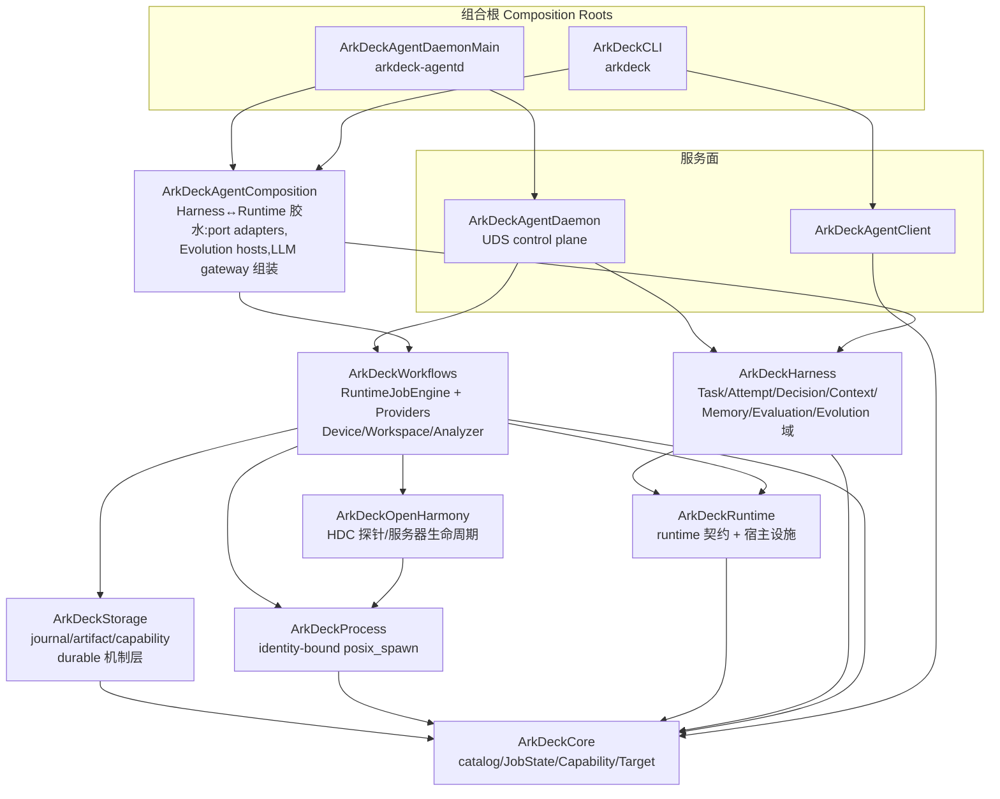

# ArkDeck Architecture Rules

> Status: current(2026-08-02 架构边界治理;与 ADR-0004 两平面分离、ADR-0008 typed-only
> agent surface 同一世界观)。
> 执法点:`Packages/ArkDeckKit/Package.swift` 的依赖声明(编译器强制)+
> `Tests/ArkDeckContractTests/ArchitectureBoundaryContractTests.swift`(结构测试)。
> 本文只描述**模块边界**;设备安全边界与 E0/E1/E2 授权见 Constitution 与 ADR。

ArkDeck 的长期形态不是更复杂的 Agent Framework,而是:

```text
AI decides
    ↓
Harness controls        (task control plane)
    ↓
Runtime executes        (admission / job / journal / capability)
    ↓
Provider operates       (hdc / build.sh / git / analyzer lowering)
    ↓
Artifact proves
    ↓
Evaluation judges
```

## 1. 模块分层(现状即规范)



要点:

- **Harness 与 Workflows 互相不可见**。二者只在 `ArkDeckAgentComposition`
  (端口适配器)与两个可执行组合根里相遇。
- `ArkDeckRuntime` 是**共享契约层**(v2 请求 DTO、`HumanActionRequired`、
  crash-ledger 分析 schema、AgentStrictJSON)加宿主设施(clock/power/
  single-instance)。Harness 与 Workflows 都可依赖它,它不依赖任何上层。
- `ArkDeckAgentComposition` 物理上位于
  `Sources/ArkDeckWorkflows/AgentComposition/`(与 `ArkDeckHarness/Candidate`
  同款目录内嵌 target;PRODUCT-LOOP §20 冻结大规模目录搬迁,目录外提是
  解冻后的一次纯 `git mv`)。

## 2. Dependency Rules(允许的 import 上限)

一个 target 可以少 import,不可多 import。完整矩阵以
`ArchitectureBoundaryContractTests.allowedImports` 为准本,这里给方向语义:

```text
Harness      → Core, Runtime                          (决策面只见契约)
Workflows    → Core, Process, Runtime, OpenHarmony, Storage
AgentComposition → Core, Process, Runtime, Storage, Harness, Workflows
Storage      → Core
OpenHarmony  → Core, Process
Process      → Core
Runtime      → Core
Core         → (nothing)
AgentClient  → Core
AgentDaemon  → Core, Harness, Storage, Workflows
CLI / AgentDaemonMain(可执行组合根)→ 宽,但仍在矩阵内
```

## 3. Ownership Rules(事实源唯一)

| 事实 | Owner | 载体 |
|---|---|---|
| Harness Task(HTASK)状态/事件/决策/记忆 | Harness | `harness.sqlite3`(legacy `task.json` 仅为非权威镜像) |
| Runtime Job 状态与时间线 | Runtime(RuntimeJobEngine) | `jobs/<jobID>/journal.jsonl` + `record.json` 快照 |
| Artifact 字节与元数据 | RuntimeArtifactStore | `artifacts/<jobID>/index.json`;Harness 只经 lease/ID 引用 |
| Capability(E0/E1/E2) | Runtime | `RuntimeCapabilityStore`(唯一 enforcement:engine 三相 preauthorize/consume/recordOutcome) |
| Recovery(runtime job) | Runtime | engine 的 `recoverPersistedJobs`/`reconcile`(Storage 只出机制原语) |
| Candidate Patch / Promotion | Harness Evolution 域 | patch 是元数据 artifact;promotion 产物固定为 `READY_FOR_NORMAL_PR` 文档,永不 merge |
| Evolution 隔离工作区 | EvolutionWorkspaceManager(组合层) | `evolution-workspaces/<id>`,按值拷贝、路径必须窄于源 profile |

引用链:`HTASK → (idempotencyKey) → jobID → journal/artifacts`。
Harness 对 job/artifact 只存**引用与自证观测**,不复制 runtime 状态。

## 4. Forbidden Rules(结构测试逐条钉死)

```text
Harness   -> ArkDeckProcess / shell / hdc / git      (不能 spawn,连类型都见不到)
Workflows -> ArkDeckHarness                           (engine/provider 不理解决策面)
Storage / RuntimeArtifactStore -> HarnessTask/HTASK   (存储层任务无知)
任何模块公开 API -> command: String / shell script     (typed argv-only)
LLM 符号(DecisionGateway/CodexTransport/VendorConfiguration)
          -> 只准出现在 Harness、AgentComposition、AgentDaemonMain
git 可执行 -> 只有 WorkspaceOperationsProvider 与 EvolutionCandidatePipeline
          两个声明点,且 push/merge/commit/checkout/clone/… 写动词为字面量违规
```

对应测试(`ArchitectureBoundaryContractTests`,共 8 条):manifest 依赖矩阵、
逐文件 import 矩阵、Harness 进程/shell 纯净性、raw-command 公开 API 扫描、
LLM 面隔离、git 执行点收敛、存储任务无知、carve-out `exclude:` 防回流。
文件级扫描不是 manifest 检查的冗余:SwiftPM 允许同包未声明依赖的 import
通过编译,测试是那个洞的唯一护栏。

## 5. Evolution 边界

Evolution 可以:隔离工作区内 patch/build/test/deploy/verify(全部走
catalog typed operation + RuntimeJobEngine admission)。

Evolution 不能:碰 primary tree 的 ref(派生 profile `sourceControlPreset: nil`,
git 面只有 status/diff/stash-create + 只读 plumbing)、自动 merge/push、
绕过 review(promotion gate 要求 build/test/deploy readback + evaluation pass +
对抗审阅 pass 且零 HIGH/CRITICAL,产物是 PR 候选文档)、扩权
(`HarnessEvolutionPolicy` 拒绝可破坏操作,scope 必须窄于任务 policy)。

LLM 参与 Evolution 的两个点(对抗审阅器、策略修复器)都是
AgentComposition 里的 Codex 适配器;Workflows 只持有协议。

## 6. 判例(遇到边界问题先查这里)

1. **一个类型被 Harness 与 Workflows 同时需要** → 下沉到 ArkDeckRuntime
   (契约)或 ArkDeckCore(全局模型),不要让任何一方 import 另一方。
   判例:crash-ledger schema、`HumanActionRequired`。
2. **要给 Harness 加"执行能力"** → 不加。定义 port(typed 输入/引用),
   实现放 AgentComposition 或 provider,组合根注入。
3. **Provider 想读任务上下文** → 不读。provider 只见 Operation/Input/
   Target/Effect/Policy;任务语义留在 Harness 侧评估。
4. **新的跨面适配器** → 进 AgentComposition,保持薄(现存反例
   `WorkspaceHarnessRepairPort` 的 317 行域逻辑是已记录债务,勿模仿)。
5. **矩阵需要放宽** → 那是架构决策:与需要它的代码同 PR,由维护者 review;
   先自问是否其实该走 1/2/3。
