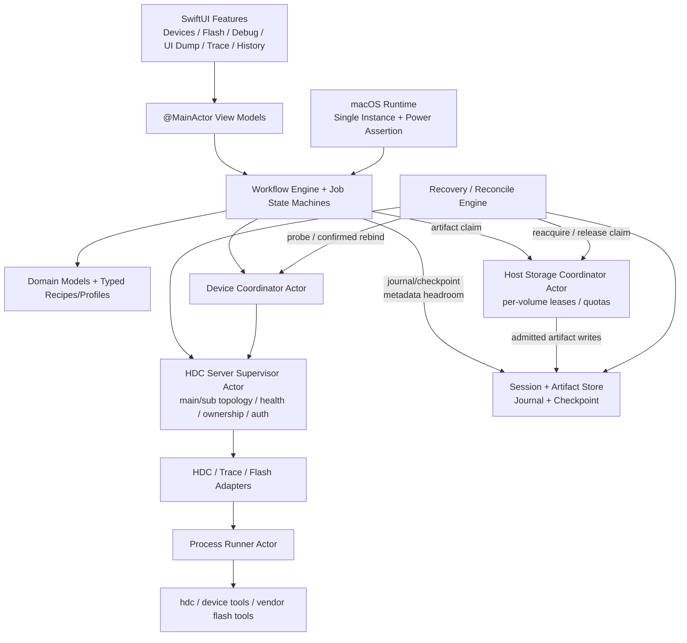

# ArkDeck 设计与实施计划

> 状态：Historical v0.3（已迁移到 [`openspec/`](../openspec/README.md)，不再作为实现事实源）  
> 日期：2026-07-12  
> 范围：macOS 原生 SwiftUI 工具，用于 OpenHarmony 设备连接、刷机、调试、Dump/Trace 采集与产物管理。

> 后续产品行为、验收和平台约束以 `openspec/constitution.md`、`openspec/specs/`、contracts 和已批准 change 为准；本文件只保留迁移背景。覆盖关系见 `openspec/MIGRATION_MAP.md`。

## 1. 结论先行

ArkDeck 不应成为一层“按钮调用 BAT 脚本”的壳，而应成为一个面向 OpenHarmony 的本地工作流工具：

- 使用 SwiftUI 构建原生 macOS UI，使用 Swift 6 structured concurrency 管理长任务。
- 以 HDC 为首个设备传输层，使用进程级 `HDCServerSupervisor` 管理共享的 main/sub server topology，再由 per-device coordinator 绑定用户明确选择的 `connectKey`。
- 将刷机、Dump、Trace 表达为可校验、可追踪且具有步骤级取消策略的 typed workflow，而不是任意 shell 字符串。
- 把附件脚本当作行为样本，迁移其能力，但修复多设备串线、永久参数污染、覆盖原始文件和无错误处理等问题。
- 每次操作形成独立 Session，增量持久化 Job journal/checkpoint，并保留原始产物、派生产物、完整日志和可复现的 `manifest.json`；App 重启后先 reconcile，不盲目续跑危险步骤。
- 刷机采用 Provider 架构。首版支持官方 HDC/flashd 路径；fastboot、Rockchip 等厂商工具作为独立 Provider 增量接入，不能承诺“一套命令刷所有 OpenHarmony 设备”。
- “Debug”首版定义为设备调试工作台，不在首版内自研 ArkTS/C++ 源码级调试器。

建议首版最低系统为 macOS 14，尽量不引入第三方运行时依赖。发布方式优先考虑 Developer ID 签名、Hardened Runtime 和公证的站外分发；App Sandbox 与外部 HDC/刷机二进制、后台服务和 USB 访问的兼容性必须在第一个技术 Spike 中验证。

HDC 工具策略默认是“外部优先”：先使用用户明确配置或 DevEco SDK 提供的 HDC，并展示来源、绝对路径、client/server 版本和 endpoint。ArkDeck 捆绑 HDC 只作为经过版本兼容、许可证、签名与供应链评审后的可选 fallback，不作为 MVP 的默认假设。

## 2. 当前输入与约束

### 2.1 仓库状态

开始规划时 `ArkDeck` 目录为空；目前仅新增本计划文档，且尚未初始化 Git。仍没有可继承的 Xcode 工程、功能代码、测试、部署目标或依赖。

当前机器可见 Swift 6.3.2，但 `xcode-select` 指向 Command Line Tools，无法运行 `xcodebuild`。开始编码前需要安装或切换到完整 Xcode。

### 2.2 附件脚本结论

`dump.rar` 包含 6 个 Windows BAT，最终可归并为 4 个正式 Dump Recipe：

| Recipe | `hidumper` 参数 | 说明 |
| --- | --- | --- |
| `nodeSummary` | `-w <windowId> -default` | 脚本名声称“节点数”，实际输出语义需要按固件样例确认 |
| `elementTree` | `-w <windowId> -element -c` | 当前 element pipeline |
| `fullDefaultTree` | `-w <windowId> -default -all` | 完整默认树 |
| `componentDetail` | `-w <windowId> -element -lastpage <compId>` | 指定组件详情 |

公共窗口发现命令为：

```text
hidumper -s WindowManagerService -a '-a'
```

附件注释中的 `-render -c` 只作为旧固件兼容 fallback，在设备探测确认支持后才出现。`persist.ace.debug.enabled` 是独立的 Debug Policy，不应复制出另一套 Dump 类型。

`trace.rar` 包含两个 BAT：

- `openDebugTrace.bat`：写入 9 个 `persist.*` ArkUI/Graphic/Rosen 参数并无条件重启，没有读取旧值、验证、回连或恢复。
- `getTrace.bat`：固定使用 `bytrace` 抓 15 秒、buffer 值 `327680`、11 个 tag，将结果写到固定远端文件，原地删除前两行及含 `CreateFileAsset` 的行，再拉回当前目录。

附件的 Trace tag 为：

```text
sched freq ace app binder disk ohos graphic sync workq ability
```

附件设置的 9 个持久参数为：

```text
persist.ace.trace.syntax.enabled=true
persist.ace.trace.layout.enabled=true
persist.ace.trace.build.enabled=true
persist.ace.trace.measure.debug.enabled=true
persist.ace.trace.sync.debug.enabled=true
persist.ace.debug.enabled=1
persist.ace.performance.monitor.enabled=true
persist.sys.graphic.openDebugTrace=1
persist.rosen.animationtrace.enabled=1
```

这些值只能作为“附件兼容 Profile”的输入，不代表所有 OpenHarmony 版本都支持；需要逐项探测、显示实际读写结果，并允许 Profile 按设备/固件覆写。

这些脚本共同存在以下问题，ArkDeck 不得原样继承：

- 只适用于 Windows CMD/PowerShell，macOS 无法直接使用。
- 默认只有一台设备，从不使用 `hdc -t <connectKey>`。
- 把 window/component ID 和远端路径拼入 shell，存在注入与转义问题。
- 递归删除设备 `data/**/arkui.dump`，可能破坏其他应用或并发会话的文件。
- Dump 的 stdout 和远端 sidecar 使用相同本地文件名，容易静默覆盖或拼入陈旧数据。
- Trace 原地修改 raw 文件，无法恢复原始证据。
- 固定远端文件名造成并发、失败重试和陈旧产物串线。
- 永久修改 `persist.*` 参数，不保存原值，也不在失败或取消时恢复。
- 不检查 HDC、权限、能力、退出码、语义错误、磁盘空间、空文件、断线、超时或传输完整性。
- 时间戳只有分钟级或依赖 Windows 区域格式，存在覆盖风险。

## 3. 产品范围

本计划把容易混淆的“Dump”拆成三类：

- **ArkUI UI Dump**：通过 `hidumper` 获取 WindowManagerService 的窗口、组件树和组件详情；这是附件脚本覆盖的能力，也是当前 MVP 的 Dump 范围。
- **Fault Log / Crash Artifact**：由 FaultLoggerd/HiviewDFX 生成或归档的 C++/JS crash、Rust panic、AppFreeze 等故障日志，以及 coredump/minidump/主动抓栈类产物；具体能力随系统与构建变化。
- **System Diagnostic Snapshot**：例如 HDC `bugreport` 或多个系统服务信息组合成的整机诊断快照。

除非 §13 的产品决策明确扩展范围，文中不加限定的 “Dump MVP” 均指第一类 ArkUI UI Dump；后两类仅作为 v1.x 候选，不因列入参考资料而视为已经设计或承诺支持。

### 3.1 MVP 必须包含

1. 环境与设备
   - 自动查找或手动选择 HDC，显示工具来源、路径、client/server 版本、server endpoint、健康状态和 ArkDeck 是否拥有其生命周期。
   - 通过共享 `HDCServerSupervisor` 管理 server 发现、兼容性检查、端口冲突和健康事件；默认不 kill DevEco 或用户已启动的 server。
   - USB 与系统可枚举的 UART 候选发现、用户显式添加的 TCP/UART endpoint 及统一目标管理；不通过网络扫描发现 TCP 设备。正确展示 Ready、Offline、Unauthorized 等状态。
   - Unauthorized 有独立引导：提示解锁设备并确认“信任此设备”，轮询到 Ready，超时后给出非破坏性的重试路径。
   - 零设备、多设备、设备重启和拔插都能得到明确状态。
   - 能力探测：`hidumper`、`hitrace`/`bytrace`、`param`、root/flashd、支持的 trace tag 和参数。
   - ArkDeck 单实例写入保护；第二个实例激活已有实例后退出，避免争抢设备、server 和 Session。

2. ArkUI UI Dump
   - 刷新并解析窗口列表，解析失败时仍能查看原始输出和安全地手输 ID。
   - 支持 4 个正式 Dump Recipe 和能力探测后的 legacy fallback。
   - 支持不改变 Debug 参数、临时开启后恢复、明确确认后保持开启三种策略。
   - stdout、远端 sidecar、merged 派生产物分别保存并标明来源。

3. Trace
   - 按当前设备实际存在的工具和 help 能力选择 `hitrace`/`bytrace` adapter，不根据系统版本名称猜测。
   - 支持预设和自定义 duration、buffer、tag；只允许选择设备实际支持的能力。
   - 支持 Debug 参数快照、逐项设置验证、按需重启、同一设备回连，以及仅在确认可逆时恢复原值。
   - 保留不可变 raw trace，过滤版本在主机侧派生。
   - 有准确的阶段状态、停止、取消、超时、接收、验证和清理状态；只有 Adapter 提供可靠总量时显示百分比/ETA，否则明确显示不定进度。

4. Debug 工作台
   - 实时 hilog，支持等级、domain/tag、PID/关键字过滤、host 侧分片轮转和保存；设备 buffer 清理/扩容是单独的显式危险操作。
   - 应用安装/卸载、启动/停止、进程列表、基本包信息。
   - 一次性远端命令面板和常用安全命令模板。
   - 端口转发列表、创建和删除。
   - 设备重启、root 状态、只读信息与显式高风险操作分区。

5. 刷机
   - 官方 HDC/flashd Provider：进入 updater、刷 partition image、整包 update、可选 erase/format、重启和回连。
   - Image Set/Flash Profile 校验、文件 hash、目标设备和分区预览、二次确认。
   - 中途断连视为状态机的一部分；失败后给出当前阶段和人工恢复指引。
   - 刷写临界区持有防 idle sleep/防突然终止 token；大镜像执行 host/device 空间预检，按 Provider 能力显示真实进度、吞吐或 indeterminate 状态。
   - 首版至少在一个明确型号和固件组合上完成真实设备验收。

6. Session 与 Artifact
   - 历史列表、详情、预览、在 Finder 中显示、复制/导出目录。
   - 每个 Session 保存增量 Job journal/checkpoint、manifest、命令日志、原始产物、派生产物和校验值；启动时发现未 finalize Job 会进入 recovery/reconcile。
   - Session 创建时先为 journal/checkpoint/finalization 建立有界 metadata headroom；大 Artifact、轮转和导出写入经过 host-wide、按实际卷归组的 `HostStorageCoordinator` 准入。MVP 对同一卷的 heavy-write Job 保守串行，轻量流任务也按总配额记账。

7. 产品质量
   - ArkDeck 自身使用 Unified Logging 分类记录运行状态，并能由用户导出脱敏诊断包；默认不上传设备数据或崩溃信息。
   - 所有 UI 文案从首日进入 String Catalog；MVP 提供简体中文和英文。

### 3.2 首版不做

- 不自研 ArkTS/C++ 源码级调试器；先与 DevEco Studio/LLDB 等现有工具协作。
- 不承诺支持所有芯片和厂商的刷机协议。
- 不在首版内实现完整的 Trace 时间线渲染器；先生成兼容产物并支持交给 SmartPerf/其他查看器。
- 不把任意 shell 脚本当插件直接执行。
- 不把提权密码写入配置、日志或命令参数，也不调用交互式 `sudo`。
- 首版不收集 FaultLoggerd/HiviewDFX 的 crash、Rust panic、AppFreeze、coredump/minidump/主动抓栈等故障产物，也不提供 HDC `bugreport` 整机诊断快照；如果产品决定扩展，需单独设计权限、远端目录、隐私、符号化和版本兼容工作流。

## 4. 总体架构



推荐工程结构：

```text
ArkDeck/
├── ArkDeck.xcodeproj
├── ArkDeckApp/
│   ├── App/
│   ├── Features/
│   │   ├── Devices/
│   │   ├── Flash/
│   │   ├── Debug/
│   │   ├── Dump/
│   │   ├── Trace/
│   │   └── History/
│   └── Resources/
│       └── Recipes/
├── Packages/ArkDeckKit/
│   ├── Package.swift
│   ├── Sources/
│   │   ├── ArkDeckCore/
│   │   ├── ArkDeckProcess/
│   │   ├── ArkDeckRuntime/
│   │   ├── ArkDeckOpenHarmony/
│   │   ├── ArkDeckWorkflows/
│   │   └── ArkDeckStorage/
│   └── Tests/
└── docs/
```

模块职责：

- `ArkDeckCore`：纯 Swift 领域模型、状态机、Recipe/Profile schema；不依赖 SwiftUI/AppKit。
- `ArkDeckProcess`：安全启动子进程、流式 stdout/stderr、超时、取消、退出码和日志脱敏。
- `ArkDeckRuntime`：macOS 单实例锁、power assertion/activity、睡眠/唤醒与 App 终止协调。
- `ArkDeckOpenHarmony`：`HDCServerSupervisor`、授权协调、HDC 命令生成与解析、设备发现、能力探测、TraceToolAdapter、FlashProvider。
- `ArkDeckWorkflows`：Flash/Debug/UI Dump/Trace 的步骤编排、补偿动作、进度事件和启动后的 recovery/reconcile。
- `ArkDeckStorage`：Session 目录、增量 journal/checkpoint、per-volume `HostStorageCoordinator`、manifest、hash、原子文件写入和历史索引。
- `ArkDeckApp`：窗口、导航、ViewModel、系统文件选择器、Finder/外部查看器集成和依赖装配。

UI 只消费用例和状态，不直接调用 `Process` 或拼接 HDC 命令。

## 5. 核心领域模型

### 5.1 Device 与能力

```text
Device
  connectKey
  transport: usb | tcp | uart
  state: unknown | unauthorized | offline | ready | rebooting | updater
  name / model / build / osVersion
  capabilities: Set<DeviceCapability>
```

连接期间不能只依赖 UI 当前选择。创建 Job 时固化不可变的 `OriginalTargetSnapshot`（初始 `connectKey`、transport 和 `DeviceIdentitySnapshot`），同时建立唯一可用于派发命令的审计化绑定：

```text
CurrentDeviceBinding
  connectKey
  revision
  identitySnapshot
  evidence / confirmedBy
  channelProtection: encryptedVerified(evidence) | unverifiedAssumeUnprotected
```

每条设备命令都使用当前已确认 binding 中的 `hdc -t <connectKey>`，并在派发前把 binding revision 写入 step intent；设置页或 UI 当前选择不能改写它。重启/升级模式后，只有本节的 rebind 状态机能先 durable 记录 old→new `connectKey`、证据 diff 和确认结果，再生成下一 revision。`connectKey` 只用于寻址，不能自动等同于设备身份。重绑定按 transport 分级：

- **USB**：只有处于 Provider 预期的重启/模式切换、恰好一个候选，且稳定 serial/daemon fingerprint、USB topology、预期模式等证据组合满足 ArkDeck Core 不可降低的 minimum evidence policy 时才可自动 rebind；不能只凭 model/build。Provider/Profile 只能声明模式切换后哪些证据应保持或追加更强条件，不能放宽 Core 基线。拓扑变化、证据缺失/冲突或多候选都暂停确认。
- **TCP**：`IP:port` 只是 endpoint，DHCP 或地址复用可能指向另一块板。任何断线后都必须重新 probe 并由用户确认；地址变化时不扫描网络，也不按相似 model/build 猜候选。
- **UART**：串口节点和 USB-UART 适配器也不是板卡身份。断线、节点重建或模式切换后一律由用户确认目标。

候选证据 diff、用户选择/拒绝和 binding revision 都在继续执行前写入 journal；身份未确认前禁止任何 device mutation/destructive step。状态流为 `waitingForDevice → awaitingRebindConfirmation → running | waitingForRecovery`。

### 5.2 HDC server、endpoint 与授权

HDC 是 client/server/daemon 架构。默认主 host server 被所有设备和 HDC client 共享，并不是 per-device 资源。API 26.0.0 起还存在可迁移指定 USB 设备的 subserver 能力，因此 `DeviceCoordinator` 之上需要一个进程级 `HDCServerSupervisor`，管理主 server 和能力探测后的可选 subserver 拓扑：

```text
HDCEndpoint
  address / port
  toolURL / toolSource
  topology: mainServer + optionalSubservers
  clientVersion / serverVersion
  ownership: external | arkDeckManaged | unknown
  state: unknown | healthy | mismatchUnverified | incompatible
       | occupied | stopped | failed
  generation
  authStrategy: toolManagedKey | customKeyBookmark
```

Supervisor 负责：

- 发现当前 endpoint、执行 `checkserver`/版本与健康检查，并把 server generation、重启、崩溃或协议异常广播给全部受影响的 DeviceCoordinator/Job。
- 识别默认端口 8710、`OHOS_HDC_SERVER_PORT` 与显式 `-s` endpoint；显式 `-s` 覆盖环境变量。ArkDeck 只给自己的子进程设置 endpoint，不修改用户全局 shell 配置；仅换端口不被视为已经创建了独立主 server。
- 默认 attach 到兼容的既有 server。ArkDeck 不自动执行 `hdc kill`，也不停止 DevEco/用户启动的 external server。
- client/server 版本字符串不同先进入 `mismatchUnverified`，不能一律判定不兼容；只读能力可经探测后降级，Flash 必须命中已验证的 toolchain/device 组合。
- 遇到端口占用或 server 异常时，显示 client/server/path/port 诊断并让用户选择匹配的 HDC。只有确认启动前不存在 server，且启动后验证 PID、path 和 endpoint，才把它标为 `arkDeckManaged`。
- 对 `external`/`unknown` server 不自动执行 `kill`、`kill -r`、`start -r` 或 `killall-sub`。任何 server 生命周期动作都按 host-wide 影响审计，展示受影响设备/Job/其他客户端并要求确认，而不是记成单设备动作。
- MVP 只附着主 server；`spawn-sub`/`killall-sub` 仅做能力探测，不自动启用，因为迁移设备归属可能干扰 DevEco。
- Supervisor 与 DeviceCoordinator 对主机授权和每条设备 link 的通道保护分开探测。`encryptedVerified` 必须携带版本化诊断、ArkDeck-owned server log 或 M0B 认可的等价 evidence；外部/旧 HDC 没有可靠可观察证据时永远降级为 `unverifiedAssumeUnprotected`，不能从授权成功、环境变量值或版本号推断已协商加密。

HDC 工具默认采用 `toolManagedKey`，避免 ArkDeck 猜测或复制不同版本的默认 key 路径。当前官方 macOS/Linux 实现使用 `~/.harmony/hdckey` 和 `.pub`，私钥缺失时可由 HDC 生成，但这是实现细节而不是 ArkDeck 应硬编码的稳定 API。M0 要验证该行为在 Sandbox/站外分发下的可访问性；MVP 不复制、不删除或记录私钥。只有确有多租户或隔离需求时才开放用户选择的 key/bookmark，并仅记录公钥指纹和诊断状态。

Unauthorized 不是普通错误，而是可恢复的连接状态：

```text
unauthorized → showTrustInstructions → waitForDeviceConfirmation
             → ready | denied | timedOut
```

UI 提示用户解锁设备并在“是否信任此设备？”弹窗中选择“信任”或“始终信任”，有界、可取消地轮询但不反复弹通知。解析时区分 E000002（公钥尚未信任）和 E000003（拒绝或弹窗超时）。拒绝、超时、换机或 key 丢失时给出分级处理：先检查/重开设备调试开关；涉及重启 HDC server 的方案必须明确说明会影响 DevEco 和所有设备，并由用户确认，不能为了重新触发授权而静默 kill server，更不能把删除 `~/.harmony` 当自动修复。

### 5.3 Job、持久化与状态机

统一 Job 状态：

```text
queued → preflight → running ↔ waitingForDevice/awaitingRebindConfirmation
                    ├→ finalizing → succeeded | failed
                    ├→ cancelRequested → cancellingAtSafeBoundary → cancelled
                    └→ waitingForRecovery → userAbandonRequested → interrupted

plan-only: queued → preflight → planning → finalizing → planned
             ├─ any nonterminal phase → failed
             └─ any nonterminal phase → cancelRequested → cancellingAtSafeBoundary → cancelled
```

`planned` 只表示完整计划已成功持久化；preflight、hash、`makePlan`、finalization 或 execution gate 任一失败都进入 `failed`，取消则走统一取消分支。`planned`、`succeeded`、`failed`、`cancelled` 和 `interrupted` 都是不同语义的终态；UI、manifest 和历史筛选不得把它们折叠成同一个“完成”。`waitingForRecovery` 在正常运行中断或启动 reconcile 后都可进入，但只能通过明确的恢复结果或下面的用户放弃动作退出。

每个步骤产生结构化事件：step、时间、进度、stdout/stderr chunk、warning、error、recovery action。

Workflow 维护补偿栈。可逆参数恢复、停止远端 trace、清理当前 Job 临时文件等补偿动作必须在成功、失败和取消路径上执行，并单独记录结果；补偿失败会把设备标为 `needsAttention`，不能被原始错误覆盖。

每个 Step 声明 `CancellationPolicy`：`immediate`、`atSafeBoundary` 或 `criticalNonInterruptible`。普通采集/等待可立即或通过远端 stop 取消；分区正在写入等临界步骤只记录 `cancelRequested`，禁止强杀进程，在 Provider 报告的安全边界停止后续步骤。

并发策略：

- 每台设备由一个 `DeviceCoordinator` actor 管理。
- Flash、ArkUI UI Dump、Trace 和会改系统参数的动作占用设备 exclusive lane。
- 只读观察任务可在验证安全后进入 observation lane；MVP 可先保守地按设备串行。
- 不同设备之间允许并行，但共享同一个 HDCEndpoint 时仍受 Supervisor 的 host-wide 健康事件影响。

Job 的权威状态不能只存在于 actor/ViewModel 内存。每个有外部副作用的 Step 使用 write-ahead 顺序：

1. 先把 typed `stepIntent`、attempt、target、arguments hash 和 compensation descriptors 同步写入 append-only journal。
2. checkpoint 持久化成功后才执行外部命令。
3. 命令结束后写 `stepOutcome`，再原子更新 snapshot；补偿动作保存 typed descriptor 和状态，不保存进程内 closure。

启动并取得单实例锁后，扫描未 finalize Session：

```text
nonterminalOnLaunch → reconciling
                    → resumeAtConfirmedSafeBoundary
                    → waitingForRecovery → userAbandonRequested → interrupted
```

Reconciler 核对最后一个 durable event、工具/Provider identity、设备稳定标识和 normal/updater 状态。只有 Provider 明确声明 `restartSafe`、最后一步结果确定且设备匹配时，才允许从安全边界续跑。若只有 `stepIntent` 而没有 `stepOutcome`，必须标为 `outcomeUnknown`；不得自动重发 flash/erase/format，也不得猜测性补偿，只展示中断阶段、当前设备模式和 Provider recovery guide，由用户确认单独的 recovery action。

Recovery Banner 必须提供“结束恢复并归档为已中断”的显式出口。二次确认要说明：该动作只停止 ArkDeck 跟踪并把 Job 终结为 `interrupted`；它不会证明设备已恢复、远端任务已停止，也不会自动回滚参数或清理远端文件。执行顺序是：先 durable 写入 abandon intent；按各自取消策略停止所有 ArkDeck-managed 非 critical host process，只有已确认无设备副作用且不会继续写当前 Session 的进程才可审计化脱离；若 critical child 仍可能运行则等待安全边界或禁用该动作，绝不借“放弃”强杀写分区进程；最后 durable 写入 terminal outcome 后才释放 device lane 和 host storage 软额度。任一审计写入失败都保持 `waitingForRecovery`，不能宣称已经归档。

归档审计记录最后 confirmed step、`outcomeUnknown`、未执行 compensation、最后设备模式/身份、仍可能存在的 remote task/parameter/device hazard、用户确认和 RecoveryGuide。`interrupted` 是 Job 终态，Session 的 `archivedAt` 是正交字段；历史仍显示 `needsAttention/unknown outcome`。存在可能冲突的 unresolved mutation/remote task 时，后续 Job 必须 fail preflight，或在 Provider 明确允许时经过单独的风险 override 和审计，不能只显示普通提示；新的恢复尝试创建关联 Recovery Session。

### 5.4 Typed Workflow Step

允许的基础步骤应是封闭枚举，而非任意 shell：

```text
runHDC(arguments)
runRemoteTool(tool, validatedArguments)
sendFile / receiveFile
snapshotParameter / setParameter / restoreParameter
waitForDisconnect / waitForReconnect
verifyOutput / verifyArtifact
preflightHostStorage / preflightDeviceStorage
postprocessLocally
cleanupOwnedRemotePath
requestConfirmation
```

Profile 只能组合这些步骤、声明参数和约束。将来如开放第三方 Profile，需要 schema version、来源提示、权限摘要、命令预览和签名/信任机制。

### 5.5 Host volume 级存储协调

`StorageBudget` 是单个 Job 的峰值估算，不能独立决定准入。所有 Job 还要向进程级 `HostStorageCoordinator` 提交按真实卷归组的 claim：

```text
HostStorageClaim
  volumeID
  metadataHeadroomBytes
  peakAdditionalBytes / safetyMargin
  growth: bounded | rollingQuota | unknown
  writerClass: light | heavy
```

Coordinator 提供的是 ArkDeck 内部的**软额度/准入记账**，不是真正的文件系统块预留：

- 路径按 volume identity/挂载卷归并，不能按输出目录字符串判断是否共享磁盘。
- Job/Session 创建时先取得有界的 metadata/finalization headroom，专供 journal、checkpoint、错误摘要、abandon/reconcile 审计和 manifest finalization；可选 Artifact 不能侵占它。该 headroom 仍只是 ArkDeck 内部逻辑额度，不能抵御外部进程占满磁盘；关键状态写入实际失败时必须 fail closed。
- MVP 对同一卷最多准入一个 `heavy` writer；有明确总上限且合计额度充足的轻量采集可并行。未知或无界 writer 必须串行并设置上限/中止策略，hilog 必须先声明 rolling quota。
- 准入计算使用当前 free space、未完成 Job 的剩余未来增长和安全余量；随着实际落盘更新 claim，避免把已写字节在 free space 与原始峰值里重复扣除。
- 软额度只能防止 ArkDeck 自身并发过量，外部进程仍可消耗磁盘，因此写入期间继续复检并处理 ENOSPC。
- Artifact lease 在 success/failure/cancel/throw 后释放；terminal journal/finalization 完成前仍保留 metadata headroom。App 崩溃后不延续内存 lease；reconcile 根据 `.part`/已完成分片、当前卷身份与 free space 重新准入，并优先重建完成状态审计所需的 headroom。卷拔出或重挂后不得静默改写到其他卷。

## 6. 命令执行与错误模型

`ProcessRunner` 使用绝对可执行文件 URL 和 `[String]` 参数数组启动 Foundation `Process`，不使用 `/bin/sh -c`。对于确实只能由设备 shell 解释的旧命令，也只能通过专门的 remote argument encoder 生成，并对数字 ID、tag、路径和枚举做严格校验。

必须支持：

- stdout/stderr 分流并按字节流式写入磁盘，UI 只保留有上限的滚动窗口。
- 按 Step policy 处理取消与超时；只对可安全终止的进程升级终止。App 退出时若存在不可中断临界步骤，阻止直接退出并展示当前安全边界。
- 大输出、非完整 UTF-8、CRLF、路径含空格/中文。
- 同时检查进程退出码和 HDC 语义错误。旧版 HDC 曾出现失败仍返回 0 的情况，因此还要识别 `[Fail]`、错误码、Unauthorized/Offline 等输出。
- 命令日志记录可复现的 executable、arguments、环境摘要和时长，但必须脱敏 token、用户路径或潜在隐私字段。
- 使用配置过的工具绝对路径，不信任 GUI 进程继承到的 `PATH`；保存版本、签名/hash 和最近验证时间。
- GB 级输入和产物全部流式处理，不把整包读入内存。进度模型是 `determinate(completed,total)` 或 `indeterminate`；只有 Adapter 能可靠获得 byte/total 时才显示百分比、吞吐与 ETA，不能根据阶段数伪造进度。

时间模型分开处理：

- `Date`/UTC 只记录用户可读和审计用的绝对时间。
- duration、deadline、timeout 使用可注入的单调 `Clock`。overall deadline 可用 `ContinuousClock`，其在系统睡眠期间仍会前进；只统计主机清醒工作时间时使用 `SuspendingClock`。
- 吞吐使用单调时钟的增量样本和平滑窗口；睡眠、长暂停或进程恢复后重置 ETA。`Clock.Instant` 不跨进程持久化，checkpoint 只保存已累计 duration 和 wall timestamp，恢复后开启新的 monotonic segment。

不再使用附件中的以下模式：

- 主机 shell `>` 重定向。
- 设备全局 `find data/ ...` 后批量 `rm`。
- 设备端 `sed -i` 修改唯一 raw 文件。
- stdout 与 recv 目标使用同名文件。

## 7. 功能工作流设计

### 7.1 环境与设备发现

启动诊断流程：

1. 发现所有 HDC 候选，优先级为：设备 Profile/用户明确选择的 SDK toolchain、DevEco/OpenHarmony SDK、解析为绝对路径且验证过的 `PATH` 候选、可选 bundled fallback；不因 `PATH` 顺序静默切换工具。
2. Supervisor 探测 main/subserver topology、endpoint/port、server ownership、`version`/`checkserver` 和兼容状态。设备 Ready 后再按能力获取 daemon 版本。UI 固定展示当前 tool path/source、client/server/daemon 版本和 endpoint。
3. 若既有 external server 健康且兼容则 attach；不兼容或端口冲突时先提供诊断与换用匹配 HDC 的路径。隔离 endpoint/restart 是用户确认后的恢复动作，不是自动修复。
4. 周期性执行 `hdc list targets -v`，解析连接方式和授权状态；server 全局故障会同时更新所有设备，而不是逐设备重复重试。
5. Unauthorized 进入授权协调页，等待设备端信任确认；轮询、超时和拒绝都有明确状态。key 默认交给当前 HDC 管理，MVP 不自行移动或重置私钥。
6. 选择设备后获取只读信息并探测远端工具/help；探测失败表现为 capability unavailable，而不是让整个设备消失。创建 Job 时固化 HDC source/path/hash/signature、client/server/daemon version、endpoint 和 server generation，运行中不跟随设置页切换。
7. TCP/UART endpoint 必须由用户主动添加；可以保存最近目标，但每次断线后仍按 §5.1 重新确认，不扫描网络，也不静默重连未经再次确认的目标。

### 7.2 ArkUI UI Dump

状态机：

```text
Preflight → WindowInventory → SnapshotDebugParam → ConfigureIfNeeded
→ CaptureStdout → DiscoverOwnedSidecars → Receive → Validate
→ Derive/MergeIfRequested → RestoreParam → Complete
```

关键规则：

- `windowId`、`componentId` 建模为验证后的值，不是自由 shell 文本。
- stdout 和每个 remote sidecar 先作为独立 Artifact 保存，绝不静默覆盖。
- 只有 Recipe 明确声明、各输入校验成功时，才生成 merged 派生产物；原文件仍保留。
- 不清理全局 `/data`。仅删除能证明属于当前 Job 的远端路径；无法建立归属时宁可保留并提示。
- 对旧固件只能生成固定 `arkui.dump` 的情况，可在 capture 前后记录候选文件的 path/mtime/size，并拒绝陈旧或歧义结果。
- ArkUI dump 可能包含页面文本、包名、组件树和标识符，按敏感数据处理。

### 7.3 Trace

TraceToolAdapter 在每台设备上动态探测：

- 分别探测 `hitrace` 与 `bytrace`；若两者并存，由已验证的设备 Profile/能力矩阵选择，不能仅按工具名或系统版本推断优先级。
- 读取 `-h`/`-l` 或等价输出，识别 duration、buffer、输出文件、begin/finish 和 tag 能力。
- 参数语义随版本变化时，以当前设备 help 为准；UI 展示实际效果，不只展示模糊 flag 名。

内置 Preset：

| Preset | Tag |
| --- | --- |
| 附件兼容/全景 | `sched freq ace app binder disk ohos graphic sync workq ability` |
| ArkUI 深度 | `ace app ability graphic ohos sched freq sync` |
| 渲染/动画 | `graphic ace app sched freq sync` |
| 调度/IPC | `sched freq workq binder sync` |
| I/O | `disk sched workq binder` |
| 自定义 | 仅设备探测确认支持的 tag |

附件兼容 Preset 可以保留 buffer 值 `327680`，但必须显示资源警告；不同版本中单位和 buffer policy 需从 help/版本适配器确认。普通默认值应结合设备可用空间/内存采用更保守的 Profile 值。

Debug 参数工作流：

1. 逐项读取并保存为 `missing`、`unreadable` 或 `value(String)`，而不是强行转换成 Bool。
2. 只有原值为可写回的 `value` 且 read-back 验证通过时，才提供“临时应用并恢复”；原值缺失或不可读时只允许“不改变”或明确确认后的持久变更。
3. 写入后逐项 read-back；unsupported、permission denied、needs developer mode 分别展示。
4. 若重启，预期 HDC 先断开，再在限定时间内回连同一设备。
5. 对已确认可逆的条目，操作结束后写回原始字符串；不能统一写 `false`/`0`。`param` 无法通用地恢复“原本不存在”状态，因此这类变更不能承诺自动回滚。
6. 若恢复后的运行时效果需要再次重启，UI 应先说明影响并让用户选择立即重启或保留待处理提醒；恢复失败进入 `needsAttention`。
7. 用户选择保持开启时二次确认，并在 Session 和设备状态栏持续显示提醒。

Trace 状态机：

```text
Preflight → SnapshotParams → Configure/Verify → OptionalReboot
→ WaitReconnect → Capturing → Finalizing → Receiving
→ Validating → Postprocess → Cleanup → OptionalRestore → Complete
```

远端目录使用 Job UUID 隔离，例如：

```text
/data/local/tmp/arkdeck/<jobUUID>/
```

接收先写主机 `*.part`，检查非空、基本格式和可选 checksum 后原子 rename。远端文件只在接收验证成功后清理。

产物至少分为：

- `*.raw.ftrace`：设备原始字节，永不原地修改。
- `*.filtered.ftrace`：从 raw 可重复构建的派生产物。
- `capture.log`：完整 stdout/stderr 和阶段事件。
- `manifest.json`：设备、工具、参数、tag、duration、buffer、参数 before/after、时间、hash 和过滤统计。

`CreateFileAsset` 过滤默认可关闭并记录删除行数。“删除前两行”只有在解析确认其为工具 chatter 时才执行，不能按固定行号破坏 ftrace header。

### 7.4 Debug 工作台

首版拆成四块：

- Logs：启动/停止 hilog、过滤、暂停 UI、保存原始流、标记时间点和 host 侧有界轮转。
- Apps：安装/卸载 HAP、包信息、启动 Ability、停止进程、显示可调试进程。
- Network：查看/创建/删除 HDC forward/reverse port。
- Commands：一次性命令和内置模板，显示精确命令、结果、退出码和耗时。

完整交互终端需要 PTY/VT100、窗口 resize、控制字符和断线恢复，单独排入 v1.x；MVP 的一次性命令面板不假装是完整终端。

Logs 必须区分两层状态：

- 设备端 `hilogd` 使用环形 buffer；查询/调整容量、清空 buffer 和设备落盘任务都由当前设备 `hilog --help`/权限探测决定是否展示。
- 主机侧采集默认按 size/time 分片，设置单片大小、总配额和保留策略；每片记录顺序、size/hash，UI 只保留有上限的滚动窗口。
- 清空设备 buffer（常见命令为 `hilog -r`）是全局且破坏性的独立动作，需要范围说明、二次确认与审计；开始/停止普通采集绝不自动清空。
- 调整设备 buffer 或启动设备侧 `-w` 落盘同样是显式设备变更。固件不支持或参数语义不明时使用 host 轮转 fallback，不猜测执行。
- 磁盘满、停止或取消时先 finalize 已完成分片并更新 manifest；不得产生无限增长的单文件。

### 7.5 Flash

刷机抽象：

```text
FlashProvider
  probe(device, toolchain) -> capabilities
  validate(imageSet, device) -> issues
  makePlan(imageSet, device) -> [FlashStep]
  recover(failureContext) -> RecoveryGuide
```

真实 Provider 同时支持 `FlashExecutionMode.planOnly`：复用真实 `probe/validate/makePlan`，只允许 host-only/read-only probe 和流式 hash，生成状态为 `planned` 的 plan Artifact；绝不执行进入 updater、设备参数修改、flash/erase/format，也不能把 planned 显示成成功或硬件兼容性验证。每个 `FlashStep` 都声明 `effect: hostOnly | readOnly | deviceMutation | destructive`；ArkDeck Core 按 typed step 给出不可降低的 minimum effect，Provider/Profile 只能提高风险等级，未知 step 默认按 destructive fail closed。完整计划仍保留后两类步骤、精确参数摘要和顺序，但将其标为 `notExecuted(planned)`；plan-only 不把它们派发给 runner，任何错误控制流一旦尝试派发就由 execution gate fail closed，并以错误终结而不是伪造 `planned`。

另提供 `SimulatedFlashProvider` 作为开发和演示 harness：使用合成设备/fixture、可配置延迟、断线、失败和 unknown outcome 跑通 UI、journal、取消与 reconcile，不绑定真实 `connectKey`，也不启动外部工具。Release 中如保留，只在明确的 Demo/Developer Mode 出现，并持续标识“模拟，不访问真实设备”；模拟成功不能进入硬件支持矩阵。

首个 `HDCFlashdProvider` 基于官方路径：root 设备进入 updater/flashd，然后使用 `hdc flash <partition> <image>`、`hdc update <package>`，以及显式选择后的 erase/format。该路径只适用于支持 flashd 的设备，不代替 fastboot 或厂商协议。

每个 Provider 声明 typed prerequisite：

```text
FlashPrerequisite
  capability: root | updater | flashd | unlocked | stablePower | recoveryPath | ...
  requirement: required | optional | notApplicable
  state: satisfied | unsatisfied | unknown
```

HDC/flashd 流程在 Preflight 中显式验证设备属于 root-capable 构建、所需 root/smode 能力可用、支持进入 updater，并在升级模式重连后实际探测 flashd/flash 能力。`hdc smode` 不能被解释为给 production user build 获取 root，也不是 bootloader unlock；bootloader 解锁等条件只在具体 Provider/Profile 要求时检查。任何 required prerequisite 为 `unsatisfied` 或 `unknown` 都必须在临界步骤前阻断，不能刷到一半才发现。

刷机状态机：

```text
Select Profile/Image Set → Validate Files/Hash/Compatibility
→ Preflight Device/Power/Space → Show Exact Plan
  ├→ Plan Only → Persist Full Plan Artifact → planned
  └→ Execute → Destructive Confirmation → Enter Upgrade Mode
            → Wait/Re-identify Device → Flash Steps → Verify Tool Output
            → Reboot → Wait System Device → Postflight → succeeded
```

安全要求：

- Profile 声明允许的分区、必需文件、大小范围、hash 和执行顺序。
- UI 同时显示设备标识、Provider、镜像路径/hash、分区和会擦除的数据。
- `erase`、`format`、解锁或降级类步骤需要更强的二次确认。
- 分区写入步骤标为不可中断临界区。用户点击取消时只停止后续安全步骤，不直接终止正在写分区的工具。
- 在 `Enter Upgrade Mode` 前取得引用计数的 `CriticalActivityLease`，覆盖模式切换、传输/分区写入、重启等待，直到 postflight 或稳定 recovery/terminal 状态；所有成功、失败、取消和 throw 路径必须释放。MVP 优先使用 `ProcessInfo.beginActivity(options: [.userInitiated, .idleSystemSleepDisabled], reason:)` 并配对 `endActivity`；若 M0 需要可检查的返回码、超时或系统可见 reason，再由 `PowerAssertionController` 封装 `IOPMAssertionCreateWithDescription`，不同时重复持有两套 idle-sleep assertion。
- power activity 只能阻止 idle sleep，不能保证阻止合盖、用户主动睡眠、低电量或热保护。UI 持续提示“请勿合盖、手动睡眠、断电或拔线”；若仍收到 sleep/wake 事件，立即 journal，唤醒后执行重连与 reconcile。
- Job StorageBudget 覆盖目标卷上的 `.part`、raw、并存 derived、日志和安全余量；取得 `HostStorageCoordinator` 的 per-volume 软额度后才可开始写入，并在每次大写入/临界步骤前复检。设备侧需要 staging 时也检查可用空间。软额度不是空间预留，外部占用或运行时 ENOSPC 仍作为明确失败处理。
- GB 级镜像默认原地 hash 和引用，只在 Session 保存 bookmark/脱敏路径、size 与 hash，不自动复制镜像。用户选择归档镜像时必须单独计算峰值预算。
- 传输与 hash 流式执行。只在 Provider 输出或字节计数可靠时显示 determinate progress、吞吐和 ETA；否则显示 indeterminate，不伪造百分比。
- 不把“Process 退出 0”单独视为刷机成功；需 Provider 解析输出、完成 postflight 和版本/设备校验。
- App/电脑休眠、拔线、工具崩溃和设备未回连必须落到可恢复的明确阶段。
- 厂商二进制独立配置绝对路径和版本；禁止把任意可执行文件伪装成受信 Provider。

刷机确认页、失败 RecoveryGuide 和用户文档都必须明确能力边界：刷机可能导致数据丢失、设备无法启动，或必须使用厂商恢复工具；ArkDeck 只能为已验证的设备/Profile 提供恢复指引，不能保证所有失败都能由 ArkDeck 自动恢复。继续前需确认镜像兼容、稳定供电和可用的厂商恢复路径；对外发布前，法律免责文本另行审阅。

## 8. Session、存储与隐私

初版以 Session 内的持久化 journal + snapshot 作为运行中 Job 的事实来源，不必先引入数据库；`manifest.json` 是 finalization/reconcile 生成的可导出汇总。下面是默认目录；用户改选输出根目录时保存授权/bookmark，并保持相同的 Session 结构：

```text
~/Library/Application Support/ArkDeck/
├── Sessions/
│   └── 2026/07/<sessionUUID>/
│       ├── manifest.json
│       ├── job-state.json
│       ├── events.ndjson
│       ├── job.log
│       ├── raw/
│       └── derived/
├── Profiles/
└── Index/
```

`manifest.json` 至少包含：

- schema/app 版本、Job/Session UUID、创建与完成时间、terminal `status`、`executionMode: execute | planOnly | simulated`、`outcomeCertainty` 和独立的 `sessionDisposition/archivedAt`。
- 原始目标快照、当前/历次 binding revision（connectKey 导出时可脱敏）、identity evidence/rebind audit、model、build、OS/API、HDC/远端工具版本。
- Workflow/Profile 版本、Provider identity、模拟时的 fixture/scenario identity、精确步骤及 `executed | notExecuted(planned)`、arguments、退出码和耗时。
- 参数变更的 before/desired/after/restored 状态。
- 每个 Artifact 的 role、origin、相对路径、size、SHA-256、MIME/format。
- warning、failure stage、`outcomeUnknown`/`interruptedReason`、abandon confirmation/audit 引用和可执行恢复建议；Recovery Session 记录 `recoveryOfSessionID/recoveryOfJobID`。

`events.ndjson` append-only 记录 intent/outcome/reconcile，`job-state.json` 原子替换保存最新 snapshot。临界 intent 必须 durable 后才执行副作用；journal/checkpoint 写入或同步失败时禁止进入下一步。尾部半行、损坏 snapshot 和 schema 变化都要可检测，不能将不确定结果解释为成功。

原子性：产物先写临时文件，验证后 rename；Session 即使失败、取消或 App 崩溃也保留 journal、日志和中断摘要，不伪装成成功产物。

`StorageBudget` 按实际目标卷计算单 Job 峰值占用，`HostStorageCoordinator` 汇总同卷并发 claim 后决定准入。Session 先保留关键 metadata/finalization headroom，大 Artifact/轮转/导出再走 writer 准入；MVP 同卷 heavy writer 串行。达到低水位时先停止可选 Artifact 写入并 finalize 已完成分片/partial 状态，尽最大努力保住 journal 与错误摘要；实际关键写入失败仍 fail closed。输入镜像默认不复制到 Session；历史清理遵守用户配置的总配额、保留期与 pinned Session。

隐私：ArkUI UI Dump/Trace/hilog 可能包含业务文本、进程、路径、标识符和时序信息。默认只保存在本机，不自动上传；导出前提示敏感信息，提供设备标识脱敏和可配置保留周期。

### 8.1 ArkDeck 自身诊断

设备 Artifact 与 App 自身诊断分开保存：

- 使用 Apple Unified Logging/`Logger`，按 app、hdcServer、workflow、storage、ui 分类，并对设备 ID、路径和业务字符串使用 privacy/redaction。
- 另保留有界、可轮转的结构化诊断事件，用于关联 Job/Session 和未正常退出标记；不能无限增长。
- “导出诊断包”由用户主动触发，默认包含 app/build/macOS、脱敏的 HDC path/source/version/hash/endpoint、最近 Job journal/manifest 和 ArkDeck 日志。ArkUI UI Dump/Trace/hilog raw 默认不包含，导出前可预览和勾选。
- MVP 默认本地优先、无自动上传。远程 crash/遥测只有在隐私、服务端、保留期和许可证方案确定后才作为明确 opt-in；允许用户经文件选择器附加 macOS crash report，不假设 App 可任意读取系统诊断目录。

## 9. SwiftUI 信息架构

主窗口使用 `NavigationSplitView`：

- 左侧：设备列表、连接状态、当前 Job 标记。
- 中间导航：Overview / Flash / Debug / UI Dump / Trace / History。
- 右侧：当前功能配置与结果。
- 底部可展开 Job Drawer：所有任务、阶段、进度、实时日志、取消和恢复操作。

关键页面：

1. Overview：环境诊断、设备信息、能力矩阵、风险参数提醒。
2. Flash：`Execute / Plan Only / Simulated` 模式选择、Profile/Image Set、校验清单、完整计划、确认、阶段进度和恢复指引；planned/simulated 使用持续可见且不可与真机成功混淆的 badge。
3. Debug：hilog、Apps、Network、Commands 四个 Tab。
4. UI Dump：窗口刷新、Recipe、component ID、Debug Policy、产物预览，并明确提示 Fault/Crash Artifact 与 System Diagnostic Snapshot 首版不支持。
5. Trace：Preset、自定义 tag/duration/buffer、Debug 参数 diff、重启提示、抓取进度。
6. History：Session 搜索、terminal status/execution mode、设备、产物、manifest、导出和 Finder 定位；plan-only/simulated 标识在历史与导出中持续保留。
7. Settings：HDC/Provider 工具路径、输出根目录、默认 Profile、隐私与清理策略。

Overview 还要展示 HDC server endpoint/ownership/版本兼容状态、当前 key strategy 和授权引导；存在未 finalize Job 时，应用启动后优先显示 Recovery Banner，而不是直接进入新的刷机操作。

本地化从 M0 开始使用 String Catalog。MVP 的 ArkDeck 自有 UI、错误摘要、危险确认和恢复指引提供 `zh-Hans` 与 `en`；设备原始输出、命令和 Artifact 保持原文，错误页采用“本地化摘要 + raw detail”。禁止拼接面向用户的句子，数字、日期、时长和文件大小按 locale 格式化，Profile 展示名使用 localization key + fallback。

危险操作不能只靠颜色表达；使用图标、文字、确认摘要，并支持 VoiceOver 和键盘操作。

## 10. 运行安全与分发

ArkDeck 对同一 macOS 用户和产品 bundle 实行严格单写者：

- 在初始化 SessionStore、HDC 或 recovery 之前，对固定 Application Support 路径的 lock file 执行非阻塞 `flock(LOCK_EX | LOCK_NB)`，并在进程生命周期持有 file descriptor；锁不能放在用户可切换的输出目录。
- 第二实例不得访问 HDC 或写 Session，只尝试激活主实例并退出。进程列表只用于 UX，不能替代内核锁；主实例崩溃关闭 descriptor 后锁由系统释放，不实现危险的 `breakLock`。
- 锁目录不可写或文件系统不支持可靠锁时 fail closed：可显示诊断，但禁用设备/Session 写操作。
- 该锁只解决 ArkDeck 自身多实例；DevEco/其他 HDC client 的协调仍由 `HDCServerSupervisor` 处理。
- 用户正常退出时若有 critical step，App 先 durable 记录取消/退出请求并延迟终止，等到 Provider 安全边界后再退出。该机制不覆盖 crash、Force Quit、SIGKILL 或断电，因此不能替代 journal/reconcile。

- 所有外部输入按数据处理，不作为 shell 代码执行。
- HDC TCP 的主机授权与链路加密是两个独立、受 HDC 版本、设备 build 和运行配置影响的能力。当前 `OHOS_HDC_ENCRYPT_CHANNEL` 默认关闭；只有 Adapter 命中 §5.2 的 evidence contract 才显示 encrypted，否则显示 unverified 并按未受保护通道制定安全策略。TCP 目标只允许用户显式添加，不扫描或静默重连，并提示仅在可信、隔离网络中使用；设备授权不等于链路机密性。
- 不保存密码，不把密码放到 stdin/arguments，不提供“一键 sudo”。
- 设备 root/smode、持久参数、重启、erase/format 等操作都显示影响范围并写入审计记录。
- 用户选择的工具、镜像和输出目录使用标准文件选择器；若启用 App Sandbox，则使用 security-scoped bookmark 管理跨启动访问。
- 第一阶段同时验证两种发布形态：Sandboxed prototype 与 Developer ID direct distribution。若 HDC server、USB 或外部 Provider 与 Sandbox 冲突，v1 采用非 App Store 的签名公证分发，并保留最小权限面。
- 自带的所有辅助可执行文件必须纳入签名、公证和供应链清单；用户外置工具记录 hash/version，但不由 ArkDeck 宣称其可信。
- MVP 不假设一个固定 bundled HDC 能覆盖所有固件。若提供 fallback，必须声明支持的 API/设备矩阵、更新策略、许可证 notices 与 SBOM，并审核 HDC 构建所带 OpenSSL/libusb/libuv 等依赖，不能只看主仓许可证。

### 10.1 macOS execution / entitlement Spike

M0A 必须分别在 Sandboxed prototype 和非 Sandbox Developer ID prototype 上产出可复核的 execution/entitlement matrix，不能预先假定 App Sandbox 可行。

Gatekeeper/Quarantine 与 Hardened Runtime 是不同机制。ArkDeck 自身已签名公证，并不会自动让用户提供的外部 HDC 可信。Spike 使用可回滚的干净 macOS VM，分别测试 DevEco 已安装 HDC、浏览器下载且带 `com.apple.quarantine` 的 HDC、已签名/公证和未知签名工具，覆盖 `hdc -v`、server、USB/TCP/UART、外部镜像、key 与输出目录。Gatekeeper 决定可能缓存，每组 trusted-execution 测试需恢复 VM snapshot。

ArkDeck 不自动删除 quarantine xattr、不重签外部工具，也不静默要求关闭系统安全机制。被阻止时显示 path、签名主体、hash、quarantine/assessment 状态和风险说明；生产代码通过系统 API（如 `URLResourceValues.quarantineProperties`）读取状态，不把 raw `com.apple.quarantine` payload 当作稳定协议解析或写 `nil` 清除。仅在用户确认来源且系统提供该入口时给出 Apple 官方的 System Settings / Open Anyway 指引，否则建议改选受信 SDK HDC。

待验证的 Sandbox entitlement matrix 至少包括：

| 场景 | 候选 entitlement / 约束 |
| --- | --- |
| Sandboxed App | `com.apple.security.app-sandbox` |
| HDC 直接访问 USB | `com.apple.security.device.usb` |
| UART | `com.apple.security.device.serial` |
| 连接既有 HDC server、TCP 设备、更新服务 | `com.apple.security.network.client` |
| ArkDeck-managed HDC server 监听端口 | `com.apple.security.network.server` |
| 用户选择的工具、镜像、输出目录 | 因输出需求，App 候选为 `com.apple.security.files.user-selected.read-write` + `com.apple.security.files.bookmarks.app-scope`；工具/镜像创建 `.securityScopeAllowOnlyReadAccess` bookmark，只有输出目录保留 read-write scope |
| bundled helper | helper 仅携带 `com.apple.security.app-sandbox` 与 `com.apple.security.inherit`，由主 App 声明静态资源权限 |

表中 entitlement 只是待验证假设：用户选择文件的 read/write 权限不等于执行外部程序的通用权限；`com.apple.security.files.user-selected.executable` 面向向所选位置写入程序，不作为启动既有 HDC 的修复方案。`Process`/`posix_spawn` child 会继承父进程静态 Sandbox 权限，但不能假定把一个 POSIX path 传给 child 就转移了 App 运行后取得的 PowerBox 动态扩展；协作型 helper 可接收数据或 bookmark，未修改的外部 HDC 不支持 ArkDeck 自定义的传递协议。因此外部 HDC 读取镜像、访问 `~/.harmony` key 和写输出目录必须端到端实测，这可能直接导向非 Sandbox Developer ID 分发。

Release 默认不申请 Hardened Runtime exceptions：`com.apple.security.cs.allow-jit`、`com.apple.security.cs.allow-unsigned-executable-memory`、`com.apple.security.cs.disable-library-validation`、`com.apple.security.cs.allow-dyld-environment-variables`、`com.apple.security.cs.disable-executable-page-protection`；Release 签名也不得包含 `com.apple.security.get-task-allow`。启动独立 HDC 进程不等于向 ArkDeck 加载第三方 library，不能据此关闭 Library Validation。Spike 交付 `.entitlements`、签名后 entitlement dump、每个场景的成功/失败与 Sandbox/Gatekeeper 日志，以及最终 distribution decision record。

### 10.2 自动更新候选（Backlog）

若 §13 决定站外分发并启用自动更新，更新通道作为独立的可执行代码供应链进行威胁建模。若采用 Sparkle，至少要求 HTTPS、Developer ID 签名/公证、更新 archive 的 EdDSA/ed25519 签名、私钥与托管服务器隔离、key 保管/轮换 runbook、发布权限隔离、依赖许可证/SBOM 和失败恢复测试；archive 签名仍是基础要求。若采用 Sparkle 2.9+ 的 signed feed，同时启用 `SURequireSignedFeed` 与 `SUVerifyUpdateBeforeExtraction`，把 appcast/release-notes 签名作为额外加固，不能与 archive 签名混为一谈。自动更新不属于当前 MVP 默认范围。

## 11. 测试策略

### 11.1 自动测试

- `ArkDeckCore`：状态机、Profile/FlashPrerequisite 校验、参数验证、补偿动作、progress 和可注入 Clock；wall clock 前后跳不能影响 timeout/duration。
- Parser golden tests：HDC device/server/checkserver/Unauthorized、窗口列表、错误码、hitrace/bytrace help/tag、hilog 和刷机输出变体。支持矩阵只覆盖已声明的 HDC/固件输出族；未知 help 降级为 unsupported/raw detail，不追求猜中任意厂商变体。
- `ProcessRunner` 合同测试：成功、非零退出、退出 0 但语义失败、stderr、超大输出、无效 UTF-8、超时、取消和子进程终止。
- HDC supervisor tests：既有 compatible/mismatch-unverified/incompatible server、非 HDC 进程占用 8710、managed/external/unknown ownership、server crash/restart 对全部设备的广播；任何自动路径都不会 kill external server 或启用 `spawn-sub`。
- Authorization tests：Unauthorized→Ready、信任一次/始终信任、E000002/E000003、拒绝、超时、key 缺失重生成、Sandbox 无权访问 key；授权引导不会通过全局 server restart 制造隐式副作用。
- Workflow integration tests：用 fake HDC executable 模拟无设备、多设备、断线回连、权限拒绝、remote sidecar 差异、recv 中断、参数不可逆/恢复失败，以及刷写临界区的延迟取消。
- Identity/rebind tests：USB 仅在单候选且强证据满足 Core minimum policy 时自动绑定，错误/恶意 Profile 不能降低阈值；弱证据/多候选进入确认。TCP 的同一 `IP:port` 换设备、DHCP 换地址以及 UART 节点重建都不得自动匹配。old/new binding revision、证据 diff、用户确认/拒绝先 durable；每个 step intent 引用正确 revision，身份确认前 mutation runner 调用数为 0。
- Crash/reconcile fault injection：在 intent 前、intent durable 后、外部副作用后但 outcome 前、outcome 后但 finalize 前终止进程；重启不得重复 destructive step，未知结果进入 `outcomeUnknown`。
- Recovery abandonment tests：设备永久不返回时可经二次确认从 `waitingForRecovery` 终结为有审计的 `interrupted`；不运行补偿/远端清理，不把 unknown outcome 改成 recovered；所有 managed host child 按策略停止/脱离，仍活着的 critical child 会阻断该动作。abandon intent/outcome 写入失败不释放 lane/claim；成功归档后的 unresolved device hazard 会阻断冲突 Job，或只在 Provider 允许且用户显式风险 override 后继续；新的恢复尝试建立关联 Session。
- Storage tests：路径含空格/中文、`.part`、atomic snapshot、journal 尾部半行/schema migration、checkpoint 同步失败、host 空间不足和运行中 ENOSPC。相同卷不同目录归为同一额度，第二个 heavy writer 等待/拒绝；不同卷可并行；claim 更新不重复扣减，cancel/throw 释放，crash 后按 partial/free space 重算，unknown writer 串行且有上限。metadata/finalization headroom 不能被 Artifact 使用；低水位先停可选写入，外部占盘下尽力写出 terminal audit，若关键写入仍失败则 fail closed。大/稀疏 fixture 不得让内存随文件线性增长。
- Flash execution-mode tests：真实 Provider 的完整 plan 仍包含 deviceMutation/destructive step 且标为 `notExecuted(planned)`；错误/恶意 Profile 不能降低 Core minimum effect，未知 step 视为 destructive；任何派发尝试由 gate fail closed，外部 mutation runner 调用数为 0。正常路径只能在 plan Artifact finalization 后进入 `planned`，preflight/hash/makePlan/finalization/gate 失败或取消进入各自终态；`SimulatedFlashProvider` 不接受真实 `connectKey`、不启动外部工具。manifest/history/export 始终保存 execution mode、Provider/fixture identity 和显眼模拟标识，模拟成功不能写入硬件支持矩阵。
- Runtime tests：两个 ArkDeck 进程只能有一个 writer；power lease 在 success/failure/cancel/throw 和多 Job 引用计数下正确释放；sleep/wake 后触发 journal/reconcile。
- HiLog tests：host 分片顺序、单片/总配额、磁盘满 finalize；没有确认时绝不发送 buffer clear/resize/device flush 命令。
- Diagnostics/i18n tests：诊断包默认不含设备 raw、隐私字段脱敏、日志有界；String Catalog missing-key、pseudo-localization 和中英长文本 smoke。
- UI scope tests：导航和操作入口明确使用 ArkUI UI Dump，Fault/Crash Artifact 与 System Diagnostic Snapshot 只显示“首版不支持”，不会误入可执行 Recipe。
- ViewModel tests 和少量 XCUITest smoke，不把真实刷机放进普通 CI。

### 11.2 真实设备矩阵

至少记录：设备/板卡、芯片、OpenHarmony build/API、HDC 版本、连接方式、root/user build、支持的 ArkUI UI Dump/Trace/Flash Provider。

必须人工验证：

- 0/1/多台设备及 Unauthorized/Offline。
- DevEco 已运行 server、client/server 版本不匹配、端口冲突、external server 重启确认和授权弹窗完整 UX。
- USB 正常/升级模式下的强证据单候选与歧义候选；TCP 断线、地址变化/复用和 UART 节点重建后都需人工确认，确认前不得执行写设备步骤。
- TCP 验证授权成功但加密关闭和无法判断时均安全降级；受测 toolchain 能提供 M0B 认可的可靠 evidence 时再验证 `encryptedVerified` 正例，否则不得用猜测制造该状态。UI 不把“已授权”显示为“已加密”，且只允许用户显式添加目标。
- ArkUI UI Dump 的 stdout-only、sidecar-only、多个 sidecar、陈旧 sidecar，以及与两类非 MVP “Dump” 的 UI scope 区分。
- Trace 参数拒绝、不支持 tag、重启超时、取消、空/损坏文件和空间不足。
- 刷机 prerequisite 阻断、plan-only 零设备写入、成功、步骤失败、升级模式识别、拔线/未回连、App 异常退出后的 reconcile，以及用户结束恢复并归档 `interrupted` 的完整说明与审计。
- idle timer 下临界刷机保持主机清醒且显示器可熄灭；合盖/手动睡眠不承诺被阻止，唤醒后必须记录事件并重连/reconcile。
- 同一卷两个并发 heavy Job 的准入、不同卷并行、外部进程突发占用/运行中 ENOSPC、GB 级镜像/trace、未知总量进度、host/device 空间不足、USB 断连、中文路径和长时间 hilog 轮转。
- 在干净 VM snapshot 上测试 DevEco HDC、带 quarantine 的浏览器下载 HDC、同一工具的不带 quarantine 对照、可信签名与未知签名工具；单列 Safari 下载 + Archive Utility 解包的真实传播链，不由 ArkDeck 清 xattr 制造对照。两种 prototype 均覆盖启动、server、USB/TCP/UART、key、用户镜像和输出目录，并保存签名 entitlement dump、Gatekeeper/Sandbox 日志和最终分发决策。

## 12. 实施里程碑

当前总体工期标为 `TBD / 待硬件确认`。首批设备、固件、HDC 版本、刷机协议和恢复工具未明确前，给出一个总人日会制造虚假精确度。下表中的数字只表示单人开发的软件 planning band，不是承诺；`M0B` 完成后必须按封闭的支持矩阵重新估算 M2/M4 和总工期。

| 阶段 | 预计 | 交付与退出条件 |
| --- | ---: | --- |
| M0A 通用技术 Spike | 3–6 天 | 完整 Xcode；SwiftUI/runner 壳；外部 HDC 发现；server supervisor 原型；单实例/Journal/Power；干净 VM/实机 quarantine/Gatekeeper 矩阵、Sandbox entitlement matrix 与 distribution decision record |
| M0B 真机 Bring-up | TBD | 在首批真实设备上完成 HDC server/授权、TCP channel-protection evidence 可观测性、能力矩阵、flashd/目标协议进入、按 USB/TCP/UART 验证身份重绑定边界和厂商恢复路径 |
| M1 基础设施 | 7–12 天 | ProcessRunner、HDCServerSupervisor/Auth、DeviceCoordinator/binding revision、transport-aware reconnect、Job journal/reconcile/审计归档、SingleInstance、HostStorageCoordinator/Progress/Clock、SimulatedFlashProvider 和 Diagnostics skeleton |
| M2 UI Dump/Trace MVP | 7–12 天/已验证输出族 | 4 个 ArkUI UI Dump Recipe；封闭矩阵内的 hitrace/bytrace adapter；参数策略；raw/derived artifact；失败 fixture 与历史页 |
| M3 Debug 工作台 | 4–7 天 | hilog host rotation/配额、Apps、端口转发、一次性命令和显式设备 buffer 管理 |
| M4 Flash MVP | M0B 后重估 | 一个真实 Provider、plan-only/effect gate、prerequisite/Image Set、per-volume storage lease/进度、power lease、身份确认、持久化取消/恢复状态机和硬件故障验收 |
| M5 稳定与发布 | 5–9 天 | 故障注入、诊断包、中英双语/无障碍、隐私、签名、公证、DMG/ZIP smoke 和使用文档 |

M2 的 band 只覆盖一组已经收集 fixture 并声明支持的 help/output family；新增固件变体属于支持矩阵扩展。新增厂商刷机协议同样需要独立的工具调研、Profile、输出解析、恢复路径和真实硬件验收，不能只按“加一组命令”估算。

### MVP 完成定义

- 用户从一台明确设备上完成 ArkUI UI Dump、Trace、Debug 和一个已验证 Provider 的刷机流程。
- 产品与 UI 将 ArkUI UI Dump、Fault/Crash Artifact 和 System Diagnostic Snapshot 明确区分；除非 §13 改变决策，MVP 只承诺第一类。
- HDCServerSupervisor 能安全附着既有 server、展示工具/endpoint/版本/ownership、完成 Unauthorized 引导，并且自动路径不会 kill external server。
- 每条设备命令绑定已确认且在 intent 中持久化的 device binding revision，以及固化的 HDC/server generation；只有审计化 rebind 能更新 revision。多设备不会串线，server 全局故障不会被误报成单设备问题。
- USB 只有单候选强证据时可自动 rebind；TCP/UART 断线后必须人工确认，`connectKey` 不被当作设备身份，确认前不会执行设备写操作。
- 所有长任务可观察并接受取消请求；任务严格遵守步骤级取消策略，刷写临界区不会被强制终止，并持有正确释放的 idle-sleep activity。重启/断线是明确状态，不产生假失败或假成功。
- 设备参数变更可审计；只有确认可逆的变更才承诺恢复，不可逆或恢复失败会持续提示。危险操作有明确确认。
- 单实例锁保证只有一个 writer；App 在关键 intent/outcome 之间异常退出后，重启会 reconcile 且绝不自动重放结果不明的 destructive step。
- `waitingForRecovery` 有可审计的用户终结出口；归档为 `interrupted` 不冒充设备恢复，不运行猜测性补偿，critical child 未到安全边界时不可放弃。
- raw Artifact 不被修改，derived Artifact 可重建，journal/checkpoint/manifest/hash 完整；同一卷同时最多准入一个 heavy writer，关键 metadata/finalization 有独立 headroom；空间不足、外部磁盘压力、未知进度和 GB 级流式传输都有明确行为。
- 真实 Flash Provider 的 plan-only 保存含所有 effect 的完整计划，但保证零 device mutation/destructive 派发并产生 `planned` 结果；模拟 Provider 与真实设备通道隔离。execution mode 和 fixture identity 在 manifest/history/export 中不可丢失，模拟通过不计入硬件验收。
- hilog host 文件和 ArkDeck 自身诊断都有界轮转；诊断包默认不含设备 raw 且不会自动上传。
- fake HDC 覆盖主要失败路径，真实硬件矩阵通过验收。
- 简体中文/英文 UI、危险确认和恢复指引通过 smoke；可生成签名、公证并在干净 macOS 机器上启动的发布包。
- M0A 已用签名后 entitlement、Gatekeeper/Quarantine 和端到端 child-process 结果作出 Sandbox/非 Sandbox 分发决策，不以理论 entitlement 清单代替验证。

## 13. 开工前需要确认的产品问题

问题 1–2 是 M0B 真机/刷机 Spike 的前置输入；未确认时仍可搭建通用 SwiftUI/Process 骨架，但不能宣称 Flash Provider 能力验证完成。其余问题不阻塞通用 M0A/M1，但会直接改变后续功能、分发或维护边界：

1. 首批必须支持哪些设备/开发板、芯片和 OpenHarmony 版本？
2. 它们目前使用 HDC flashd、fastboot、`upgrade_tool`，还是厂商自有脚本？镜像目录和分区清单是什么？
3. “Debug”是设备调试工作台，还是必须包含 ArkTS/C++ 断点、变量和符号化？
4. ArkDeck 是团队内部工具，还是需要对外签名、公证和自动更新？是否要求 Mac App Store？
5. Trace 首版只负责采集/导出，还是必须内嵌 SmartPerf/Trace Streamer 查看器？
6. Dump/Trace 的默认保存位置、保留周期和脱敏要求是什么？
7. v1 是否需要 bundled HDC fallback？默认建议“不捆绑、外部优先”；若需要，承诺支持哪些 API/设备组合，如何更新并维护依赖许可证/SBOM？
8. 是否需要远程 crash 上报或使用遥测？默认建议“仅本地诊断包、无自动上传”；若需要，必须先确定明确 opt-in、服务端和隐私/保留策略。
9. 对外所称 Dump 是否仅指 ArkUI UI Dump？是否还要把 FaultLoggerd/HiviewDFX 故障产物或 HDC `bugreport` 整机诊断快照纳入 MVP？默认建议 MVP 仅做附件对应的 ArkUI UI Dump，后两类作为 v1.x 候选。

## 14. 官方参考

- [OpenHarmony HDC 使用指导（当前主线）](https://gitcode.com/openharmony/docs/blob/master/zh-cn/device-dev/subsystems/subsys-toolchain-hdc-guide.md)
- [OpenHarmony HDC 官方源码](https://gitcode.com/openharmony/developtools_hdc)
- [HDC 授权与默认 key 实现](https://gitcode.com/openharmony/developtools_hdc/blob/master/src/common/auth.cpp)
- [HDC 许可证与依赖清单](https://gitcode.com/openharmony/developtools_hdc/blob/master/bundle.json)
- [OpenHarmony ArkUI：使用 HiDumper 获取组件树信息](https://gitcode.com/openharmony/docs/blob/master/zh-cn/application-dev/performance/performance-optimization-using-hidumper.md)
- [OpenHarmony HiDumper 组件](https://gitcode.com/openharmony/hiviewdfx_hidumper)
- [OpenHarmony HiTrace 命令行工具](https://gitcode.com/openharmony/docs/blob/master/zh-cn/application-dev/dfx/hitrace.md)
- [OpenHarmony HiLog 组件与命令](https://gitcode.com/openharmony/hiviewdfx_hilog/blob/master/README_zh.md)
- [OpenHarmony DFX FAQ：HiLog 落盘与轮转](https://gitcode.com/openharmony/docs/blob/master/zh-cn/application-dev/faqs/faqs-dfx.md)
- [OpenHarmony SmartPerf Host 使用指导](https://gitcode.com/openharmony/docs/blob/master/zh-cn/application-dev/performance/performance-optimization-using-smartperf-host.md)
- [OpenHarmony FaultLoggerd 组件（v1.x 候选范围参考，非当前 MVP）](https://gitcode.com/openharmony/hiviewdfx_faultloggerd)
- [Apple App Sandbox](https://developer.apple.com/documentation/security/app-sandbox)
- [Apple App Sandbox entitlement 与 inheritance reference](https://developer.apple.com/library/archive/documentation/Miscellaneous/Reference/EntitlementKeyReference/Chapters/EnablingAppSandbox.html)
- [Apple：在 Sandboxed App 中嵌入命令行工具](https://developer.apple.com/documentation/xcode/embedding-a-helper-tool-in-a-sandboxed-app)
- [Apple：访问 macOS App Sandbox 外的用户文件](https://developer.apple.com/documentation/security/accessing-files-from-the-macos-app-sandbox)
- [Apple USB device entitlement](https://developer.apple.com/documentation/bundleresources/entitlements/com.apple.security.device.usb)
- [Apple network server entitlement](https://developer.apple.com/documentation/bundleresources/entitlements/com.apple.security.network.server)
- [Apple Gatekeeper and runtime protection](https://support.apple.com/guide/security/gatekeeper-and-runtime-protection-sec5599b66df/web)
- [Apple：从身份不明开发者打开 App（Open Anyway）](https://support.apple.com/guide/mac-help/open-a-mac-app-from-an-unknown-developer-mh40616/mac)
- [Apple Notarizing macOS software](https://developer.apple.com/documentation/security/notarizing-macos-software-before-distribution)
- [Apple Hardened Runtime](https://help.apple.com/xcode/mac/current/en.lproj/devf87a2ac8f.html)
- [Apple ProcessInfo ActivityOptions](https://developer.apple.com/documentation/foundation/processinfo/activityoptions)
- [Apple IOPMAssertionCreateWithDescription](https://developer.apple.com/documentation/iokit/1557078-iopmassertioncreatewithdescripti)
- [Apple Unified Logging](https://developer.apple.com/documentation/os/logging)
- [Swift ContinuousClock](https://developer.apple.com/documentation/swift/continuousclock) 与 [SuspendingClock](https://developer.apple.com/documentation/swift/suspendingclock)
- [Sparkle 官方安全发布文档（可选自动更新方案）](https://sparkle-project.org/documentation/publishing/#secure-your-update)
