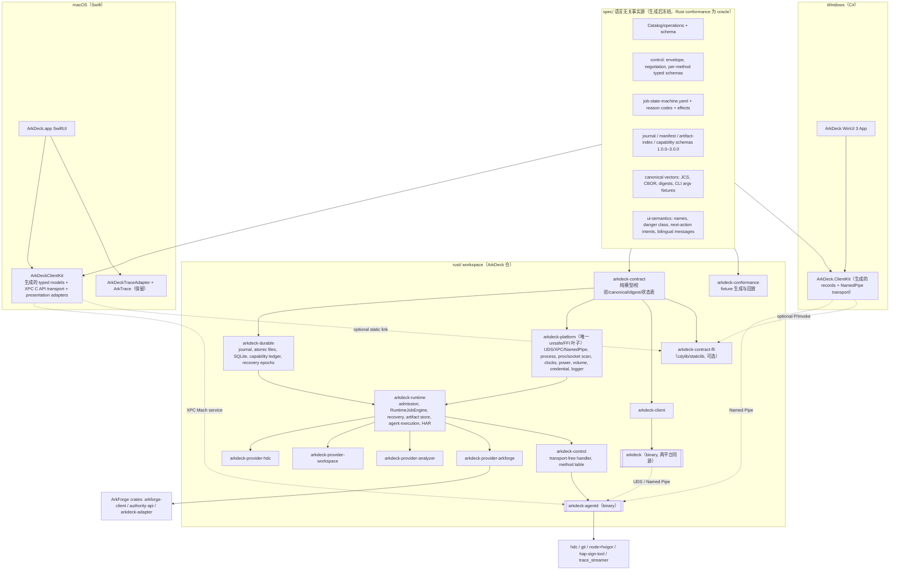
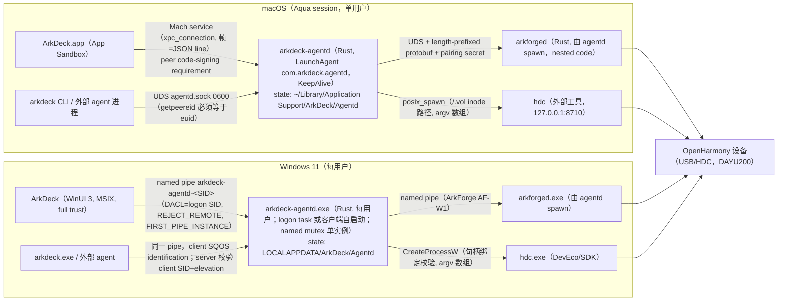
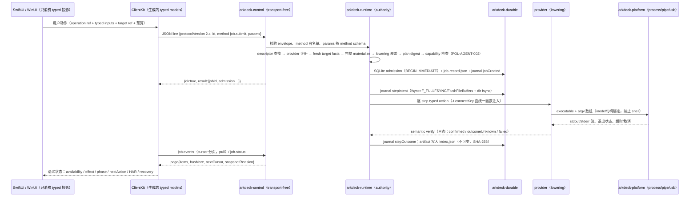
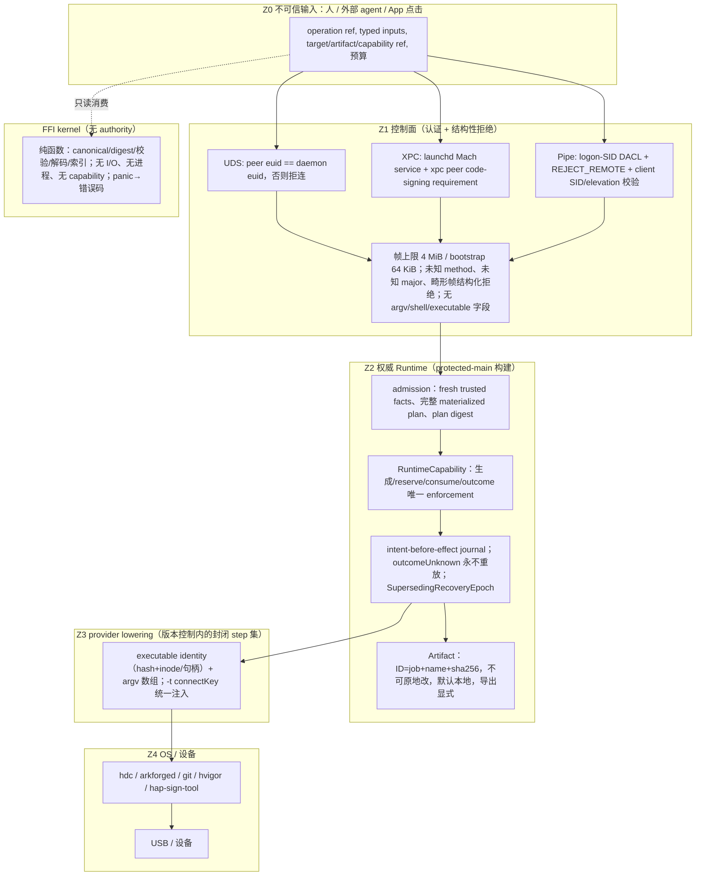
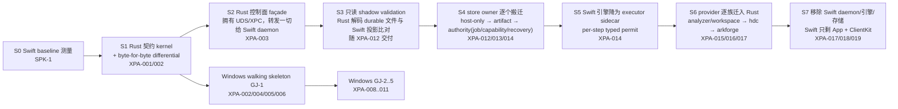
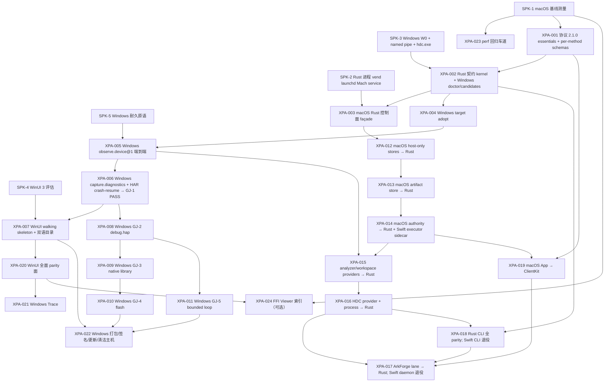

# ArkDeck 下一阶段跨平台架构设计与可执行任务规划

> Status：draft v0.2（design input，非 normative；2026-09-04 起草，2026-09-05 随 CHG-2026-074 r2 修订 §I）。本文是 `openspec/changes/chg-2026-074-shared-rust-runtime-core/` 的设计输入，不是 accepted spec 或 ADR；`CHG-2026-074` 与 `TASK-XPA-*` 只有在维护者合并该 change 的 proposal PR 后才成立。
> 基线：protected `main` = `ad94b32e`（2026-09-05；§I 的实测与车道引用以此为准，其余章节写于 `238a2fb2`），Catalog digest `508783acdf9e9b13d2d4a969e7e26f6fd60094a39d1cc9e02d2198e02ea13684`，ratified baseline CORE-3.0.0（candidate CORE-4.0.0）。
> 边界：本文不修改生产代码、Catalog、accepted specs、baseline、Profile 或安全策略。按 `openspec/architecture/core-portability.md:30,34`，本方案要开工必须先经维护者批准一个 architecture/platform change，即 `CHG-2026-074`（proposal、tasks、verification、design、spec-impact 见该 change 目录）。
> 引用约定：仓库事实用 `path:line`（相对仓库根，`Sources/…`/`Tests/…` 省略 `Packages/ArkDeckKit/` 前缀）；外部仓库 ArkForge 以 `ArkForge/<path>:line` 标注（本地只读 checkout，git tip `5a369a2`）；平台/工具链判断引用官方一手资料 URL。
> 阅读顺序：A 结论 → B 事实与冲突 → C 决策矩阵 → D 目标架构 → E/F 边界与契约 → G 迁移 → H UX parity → I 性能 → J 任务 DAG → K 风险 → L 维护者决策。

---

## A. Executive recommendation

**唯一推荐方案：方案 3「Hybrid」的严格形态，即「Rust 权威 Runtime daemon + 各平台原生 UI 经本地 IPC 消费 + 一个受限的纯计算 FFI kernel」。** 具体：

1. **权威执行层整体迁入 Rust 进程 `arkdeck-agentd`**（保留现有 launchd label `com.arkdeck.agentd` 与二进制名，避免安装面变化）。admission、Job/journal/recovery、capability、artifact、provider lowering、进程执行全部只在这一个进程内，单实例、单写者。它是现有 Swift `arkdeck-agentd` 的逐店铺（store-by-store）替换，不是重写。
2. **macOS 保留 SwiftUI App**，通过 launchd Mach service（XPC C API）访问 daemon；**Windows 用 WinUI 3 / Windows App SDK 2.x**，通过 user-private Named Pipe 访问同一 Rust daemon；CLI 改为单一 Rust 实现，两端同一二进制源码。
3. **FFI 只允许一个 crate `arkdeck-contract-ffi`**，内容限定为确定性纯计算：canonical JSON/CBOR、digest、schema/文档校验、离线 journal/artifact index 解码、（按需）Viewer 大树索引。它没有任何 authority、I/O 或副作用；panic 在边界捕获并返回错误码。它是可选优化，不是架构依赖。
4. **语言无关契约成为唯一事实源**：Catalog、JSON Schema、逐 method typed schema、状态机表、reason code、canonical vectors、CLI fixtures 全部放入 `spec/` 类目录，Rust 与 Swift/C# 都从它生成或直接消费；迁移期以 Swift 为旧字节的 oracle、Rust 为新实现，通过 byte-for-byte differential 与只读 shadow 证明相等后再切换 owner。
5. **迁移是 strangler，不是 big-bang**：第一刀是 Rust「控制面 façade」拥有 socket/XPC/pipe 并把未迁移方法转发给 Swift daemon；随后按 durable store 的 owner 逐个搬迁（host-only 存储 → artifact → admission/job/capability/recovery），provider 逐族搬迁，Swift 最终只剩 App 与客户端 SDK；Swift daemon/引擎/存储 target 的删除（XPA-017）只在 Rust CLI 与 App 都已脱钩（XPA-018/019）之后进行，仓库不经过「客户端链接已删模块」的中间态（r3）。每一步 macOS 都可发布、可通过 LaunchAgent 指回 Swift daemon 回滚，数据 schema 在迁移期零升版。
6. **Windows 从最薄的真实 GJ-1 walking skeleton 开始**（`arkdeck doctor` → `device candidates` → `target adopt` → `observe.device@1` → `capture.diagnostics@1` → 重启后可读），每个 PR 推进一个 hop，然后 GJ-2～GJ-5。

淘汰理由摘要：方案 2（进程内 cdylib）把 authority 放进每个客户端进程，破坏「唯一 owner / 单写者」与 crash isolation，且沙箱 App 在结构上不能拥有设备副作用；方案 1（纯 daemon、零 FFI）与推荐方案只差一个可选的纯计算 kernel，差异在 Viewer/离线解析的跨平台一致性与性能，因此推荐方案吸收方案 1 为骨干、把 FFI 收窄为「无 authority 的纯函数」。详见 §C 决策矩阵。

本方案**必须**经维护者批准一个 architecture/platform change 才能开始，因为它反转了 `openspec/architecture/core-portability.md:9`/`:30` 的现行决策（共享二进制在 v1 不是要求，引入共享 library 必须走 architecture/platform change 并同步更新三份 Profile）。所需批准点见 §L。

---

## B. Current facts, conflicts and assumptions

### B.1 当前事实与冲突表

分类：**F**=当前事实 · **H**=历史记录 · **C**=candidate/未批准决策 · **I**=推断 · **M**=缺失证据。

| # | 主题 | 结论 | 类 | 出处 |
|---|---|---|---|---|
| 1 | 权威顺序 | Constitution Safety invariants/POL-* > `PRODUCT-LOOP.md` > `AGENTS.md` > specs/contracts > profile > enforcement/policy > 代码 | F | `AGENTS.md:22-24`；`PRODUCT-LOOP.md:1075-1076` |
| 2 | 阶段 | 产品闭环优先阶段自 2026-07-30 生效；治理框架冻结；一个问题 = 一个垂直任务 = 一个 PR | F | `PRODUCT-LOOP.md:3,25-49,187-224` |
| 3 | GJ 状态 | GJ-1～GJ-5 于 2026-09-02 在 digest `508783ac…` 上 headless `REAL_DEVICE_PASS`；29 个 canonical operation 真机覆盖 29/29（2026-09-03 补跑） | F | `docs/design/references/v1.6-goal/real-device-validation.md:209-227,217-218,260-262`；`docs/design/references/v1.6-goal/gj-headless-rerun-2026-09-02.json:3-10,834`；`docs/design/arkdeck-cli-product-spec.md:1573` |
| 4 | 当前 digest 与 GJ digest 一致 | 生成物、registry、coverage 三处同一 digest；Catalog 30 个 descriptor（29 canonical + `flash.dayu200` alias） | F | `Packages/ArkDeckKit/Sources/ArkDeckCore/RuntimeOperationCatalogGenerated.swift:7`；`Catalog/generated/effect-authorization-matrix.md:6`；`openspec/contracts/cli-command-registry.yaml:3`；`openspec/contracts/cli-feature-coverage.json:4` |
| 5 | 冻结解除条件已满足 | §20 冻结「新平台支持/大规模 Package 重构」直到 GJ-1/GJ-2 PASS；现已 PASS。但 §12「结构性改动必须和一个 GJ 同车」仍然有效 | F | `PRODUCT-LOOP.md:1004-1029,702-725` |
| 6 | 四类 Repo 审批 | 新 operation/破坏性修改、新 provider、新 integration/device profile、E2 策略变化必须 change + 维护者 review | F | `AGENTS.md:37-40`；`PRODUCT-LOOP.md:1081-1083` |
| 7 | Core 可移植性现行决策 | 「language-neutral contracts + 各平台 native 实现」；三份 Profile 固定策略值 `native-conforming-shared-contract-vector-suite`；引入共享 Rust/C++/WASM library 须先走 architecture/platform change 并同步更新受影响 Profile | F | `openspec/architecture/core-portability.md:9,11,30,34` |
| 8 | Profile 状态 | macOS `needsReverification`（CORE-3.0.0 MAJOR 后）；Windows/Linux `notStarted`；未 verified 不得声明 supported | F | `openspec/platforms/PLATFORM-PROFILES.lock.yaml:14-23,30-35`；`openspec/baselines/CORE-3.0.0.yaml:21-24` |
| 9 | Baseline | ratified = CORE-3.0.0（2026-07-30）；candidate = CORE-4.0.0；架构文档 header 仍写 CORE-2.0.0 | F（冲突） | `openspec/config.yaml:1-2`；`openspec/baselines/CORE-4.0.0.yaml:4-5`；`openspec/architecture/system.md:3-4`；`core-portability.md:4-5`；`openspec/platforms/macos/profile.md:6` |
| 10 | Windows transport 方向 | CLI 规格与 ADR-0005 均指向 user-private named pipe；TCP/HTTP 明确禁止 | F | `docs/design/arkdeck-cli-product-spec.md:104-106,1339-1354,1994-2000`；`docs/adr/0005-agentd-uds-control-plane.md:12-14,21-23,41-42` |
| 11 | Windows 实现语言的现行假设 | 规格设想 C#/.NET 或 C++ 独立实现、共享 fixtures 而非 Swift 源码；「Windows 复刻可以只阅读 language-neutral registry/schema/fixtures」 | F | `arkdeck-cli-product-spec.md:1325-1327,2141-2142`；`openspec/platforms/windows/profile.md:15-21` |
| 12 | Windows Slice D 未开始 | 不阻断 macOS-only claim，阻断跨平台 claim | F | `arkdeck-cli-product-spec.md:1584-1586,1874-1882` |
| 13 | 控制面协议 | LF 分隔 JSON 行；请求 `{protocolVersion,id,method,params}`；`2.0.0` target / `1.0.0` legacy；bootstrap `protocol.negotiate` 上限 65,536 B；daemon 入站帧上限 4 MiB（超限直接关连接）；客户端响应上限 8 MiB；一连接一请求；一请求恰一响应 | F | `Packages/ArkDeckKit/Sources/ArkDeckCore/ControlProtocolGenerated.swift:5-12`；`Sources/ArkDeckAgentDaemon/AgentDaemon.swift:34-65,293-329,5086,5094-5121`；`Sources/ArkDeckAgentClient/AgentClient.swift:95-96,148,151` |
| 14 | **44 个方法只在协议 1.x 发布** | `job.cancel`、`job.reconcile`、`operation.list/describe`、`device.candidates`、`target.list/availability`、`artifact.quota`、`cleanupDebt.*`、`runtime.hdc-status`、`flash.*` 只读面等不在 75 个 target 方法内；schema 列 119 个方法 | F | `ControlProtocolGenerated.swift:11`；`openspec/contracts/runtime-control-plane.schema.json`（`x-arkdeck-methods` 119 项、75 项 `publishedOnTargetProtocol`）；`Sources/ArkDeckCLI/ArkDeckRuntimeCommands.swift:4166` |
| 15 | 无逐 method typed schema | `$defs.request.params` 仅 `{"type":"object"}`，result 无约束；typed 只在 Swift 侧 | F | `runtime-control-plane.schema.json`（同上）；`Sources/ArkDeckAgentDaemon/AgentXPCListener.swift:224-327` |
| 16 | 事件流 | 只有 pull：`job.events` 游标分页（pageSize 默认 100、上限 1000，AEAD 封装 cursor）；CLI 250 ms 轮询；无 server push | F | `AgentDaemon.swift:1155-1187`；`Sources/ArkDeckStorage/JournalEventPages.swift:12,121-135`；`Sources/ArkDeckCLI/CLIJobEvents.swift:83-165,164` |
| 17 | 对端身份 | UDS 检查 `getpeereid`，但 UID 不符**仍处理请求**，只影响 console 资格；ADR-0005 明言「本用户可达即授权边界（MVP）」 | F | `AgentDaemon.swift:5144-5194`；`docs/adr/0005-agentd-uds-control-plane.md:12-14` |
| 18 | App 到 daemon 的路径 | 沙箱 App 无法 `connect()` AF_UNIX（实测 EPERM），唯一通道是 launchd Mach service `com.arkdeck.agentd`（`NSXPCListener`，`shouldAcceptNewConnection` 接受一切，按帧白名单准入）；App 不 import `ArkDeckAgentClient` | F | `ArkDeckApp/ArkDeckApp.entitlements:26-41`；`AgentXPCListener.swift:26,44-51,159-222`；`Sources/ArkDeckWorkflows/XPCConnectionBox.swift:26-98`；`Packages/ArkDeckKit/LaunchAgents/com.arkdeck.agentd.plist`（注释）|
| 19 | XPC 门的实际范围 | 代码转发只读白名单 **加** typed `job.plan/submit/run/cancel` 门；entitlements 注释仍称「只转发只读白名单」 | F（冲突） | `Sources/ArkDeckCore/AgentXPCContract.swift:120-142,147-240`；`AgentXPCListener.swift:156-158,190-221`；`ArkDeckApp.entitlements:34-37` |
| 20 | App 的组合方式 | App 22,612 行 Swift/33 文件；`@main` 组合根构造 14 个 `*ApplicationFacade.make()`；facade 与 `*Presentation` 类型位于 `ArkDeckWorkflows`（引擎模块）；App 无单元测试 target，59 个 UI test 方法 | F | `ArkDeckApp/App/ArkDeckApp.swift:88-157,100-135`；`ArkDeck.xcodeproj/project.pbxproj:468,490`；`Sources/ArkDeckWorkflows/RuntimeHistoryApplicationFacade.swift:26,143,295` |
| 21 | 部署目标冲突 | Package 与 Xcode 工程要求 macOS 26；Profile/ADR-0002 写 macOS 14/arm64 | F（冲突） | `Packages/ArkDeckKit/Package.swift:7`；`ArkDeck.xcodeproj/project.pbxproj:691,710,739,777`；`openspec/platforms/macos/profile.md:9`；`docs/adr/0002-macos-v1-sandboxed-distribution.md:18` |
| 22 | 代码规模（本次实测，HEAD 238a2fb2） | Packages Sources 157,432 行/267 文件；App 22,612 行；ContractTests 101,656 行/193 文件；UI tests 5,963 行。用户线索「约 15 万行」偏低 | F | `find … -name '*.swift' \| xargs wc -l`；模块明细见 §E |
| 23 | 无 Rust/C#/Windows 工程 | 仓内无 `Cargo.toml`、`.rs`、`.cs`、`.csproj`、modulemap；唯一 C 为 code-sign helper 与两处 fixture | F | `git ls-files` 过滤；`Packages/ArkDeckKit/Tools/OpenHarmonyNativeCodeSignHelper/main.c` |
| 24 | **ArkForge 已是 Rust daemon 先例** | 15 crate workspace、76,377 行 Rust、零第三方运行时依赖、Rust 1.98/edition 2024、`panic="abort"`；UDS（0700/0600）与 Windows Named Pipe（logon SID DACL、`PIPE_REJECT_REMOTE_CLIENTS`、`FILE_FLAG_FIRST_PIPE_INSTANCE`、client SQOS identification）；length-prefixed Protobuf，16 MiB 帧、深度 16；Swift SDK 3,524 行以内联 hex 向量维持字节一致；`spec/` 为语言无关正本，Rust 为 oracle 生成 conformance fixtures | F（外部仓库） | `ArkForge/Cargo.toml:1-36`；`ArkForge/docs/architecture.md:338-400,1508-1584`；`ArkForge/crates/arkforge-ipc/src/wire.rs:1-22`；`ArkForge/crates/arkforge-platform/src/lib.rs:1-5,246-259`；`ArkForge/crates/arkforge-platform/src/platform.rs:34-45,474,513`；`ArkForge/docs/decisions/AFD-0005-language-neutral-spec.md:1-39`；`ArkForge/crates/arkforge-ipc/tests/swift_sdk_vectors.rs:20-37` |
| 25 | ArkDeck 如何用 ArkForge | `arkdeck-agentd` spawn `arkforged`（nested code，无第二个 LaunchAgent，pairing secret 走 stdin，空 entitlements）；Swift 侧 `ArkForgeLaneHost` 经 UDS + length-prefixed frames；`adapters/arkforge-arkdeck-adapter` 是 ArkForge 仓内已存在的 Rust authority-side adapter，ArkDeck 当前未用 | F | `ArkForge/docs/decisions/AFD-0003-arkforged-signing-packaging.md:50-64,66-92`；`Sources/ArkDeckWorkflows/ArkForgeLaneHost.swift:88,97-106,426-431`；`Sources/ArkDeckAgentDaemonMain/main.swift:666-691,1147-1228`；`ArkForge/docs/architecture.md:309-311,388` |
| 26 | ArkForge Windows 状态 | AF-W1 Named Pipe/ACL/WinUSB/签名脚本已落地并通过 MSVC 交叉检查，**尚未在合格 Windows x64 runner 真实跑绿** | F（外部） | `ArkForge/TASKS.md:17`；`ArkForge/README.en.md:34-36` |
| 27 | 持久化布局 | 根 `~/Library/Application Support/ArkDeck/Agentd`：`jobs/<id>/journal.jsonl` + `job-record.json` + `manifest.json`；`artifacts/<id>/index.json`；`capabilities/`（doc 2.0.0 + JSONL ledger，128 事件 checkpoint）；`targets/`；`runtime-jobs.sqlite3`（schema v2、WAL、`synchronous=FULL`、`BEGIN IMMEDIATE`）；`instance.lock`；session-storage 等 | F | `Sources/ArkDeckCore/AgentXPCContract.swift:17-31`；`Sources/ArkDeckWorkflows/RuntimeJobRecord.swift:139`；`Sources/ArkDeckStorage/RuntimeJobRepository.swift:63-64,87-96,539-581,738`；`Sources/ArkDeckStorage/RuntimeCapabilityStore.swift:146-148,222-234`；`Sources/ArkDeckWorkflows/Artifacts/RuntimeArtifactStore.swift:316-320,2084-2086` |
| 28 | Journal 耐久语义 | 每事件 `write`+`fsync`+`F_FULLFSYNC`+目录 `fsync`；`O_APPEND\|O_NOFOLLOW` 0600；无 hash 链，靠 tail cursor（末记录 SHA-256 + stat）；torn tail 用 `ftruncate` 修复；每 job `.manifest.lock` `flock(LOCK_EX)` 并重验 dev/ino/uid/nlink | F | `Sources/ArkDeckStorage/DurableFiles.swift:88-133,144-216,284-298,318-319,334-335,368-378,628-673`；`Sources/ArkDeckStorage/JournalReplay.swift:142-157,602-604` |
| 29 | Journal 版本漂移 | Swift 接受 `1.0.0/2.0.0/2.1.0/2.2.0/3.0.0` 五代；契约 `journal-event.schema.json` 仍 `const "1.0.0"` | F（冲突） | `Sources/ArkDeckStorage/JournalEvent.swift:65-69,76-92,634-636`；`openspec/contracts/journal-event.schema.json:3,19` |
| 30 | 状态机是代码 | `JobState` 20 态/6 终态、`allowedDestinations(from:mode:)` 是 `switch`；规格里是 ASCII 图；`simulated` 不是引擎 mode，只是 manifest/展示词汇 | F | `Sources/ArkDeckCore/JobStateMachine.swift:1-4,6-9,36-38,488-493,558-620`；`openspec/specs/workflow-journal-recovery/spec.md:82-112`；`Sources/ArkDeckStorage/SessionManifest.swift:905,983,1057-1060` |
| 31 | Canonical 形态 | JCS（UTF-16 code unit 键序、ECMAScript 数字、不转义 `/`）+ 10 向量 5 拒绝；deterministic CBOR 只用于 StepPermit 并与 Rust 交叉验证；digest 全部 SHA-256 小写 hex；Catalog digest 由 Python 生成器算（Profiles 不入 digest） | F | `Sources/ArkDeckCore/PortableCanonicalJSON.swift:16-41,85,97-183`；`openspec/contracts/cli-canonical-json-vectors.json`；`Sources/ArkDeckCore/CanonicalCBOR.swift:24`；`scripts/catalog_gen/generate.py:741-748` |
| 32 | 机器契约的事实源是 Swift | `arkdeck maintainer contracts export/check` 从 Swift 构建生成十项 `openspec/contracts/` 产物与 219 个 argv fixture；零漂移测试钉在 main | F | `Sources/ArkDeckCLI/CLIMachineContracts.swift:1-90`；`Tests/ArkDeckContractTests/CLIMachineContractTests.swift:29,580`；`arkdeck-cli-product-spec.md:1564-1572` |
| 33 | Darwin 绑定密度 | ArkDeckCore 与 TraceAdapter 无 Darwin import；Process 5/5 文件、Storage 17、Workflows 32 处 `import Darwin`，另有 `Security/LocalAuthentication/IOKit/os/AVFoundation/CoreGraphics` | F | 逐模块统计见 §E.1（engine 盘点） |
| 34 | 进程执行器 | `posix_spawn`，argv[0] 用 `/.vol/<dev>/<ino>` inode 路径，执行前后双重 revalidate；25 ms `poll` 抽取；无 kqueue | F | `Sources/ArkDeckProcess/VerifiedRegularFileDescriptor.swift:130-142,180-219`；`Sources/ArkDeckProcess/ArkDeckProcess.swift:6-9,1030`；`Sources/ArkDeckProcess/IdentityBoundDaemonLauncher.swift:20-23,165` |
| 35 | HDC supervisor 观测 | `proc_listallpids/proc_pidpath/proc_pidinfo/sysctl KERN_PROCARGS2`、socket 归属解码，全部 libproc | F | `Sources/ArkDeckOpenHarmony/HDCSupervisorObservationProbeRegistry.swift:310-401`；`Sources/ArkDeckOpenHarmony/ArkDeckOpenHarmony.swift:655-740` |
| 36 | 引擎单文件 | `RuntimeJobEngine.swift` 10,252 行 actor；admission 各阶段可定位 | F | `Sources/ArkDeckWorkflows/RuntimeJobEngine.swift:813,1251,1556-1610,7084-7131,7370-7498,7623-7680,8120-8177` |
| 37 | 性能门现状 | 只有 ratio/内存/opt-in 断言；无 XCTest `measure`；无跨 run 比对；soak fixture 零调用方；实测：journal append 3.6–5.3 ms/事件、10k 事件恢复 1.56 s（门 5 s）、128 MiB 流式 RSS 增长 <48 MiB、App 冷启动独立 0.994 s/批量 3.6–7.6 s | F | `Tests/ArkDeckContractTests/ViewerScalePerformanceTests.swift:9-28`；`JournalRecoveryContractTests.swift:16-47`；`RuntimeJobEngineContractTests.swift:1054-1084`；`RuntimeArtifactContractTests.swift:354-419`；`Tests/ArkDeckRuntimeSoakFixture/main.swift:30,209-210`；`docs/design/implementation-audit-2026-08-27.md:53`；`openspec/changes/chg-2026-071-interactive-device-control/evidence/runs/TASK-IDC-001/data/journal-append-bench.txt` |
| 38 | CI 车道 | merge gate `swift-ci.yml`（macos-26，30 min，`build-for-testing` 不跑 UI）；nightly `swift-slow-lanes.yml`（4 个 env-gated 慢测 + UI）；无 perf 产物归档 | F | `.github/workflows/swift-ci.yml:89-90,161-162`；`.github/workflows/swift-slow-lanes.yml:23-27,38-42,65-73` |
| 39 | 发布状态 | 无 git tag；`MARKETING_VERSION 0.1.0`；ADR-0002 四道 release gate 未满足（Developer ID 未就位等）；自动更新为自研 Ed25519 feed + Finder 交接 | F | `git tag`；`project.pbxproj:740`；`docs/adr/0002-macos-v1-sandboxed-distribution.md:69-80`；`docs/release/macos-auto-update.md:3-21` |
| 40 | 活跃任务 | 最近合入均挂 `TASK-AIN-021`（in-progress，Allowed paths 覆盖 App/Packages/Catalog/docs/design）；`TASK-AIN-026`（contracts，明言面向 Windows 复刻）；`TASK-AFG-002` in-progress；无 Windows/Rust 相关 change 或 ADR | F | `openspec/changes/chg-2026-025-ai-native-unattended-device-ops/tasks.md:3750-3818,4147-4209`；`openspec/changes/chg-2026-070-arkforge-generic-integration/tasks.md:38-105`；`docs/adr/` 目录 |
| 41 | 路径护栏机制 | active task = 非归档 `chg-*/tasks.md`；一个 PR 只能声明一个 Task；新 operation/provider/profile 的受限 supplement 由 checker 机械校验 | F | `scripts/check_pr_paths.py:411-442,474-487,590-645,944-1137` |
| 42 | ADR-0009 依据已失效 | 其论证的四个符号在仓内零命中，维护者尚未裁决决策 2/4 今日由何承载 | F（悬而未决） | `docs/adr/0009-campaign-unknown-outcome-authority.md:3-14` |
| 43 | Windows App SDK 现状（官方） | 稳定版 2.4.0（2026-08-13）、2.3.1（07-16）…；2.0 起 SemVer；runtime installer 提供 x64/x86/arm64；WinUI 3 支持 Windows 10 1809+；framework-dependent vs self-contained；`PublishSingleFile` 仅 unpackaged+self-contained；Native AOT 自 1.6 起支持（需 CsWinRT 2.1.1，`{Binding}` 需手工 root） | F（外部） | learn.microsoft.com（§C/§H 引用） |
| 44 | 用户线索校正 | 「macOS App 通过 XPC 进入同一 Runtime admission」正确；「约 15 万行 Swift」应为 ~18 万行生产代码 + ~10.8 万行测试；「12/29 覆盖」已是历史，现为 29/29 | I/F | 本表 #18、#22、#3 |
| 45 | 缺失证据 | (a) 无任何 Windows 主机/设备的仓内证据；(b) daemon 冷/热启动、IPC p50/p95/p99、artifact 吞吐、cancel 往返、idle RSS 均无基线；(c) ArkForge AF-W1 真机未绿；(d) 本机 `cargo 1.68`，低于 ArkForge 钉的 1.98（需 rustup） | M | 本机 `cargo --version`；`ArkForge/rust-toolchain.toml` |

### B.2 裁决与假设

- **冲突裁决**：#9 架构文档 header 的 CORE-2.0.0 视为历史记录，行文以 `config.yaml` 的 CORE-3.0.0 为准；#19 以代码为准，entitlements 注释视为文档漂移；#21 以工程文件（macOS 26）为当前事实，Profile 的「macOS 14」为历史，需维护者对齐（§L）；#29 以 Swift 五代为当前事实，契约需补记（§F）。
- **假设 A1**：Windows 首发支持格为 Windows 11 x64 + ARM64（Prism x64 仿真只在 Win11，且 Rust `aarch64-pc-windows-msvc` 已 Tier 1）。
- **假设 A2**：验证硬件沿用 DAYU200 `TGT-958780b2ffb7`（binding r4，固件 7.0.0.37）；新增一台 Windows 11 x64 主机与一台 ARM64 主机是新的硬件前置。
- **假设 A3**：ArkDeck Rust workspace 不继承 ArkForge 的零依赖政策，改为经审查的依赖白名单（`cargo deny`/`cargo vet`），但所有安全相关编码（JCS、CBOR、SHA-256）保留自有实现并以向量钉死。需维护者确认（§L）。
- **假设 A4**：GJ 四态是「按 digest」记录的；Rust runtime 切换后同一 digest 上必须重新取得 `REAL_DEVICE_PASS`（类比 POL-PLATFORM-002 的 needsReverification）。这是本文引入的规则，需维护者确认（§L）。

---

## C. Architecture alternatives and decision matrix

### C.1 候选方案

| 编号 | 方案 | 一句话 |
|---|---|---|
| **P1** | Rust daemon/runtime core；SwiftUI 与 WinUI 只经平台原生本地 IPC 访问 | authority 在一个 Rust 进程；客户端零共享代码 |
| **P2** | Rust `cdylib`/static library；C ABI；Swift bridge 与 C# P/Invoke 进程内调用 | 每个客户端进程内嵌 Runtime |
| **P3** | Hybrid：authority 在 Rust daemon；仅确定性、无副作用或高频数据处理经受限 FFI | P1 骨干 + 纯计算 kernel |
| P4（补充） | 把现有 Swift daemon 交叉编译到 Windows（swift.org Windows 工具链） | 保留 Swift，不引入 Rust |
| P5（补充，即现行决策） | Windows 用 C#/.NET 独立实现 Runtime，只共享 contracts/fixtures | `core-portability.md:9` 的现行路线 |

P4/P5 不在题目要求的三方案之内，但它们是「不做 Rust」的两条真实替代，必须被明确淘汰而不是忽略。

### C.2 决策矩阵

评分：**◎** 满足且成本低 · **○** 可满足 · **△** 需额外机制 · **✕** 结构性不满足。每格给出依据。

| 维度 | P1 Rust daemon | P2 cdylib 进程内 | **P3 Hybrid（推荐）** | P4 Swift 跨编译 | P5 C# 独立实现 |
|---|---|---|---|---|---|
| 安全 authority 与 single-writer | ◎ 与 ADR-0005/ArchitectureRules 一致：唯一 daemon、flock 单实例（`SingleInstance.swift:26-49`）、每 store 唯一 owner | ✕ authority 进入每个客户端进程；沙箱 App 持有 capability/journal 写权违反 `ArchitectureRules.md:94-104`「事实源唯一」与 AGENTS「UI 只消费 use case」 | ◎ 同 P1；FFI kernel 无 authority、无 I/O，结构上不能派发 | ○ 同 P1 的进程形态，但 Windows 上需重写 Darwin 绑定的 Process/Storage/OpenHarmony（§E.1 密度） | △ 两套 authority 实现（Swift/C#），语义漂移由 121 条 AC + 219 fixture 兜底，但 recovery/crash 长尾无向量（ArkForge AFD-0005 已证明「跨语言契约太薄」） |
| crash isolation / journal recovery / unknown outcome | ◎ daemon 崩溃不伤客户端；launchd `KeepAlive` 重启（`com.arkdeck.agentd.plist`）→ `recoverActiveJobs` 只读回不派发（`RuntimeJobEngine.swift:5523-5561`）；Rust `panic=abort` 等价于今日 fixture 已测的崩溃窗 | ✕ Rust panic/abort 直接杀 App；一个 UI 崩溃就是一次 outcomeUnknown | ◎ daemon 同 P1；FFI 以 `panic=unwind`+`catch_unwind` 转错误码，且只处理纯输入 | ○ 同 P1 | ○ 各自实现 |
| ABI/API/协议版本演进 | ◎ 沿用 JSON-lines + `protocol.negotiate`（`ControlProtocolNegotiation.swift:36-143`），已有兼容测试（`AgentDaemonContractTests.swift:1840-1917`） | △ C ABI 需自建版本函数、buffer 所有权、错误结构；Swift/C# 两套 binding 随每次 ABI 变更同步 | ○ 协议同 P1；FFI 面极窄（JSON in/out + ABI version），变更频率低 | ○ 协议同 P1 | ○ 协议同 P1，但两套 handler 实现 |
| async stream / 取消 / backpressure / 订阅 | ○ 现行 pull 分页（`job.events`）保持 CLI-REQ-025；可在 2.x 追加有界 long-poll unary（一请求一响应） | △ 进程内回调看似方便，实则要在 UI 进程内实现取消与背压，且和「一响应」契约无关 | ○ 同 P1 | ○ 同 P1 | ○ 同 P1 |
| 大 Artifact 传输、复制次数、内存 | ○ 今日 `artifact.read` 内联 base64 分页 4 MiB（`AgentDaemon.swift:2040-2096`，`ArtifactResourceContract.swift:29`）≈3–4 次拷贝；可追加 fd/handle 传递做零拷贝（UDS `SCM_RIGHTS`、XPC `xpc_fd_create`、Windows `DuplicateHandle`） | ◎ 零拷贝天然，但代价是 authority 进程内 | ○ 同 P1；Viewer 大树若走 FFI 则索引在 UI 进程内零拷贝 | ○ | ○ |
| App Sandbox / 签名 / 公证 / MSIX 与更新 | ◎ macOS：daemon 是 LaunchAgent nested code（AFD-0003 先例，空 entitlements，Developer ID+Hardened Runtime）；Windows：daemon 与 CLI 可 xcopy/自包含，App 走 MSIX；Rust 二进制只需 Authenticode/Developer ID | △ cdylib 必须随 App 一起签名/公证，dylib 进沙箱；Windows 上 NativeAOT/trim 与 P/Invoke 组合尚需验证 | ○ 同 P1；FFI 静态库进 App 一起签名，面窄 | △ Swift 运行时在 Windows 的分发与签名体验不成熟 | ○ |
| Swift、C#、Rust 调试与测试成本 | ○ 三种语言但边界清晰：Rust 单元/契约测试 + 黑盒 daemon 测试；Swift/C# 只测 UI 与 SDK | ✕ 崩溃在 UI 进程内跨语言栈；符号化、内存所有权问题最难调 | ○ 同 P1；FFI 有独立 fuzz 与向量 | △ Swift on Windows 的调试/覆盖率工具链弱 | ○ 两套 Runtime 测试全套翻倍 |
| x64 / ARM64 / Apple silicon | ◎ Rust `aarch64-apple-darwin`、`x86_64/aarch64-pc-windows-msvc` 均 Tier 1（后者自 1.91） | ◎ 同 | ◎ 同 | △ Swift Windows ARM64 支持成熟度低于 Rust | ◎ .NET 全支持 |
| 部署、回滚、旧客户端兼容 | ◎ 回滚 = LaunchAgent/服务指回旧二进制；旧 Swift CLI 与 App 对新 daemon 仍走同一协议 | ✕ 回滚要重发 App/CLI 全部包；旧客户端内嵌旧 Runtime 与新 daemon 并存 = 两个写者 | ◎ 同 P1；FFI kernel 与 daemon 版本独立（纯函数） | ○ | ○ |
| 性能、可观测、长期维护 | ◎ 单进程热路径；os_log/ETW 端口；Rust 无 GC；一份实现 | △ 省一次 IPC，但把 fsync/进程/USB 绑进 UI 进程 | ◎ 同 P1，Viewer/离线解析可再降一次拷贝 | ○ 性能同类，但 Darwin 绑定重写量≈Rust 重写量却收益更少 | ✕ 长期两份 Runtime 维护 |

### C.3 结论与淘汰理由

- **淘汰 P2**：authority 不能在客户端进程内。这不是性能判断，而是 `ArchitectureRules.md:94-104` 的唯一 owner、`AGENTS.md:41-48` 的 protected-main Runtime 唯一 capability 生成者、以及沙箱 App 不能拥有副作用（`ArkDeckApp.entitlements:26-37` 注释、UX 规格 `macos-ux-interaction-spec.md:125`「点击不是 Runtime authority」）共同决定的。P2 还把 Rust abort 变成 UI 崩溃。
- **淘汰 P4**：Darwin 绑定密度（§E.1：Process 5/5 文件、Storage 17、Workflows 32 处 `import Darwin`，外加 libproc/IOKit/Security/LAContext/XPC/os_log）意味着 Windows 端仍要重写全部端口，收益只是「不换语言」；而 ArkForge 已证明 Rust 端口在本产品族内可行（`ArkForge/TASKS.md:17`）。
- **淘汰 P5（现行决策）**：它把 157k 行 Swift 的 recovery/admission/journal 语义复制到 C#，长期两份事实源；AFD-0005 在 ArkForge 内已用实证否定了「靠向量维持第二实现」的可持续性（`ArkForge/docs/decisions/AFD-0005-language-neutral-spec.md:9-20`）。
- **P1 与 P3 的差别只在 FFI kernel**。推荐 P3 但把 FFI 定义为「可选、纯计算、无 authority」：Viewer 大树索引与离线 journal/artifact 解析在两端一致且零拷贝，是 P1 做不到的 parity 收益；而任何 authority、I/O、进程或设备语义绝不进入 FFI。若 §I 的基线证明 IPC 分页足够，FFI 任务（XPA-024）可以永远不做，架构不受影响。

**唯一推荐：P3。**

---

## D. Recommended target architecture and diagrams

### D.1 目标组件图

依赖方向规则（结构测试钉死，沿用 `ArchitectureBoundaryContractTests` 与 ArkForge `architecture_guard` 的做法）：

- `arkdeck-contract` 不依赖任何平台、I/O、tokio；`arkdeck-platform` 是唯一允许 `unsafe`/`extern "C"`/`windows-sys`/`libc` 的 crate；`arkdeck-runtime` 不依赖 provider 具体类型以外的任何工具路径；provider crates 不能互相依赖；`arkdeck-control` 不含 argv/shell/executable 载体（与 ADR-0005 第 2 条同构）；`arkdeck-contract-ffi` 只依赖 `arkdeck-contract`。
- Swift App 只允许 import `ArkDeckClientKit`、`ArkDeckTraceAdapter`、ArkTrace 与系统框架；禁止 import 任何 Runtime 语义模块（把现有「App 不 import ArkDeckAgentClient」的文件级扫描扩展为「App 不 import ArkDeckWorkflows」）。

### D.2 进程部署图

要点：两个平台的进程拓扑同构，差异只在 transport 与 service manager。Windows 没有 launchd `KeepAlive`，因此 daemon 崩溃后的重启由「下一次客户端连接自启动 + 单实例」承担，恢复语义不变（启动即 `recoverActiveJobs`，零派发）。

### D.3 数据流图（submit → execute → artifact → 展示）

### D.4 信任边界图

不变量到边界的映射：

| 不变量 | 落点 |
|---|---|
| UI 不能执行进程/HDC/shell/设备副作用 | Z0→Z1 只有 typed 方法；App 进程内没有 `arkdeck-runtime`（结构测试）；FFI 无 I/O |
| 外部调用方只能提交 published operation ref/typed inputs/refs/预算 | `arkdeck-control` 方法表封闭 + per-method schema；`FORBIDDEN_FIELD_NAMES`（`scripts/catalog_gen/generate.py:50-113`）延伸到 method schema |
| 只有 protected Runtime 生成/持久化/消费 RuntimeCapability | `arkdeck-runtime` 内唯一 enforcement；控制面无 capability admin 方法（今日已如此，`ArchitectureRules.md:113`） |
| connectKey 只寻址；mutation 前验证稳定身份与 binding revision | `arkdeck-runtime::admission` 的 `validateEvidenceFacts` 等价（`RuntimeJobEngine.swift:3297,3320`）+ 首个外部 effect 前重 materialize（`:8161-8177`） |
| intent-before-effect / durable journal / unknown 永不盲重放 | `arkdeck-durable::journal` 复刻 `DurableFiles.swift` 的 fsync 与 tail cursor 语义；recovery 只读回 |
| Raw Artifact 不可变、本地、显式导出 | `arkdeck-runtime::artifact` 复刻 index/payload verification（`RuntimeArtifactStore.swift:283-320`）与 export 规则（`RuntimeArtifactExport.swift:26-30,103-106`） |
| execute / plan-only / simulated 不混淆 | 状态表数据化保留 `JobExecutionMode`；plan-only 零派发在 `arkdeck-contract` 的 `authorizeDispatch` 等价函数中断言（`JobStateMachine.swift:488-493`） |
| Job/Artifact/Capability/Recovery 唯一 owner | 每个 durable store 在任一时刻只有一个进程持有其 lock（迁移期按 store 整体搬迁，§G） |
| Rust panic / FFI 异常 / daemon 崩溃 / 协议不匹配 fail closed | daemon `panic=abort` + 重启恢复；FFI `catch_unwind` 返回错误；协议 major 不匹配 `protocolVersionUnsupported`、dispatch 0 |
| shadow/differential 只比纯计算/只读投影/plan | §G.3 的白名单：`job.plan`、`operation.list`、`device.candidates`、`job.list/status/evidence`、journal/index 解码；绝不双跑 deviceMutation/destructive |

---

## E. Rust crate/module and platform Port mapping

### E.1 现有模块规模与平台绑定（HEAD 238a2fb2 实测）

| 模块 | 行数 / 文件 | `import Darwin` 文件数 | 其他平台框架 | 备注 |
|---|---|---|---|---|
| ArkDeckCore | 9,627 / 29 | 0 | CryptoKit 3 | 唯一 Darwin-free 的语义模块 |
| ArkDeckRuntime | 3,353 / 12 | 3 | OSLog, CoreFoundation | 契约 + 宿主设施 |
| ArkDeckStorage | 18,432 / 23 | 17 | SQLite, Synchronization | journal/SQLite/capability/recovery |
| ArkDeckOpenHarmony | 7,142 / 11 | 7 | — | libproc/sysctl |
| ArkDeckProcess | 3,198 / 5 | 5/5 | — | posix_spawn, PTY |
| ArkDeckWorkflows | 84,199 / 154 | 32 | os, Security, LocalAuthentication, IOKit, CoreGraphics, ImageIO, AVFoundation, Compression, NIO, ArkForge SDK | 引擎 + providers + facades + 更新 + SSH |
| ArkDeckAgentComposition | 1,602 / 3（内嵌 target） | — | — | 隔离工作区/campaign host 残余 |
| ArkDeckAgentDaemon | 7,369 / 12 | 3 | — | UDS + XPC listener |
| ArkDeckAgentClient | 3,003 / 4 | 1 | — | UDS client |
| ArkDeckCLI | 16,734 / 29 | 5 | AppKit 1 | registry/parser/machine contracts |
| ArkDeckBootstrap | 2,506 / 7 | 7 | Security | tool/bundle registry |
| ArkDeckLaunchAgent | ~1,400（57 KB） | — | Security, ArkForgeClient | launchctl 管理 |
| ArkDeckAgentDaemonMain | 1,550 / 1 | — | — | 组合根 |
| ArkDeckTraceAdapter | 319 / 2 | 0 | UniformTypeIdentifiers | ArkTrace 薄适配 |
| ArkDeckApp（Xcode） | 22,612 / 33 | — | SwiftUI 26, AppKit 9 | 8 页面 + Settings + Trace Viewer |

出处：`Packages/ArkDeckKit/Package.swift:53-153`；import 统计来自本次逐模块 grep；`ArkDeck.xcodeproj/project.pbxproj:468,490`。

### E.2 `migrate / retain / split / wrap / retire / defer` 矩阵

| 现有模块（子域） | 处置 | 目标 crate / 包 | 依据与要点 |
|---|---|---|---|
| ArkDeckCore：Catalog 类型与生成物、`WorkflowEffect`、`JobStateMachine`、`RuntimeCapability` 模型、Target identity、`PortableCanonicalJSON`、`CanonicalCBOR`、`CanonicalDigests`、`ControlProtocolGenerated/Negotiation`、`AgentXPCContract` 常量、`ArtifactResource/ImportContract` | **migrate** | `arkdeck-contract` | 已 Darwin-free；状态机由 `switch`（`JobStateMachine.swift:558-620`）转为 `spec/job-state-machine.yaml` 数据表，Swift 测试断言两者相等后冻结 |
| ArkDeckCore：Swift 侧 DTO | **split** | `ArkDeckClientKit`（生成） | 客户端仍需 Codable 模型，但改由 per-method schema 生成，不再手写 |
| ArkDeckRuntime：v2 请求 DTO、`HumanActionRequired`、crash-ledger schema、`AgentStrictJSON` | **migrate** | `spec/` + `arkdeck-contract` | HAR 文档（`HumanActionRequired.swift:81-113`）先固化为 schema（CLI 规格 §19 已要求 Windows 不得以该 Swift 文件为规范） |
| ArkDeckRuntime：`RuntimeClocks`、`PowerActivity`、`SingleInstance`、`SystemLogger` | **migrate** | `arkdeck-platform` | 双时钟语义（`RuntimeClocks.swift:18,32`）：macOS `mach_continuous_time`/`mach_absolute_time`，Windows `GetTickCount64`（含睡眠）/`QueryUnbiasedInterruptTime`（不含）；契约测试证明睡眠行为，符合 `platform-ports.md:20-21` |
| ArkDeckRuntime：`Activation`（CFMessagePort 二次实例激活） | **retain** | App / ClientKit | 属 App 自身 `PORT-ACTIVATION-001`，与 daemon 无关 |
| ArkDeckStorage：`DurableFiles`、`JournalEvent/Replay/Validation`、`JournalEventPages`、`RuntimeJobRepository`（SQLite）、`RuntimeCapabilityStore`、`RecoveryCoordination`、`SessionManifest/Layout`、`ArtifactStorage`、`RetentionAndExport` | **migrate** | `arkdeck-durable` | 字节级兼容：同 schema 版本、同 fsync 纪律、同 lock 文件名；SQLite 用 `rusqlite`（bundled）读写 schema v2、`PRAGMA user_version` 拒绝更新版本（`RuntimeJobRepository.swift:550-556`） |
| ArkDeckStorage：`AuthorizationUsageLedger` 封闭世代、`HardwareEvidence` V1–V6 解码 | **migrate（decode-only）** | `arkdeck-durable::legacy` | 只解码、不迁移、不再编码（`HardwareEvidenceProjector.swift:942-960`；`AuthorizationUsageLedger.swift:1381-1464`） |
| ArkDeckStorage：`HostStorage`（volume identity / free space） | **migrate** | `arkdeck-platform` | `PORT-VOLUME-001`/`PORT-STORAGE-001`：`statfs f_fsid` vs `GetVolumeInformationByHandleW`+`FileIdInfo` |
| ArkDeckOpenHarmony：parsers（`list targets -v`、version、checkserver）、probe registries、trace probe adapter、authorization polling | **migrate** | `arkdeck-provider-hdc` | 现有 Golden/Probe fixtures（37 文件，hash 钉死）直接复用为 Rust 测试向量 |
| ArkDeckOpenHarmony：supervisor observation（libproc/sysctl/socket 归属） | **migrate + platform port** | `arkdeck-platform::procscan` | Windows：`CreateToolhelp32Snapshot`/`QueryFullProcessImageNameW`/`GetProcessTimes` + `GetExtendedTcpTable(TCP_TABLE_OWNER_PID_LISTENER)`；语义与 `HDCSupervisorObservationProbeRegistry.swift:310-401` 一致 |
| ArkDeckProcess：`FoundationProcessExecutor`、`VerifiedRegularFileDescriptor`、`IdentityBoundDaemonLauncher` | **migrate** | `arkdeck-platform::process` | macOS 保留 `/.vol/<dev>/<ino>` 启动路径；Windows 无 inode 启动，替代：打开可执行文件句柄（`FILE_SHARE_READ`）、hash、`GetFileInformationByHandleEx(FileIdInfo)` 前后一致、启动期间持有句柄；差异写入 Windows Profile |
| ArkDeckProcess：`IdentityBoundPTYExecutor`（签名口令一次交换）、`PersistentDeviceShellChannel`（带退出码框架的持久 `hdc shell`） | **migrate + platform port** | `arkdeck-platform::pty` | Windows 用 ConPTY（`CreatePseudoConsole`）；秘密永不进 argv/env/receipt 的规则不变（`IdentityBoundPTYExecutor.swift:4-6`） |
| ArkDeckWorkflows：`RuntimeJobEngine`、`RuntimeAdmissionService`、`RuntimeRecoveryService`、`Artifacts/*`、`Bootstrap/*`（DeviceBootstrapMachine）、`AgentDeviceOperations`（AgentRuntimeExecutor/HAR）、`RuntimeSessionStorageStore`、`Settings` 存储、`RuntimeJobReadProjection` | **migrate** | `arkdeck-runtime` | 10,252 行单文件引擎按 admission/execution/recovery/artifact/agent-execution 拆模块；语义逐条对照 §D.4 表 |
| ArkDeckWorkflows：`DeviceProviders/*`（HDC adapter、Descriptor-bound dispatcher、Debug/Trace probes、Pointer input、Rockchip live-mode probe、native code sign helper） | **migrate** | `arkdeck-provider-hdc` | `deviceArguments`（`DeviceProviderAdapters.swift:1731-1740`）为唯一 `-t` 注入点；code-sign helper（C）改为随 Rust 构建或 Rust 重写 |
| ArkDeckWorkflows：`WorkspaceProvider/*`（git、hvigor/node、hap-sign-tool、DevEco 口令解码、isolated copies） | **migrate + platform port** | `arkdeck-provider-workspace` | `/usr/bin/git` 硬路径（`WorkspaceOperationsProvider.swift:281,421`）改为 registered toolchain ref；Keychain+`LAContext`（`OpenHarmonyLocalSigning.swift:275-359`）→ Credential Manager（DPAPI）+ presence 门改走 HAR console challenge |
| ArkDeckWorkflows：`AnalyzerProvider/*`（crash signature、hilog summary、ArkTrace summary/analysis envelope 校验） | **migrate（纯计算优先）** | `arkdeck-provider-analyzer` | 三个派生分析器 ~2k 行纯计算；trace 类依赖 trace_streamer/ArkTrace，Windows 先 **defer**（诚实 unavailable） |
| ArkDeckWorkflows：`ArkForgeLaneHost/Session/ControlPerformer/ExecutionAuthority/ManagedControlPort/LoaderObservation`、`RockchipRuntimeComposition` | **migrate（Rust↔Rust）** | `arkdeck-provider-arkforge` | 直接消费 `arkforge-client` 与 `adapters/arkforge-arkdeck-adapter`，去掉 Swift SDK 中转；StepPermit CBOR 向量沿用 |
| ArkDeckWorkflows：`RockchipDeviceBinding`（IOKit USB 枚举） | **wrap** | 经 `arkforged discoverDevices` | ArkForge 已有原生 IOKit/WinUSB 枚举（`ArkForge/crates/arkforged/src/service.rs:58-80`），ArkDeck 不再自持 IOKit |
| ArkDeckWorkflows：13 个 `*ApplicationFacade` 与 `*Presentation` | **split** | 语义投影 → `arkdeck-runtime`（daemon 计算的 status/availability/nextAction/HAR/recovery 投影，已部分存在）；平台胶水 → `ArkDeckClientKit` / `ArkDeck.ClientKit` | 消除 App 对引擎模块的依赖（`ArkDeckApp/App/ArkDeckApp.swift:100-135`） |
| ArkDeckWorkflows：`XPCConnectionBox` | **retire** | `ArkDeckClientKit::XPCTransport`（xpc C API） | NSXPC 与 Rust 侧 `xpc_connection` 不同线协议，必须一起换 |
| ArkDeckWorkflows：`AutoUpdate/*` | **retain（macOS platformService）** | Swift ClientKit/App | Ed25519 feed 校验、Finder 交接是 macOS 特有；语义（检查/下载/验签/用户发起）写入 `ui-semantics` 以便 Windows App Installer 路径对齐 |
| ArkDeckWorkflows：`RemoteBuildSource`（Citadel/NIOSSH，Keychain SSH 凭据） | **retain（DEC-013 platformService）** | Swift App 侧 | CLI 等价路径已定义（`arkdeck-cli-product-spec.md:1625-1627`）；Windows 首版不提供 |
| ArkDeckWorkflows：`DeviceRecordingBudget`、AVFoundation `.mov` 合成 | **split** | 预算/帧率语义 → `arkdeck-runtime`；视频合成 → 平台 App | Windows 用 Media Foundation 或先只交付帧序列 |
| ArkDeckAgentDaemon：`RuntimeControlPlaneHandler`、`AgentXPCListener`、server | **migrate** | `arkdeck-control` + `arkdeck-platform::ipc` + `arkdeck-agentd` | handler 保持 transport-free（`AgentDaemon.swift:89`；ADR-0005 第 3 条） |
| ArkDeckAgentClient | **split** | `arkdeck-client`（Rust，供 CLI）+ `ArkDeckClientKit`/`ArkDeck.ClientKit`（生成） | 现有 deadline/negotiation 契约测试改为黑盒对 Rust daemon 复跑 |
| ArkDeckCLI | **migrate** | `arkdeck-cli` | 219 argv fixtures + envelope/page/nextAction 样本是现成回归面；`maintainer contracts export` 移到 Rust 后事实源翻转 |
| ArkDeckAgentComposition | **migrate / 部分 retire** | `arkdeck-runtime::workspace` | campaign host 已随 CHG-2026-065/066 退役（ADR-0009 注记），只保留 Runtime-owned isolated workspace |
| ArkDeckBootstrap、ArkDeckLaunchAgent | **migrate** | `arkdeck-cli::service` + `arkdeck-platform::service` | macOS `launchctl` argv；Windows Task Scheduler（COM）/客户端自启动；ArkForge.bundle 校验逻辑（`LaunchAgentService.swift:176-261`）同迁 |
| ArkDeckAgentDaemonMain | **retire** | `arkdeck-agentd` | 组合根换语言 |
| ArkDeckTraceAdapter + ArkTrace | **retain（macOS）/ defer（Windows）** | Swift | Trace Viewer 与引擎是 Swift；Windows 走 §H 决策 |
| ArkForge | **retain（外部 Rust）**，消费方式 **wrap → 直连** | — | 由 Swift SDK 中转改为 Rust crate 直连 |
| Citadel / swift-nio-ssh（fork `Wellz26/swift-nio-ssh` 0.3.4） | **retain（App 侧）**，供应链复审 | — | `Package.swift:30-35`；daemon 不再链接 |
| swift-crypto / CryptoKit | daemon **retire**；App **retain** | — | Rust 用自有 sha2 向量；App 更新验签仍用 CryptoKit |
| 系统 sqlite3 | **migrate** | `rusqlite` bundled | schema v2 字节/语义兼容测试 |
| ArkDeckContractTests（101k 行） | **split** | 黑盒 transport/协议测试 → 参数化到 Rust daemon 复跑；引擎内测试 → 逐步 Rust 化；旧字节解码测试 → 转 fixture | 详见 §G.5 |

### E.3 「Rust core」到底包含什么

**包含**：纯领域模型（Catalog、状态机、capability、identity、artifact 契约）、Workflow Engine（admission、materialize、lowering 覆盖、plan digest、dispatch 顺序）、journal/recovery、storage 机制层、provider lowering、agent execution/HAR、artifact store、daemon 控制面。也就是今天 `arkdeck-agentd` 进程里的一切。

**不包含（留在 Swift/C#/平台 Port）**：UI toolkit 与导航、窗口/快捷键/文件选择器/Finder-Explorer reveal（`PORT-FILE-REVEAL-001`）、security-scoped bookmark/文件选择 token（`PORT-FILE-ACCESS-001` 的 UI 半）、App 自身诊断日志的导出 UI、平台更新客户端（macOS Ed25519 feed；Windows App Installer）、SSH 远程构建源（platformService）、Trace Viewer 渲染（ArkTrace）、视频合成。

**平台 Port 的归属**（`platform-ports.md:8-24` 的 14 个 Port）：`ProcessExecutor`、`SingleInstanceGuard`（daemon 半）、`PowerActivityController`、`VolumeIdentityResolver`、`HostStorageProbe`、`ToolTrustInspector`（hash/签名/来源）、`DeviceAccessAdvisor`（诊断，不提权）、`SystemLogger`（daemon 半）、`ElapsedDeadlineClock`、`ActiveWorkClock`、`SleepWakeObserver` 全部在 `arkdeck-platform`（Rust）；`AppActivationService`、`PersistentFileAccess`（UI 半）、`PlatformFileRevealer`、`SystemLogger`（App 半）在各平台 App。

### E.4 Crate graph、公开 API、依赖方向、线程/async 模型、panic 边界

- **公开 API 方向**：`arkdeck-contract` 公开纯类型与纯函数；`arkdeck-durable` 公开 store trait 与具体实现；`arkdeck-runtime` 只公开 `RuntimeHandle`（提交/查询/取消/恢复的 typed 方法）与 provider SPI；`arkdeck-control` 公开 `handle_frame(bytes) -> bytes` 与 method table；`arkdeck-agentd` 只是组合根。任何 crate 的公开 API 不得出现 `command: String`、shell、raw path 参数（结构测试沿用 `ArchitectureBoundaryContractTests.testNoPublicRawCommandStringParameters` 的思路）。
- **async 模型**：`tokio` 单线程 runtime 承载控制面与引擎状态机（每 target lane 一个 actor 任务，等价于今日 `DeviceMutationLaneCoordinator`，`RuntimeJobEngine.swift:1159`）；fsync 密集的 durable 写与子进程等待在阻塞线程池；每个连接一个任务、连接内串行（复刻 `AgentDaemon.swift:5042-5047,5087-5122`）；取消用 `CancellationToken` 传到 process 层并映射 `ProcessTermination.cancelled`。ArkForge 选择了 std 同步模型，ArkDeck 选择 tokio 的理由是 HDC 流式 stdout、并发 job.events 分页与 XPC 回调的混合负载；这是假设 A3 允许依赖的直接后果。
- **panic 边界**：daemon 二进制 `panic = "abort"`（与 ArkForge 一致），依赖 launchd/自启动重启 + 启动恢复；FFI crate `panic = "unwind"`，每个导出函数 `catch_unwind`，panic → `ARKDECK_FFI_PANIC` 错误码并使句柄失效；provider 子进程异常只产生 `outcomeUnknown` 或 failed，永不 unwind 穿越 `extern "C"`（Rust 规定 `extern "C"` 内 panic 直接 abort）。
- **依赖政策**（假设 A3）：允许 `tokio`、`rusqlite(bundled)`、`serde`/`serde_json`（只用于解析，且必须包一层重复键/BOM/控制字符拒绝，因为 `CLIStrictJSON` 的严格性是契约：`Sources/ArkDeckCLI/CLICanonicalJSON.swift:13-37`）、`sha2`、`libc`、`windows-sys`、`cbindgen`（构建期）；canonical JSON/CBOR 自研并以向量钉死；`cargo deny` + `cargo vet` 入 CI。

---

## F. API、IPC/FFI、versioning and data ownership

### F.1 语言无关输入如何成为唯一事实源

| 资产 | 今日事实源 | 目标事实源 | 迁移动作 |
|---|---|---|---|
| Catalog descriptor + digest | `Catalog/operations/*.json`，Python 生成 Swift（`scripts/catalog_gen/generate.py:974-978`） | 不变；生成器改为同时生成 Rust（`RuntimeOperationCatalogGenerated.rs`）并断言 digest 相等 | 零漂移检查扩到两种语言 |
| 控制协议 envelope/negotiation | `Packages/ArkDeckKit/Contracts/control-negotiation.json` → Swift 生成物 | 移到 `spec/control/control-negotiation.json`，生成 Swift/Rust/C# | 帧上限常量（4 MiB/8 MiB/64 KiB）从代码常量升为契约字段 |
| 逐 method typed schema | 不存在（`params` 只是 `object`） | `spec/control/methods/<method>.json`（request/result/error details 三段），由现有 Swift 记录帧反推并用 193 个契约测试的录制帧验证 | 新增；Windows 与 ClientKit 生成依赖它 |
| Job 状态机/终态/转换 | Swift `switch` | `spec/job-state-machine.yaml`（states、terminal、mode×state→destinations、directives、invariant violations） | Swift 测试导出并断言相等后冻结；Rust 直接加载 |
| reason codes / error registry / exit codes | `cli-error-registry.yaml`（45 码）、Swift `RuntimeAvailabilityReasonCode`（7）、`cli-next-action.schema.json`（7） | 合并为 `spec/registries/*.yaml` | 从 Swift 导出一次后冻结 |
| journal/manifest/artifact-index/capability schema | `openspec/contracts/*.schema.json`（journal 仅 1.0.0） | 补记 2.0.0/2.1.0/2.2.0/3.0.0 世代与 `capability-store 2.0.0`、`artifact-index 1.0.0`、`recovery-epoch 1.0.0`、`SQLite runtime_job v2` | 契约补齐 = 契约 change（不改语义） |
| canonical vectors | `cli-canonical-json-vectors.json`、CBOR permit vectors、HDC Golden/Probes | 不变，加入 `arkdeck-conformance` 回放 | Rust 与 Swift 都必须逐向量通过 |
| CLI argv fixtures | 219 个（`Tests/ArkDeckContractTests/Fixtures/CLI/**`） | 不变 | Rust CLI 逐 fixture 字节相等 |
| UI 语义 | 分散在 13 个 facade 与 1,546 个 xcstrings 键 | `spec/ui-semantics/*.json`：名称、危险等级、effect 徽章、next-action 意图、双语消息 | 生成 xcstrings 与 `.resw` |

事实源翻转规则：**任一资产在 Rust 通过全部向量与 differential 之前，Swift 保持 oracle；通过之后由 `arkdeck-conformance` 生成 fixture 并提交，Swift 变为消费方**。同一语义在仓内只能有一个可执行实现加若干 decode-only shim。

### F.2 IPC 规范（正式本地控制面）

| 项 | 规范 |
|---|---|
| 传输 | macOS：UDS（目录 0700、socket 0600）+ launchd Mach service（沙箱 App）；Windows：`\\.\pipe\arkdeck-agentd-<logon SID>` byte-mode；**禁止** localhost TCP/HTTP（CLI-REQ-013） |
| 身份验证 | UDS：`getpeereid` 必须等于 daemon euid，否则在 accept 后立即关闭（收紧 ADR-0005 的 MVP 立场，见 §L）；XPC：`xpc_connection_get_euid` 等于自身 + peer code-signing requirement（Team ID + bundle id；API 可用性在 SPK-2 验证）；Pipe：DACL 仅 logon SID，`PIPE_REJECT_REMOTE_CLIENTS`，`FILE_FLAG_FIRST_PIPE_INSTANCE`，客户端 `SECURITY_IDENTIFICATION` SQOS，服务端用 `GetNamedPipeClientProcessId` 打开 token 比对用户 SID 与 elevation（与 .NET `PipeOptions.CurrentUserOnly` 服务端语义一致）；**Pipe 客户端必须认证服务端（r3）**：`CreateFile` 带 `SECURITY_SQOS_PRESENT | SECURITY_IDENTIFICATION`，连接后以 `GetSecurityInfo(hPipe, SE_KERNEL_OBJECT, OWNER_SECURITY_INFORMATION)` 读 pipe 对象 owner SID，不等于自身 token owner SID 即关闭、零帧发送——这是 .NET `PipeOptions.CurrentUserOnly` 的客户端语义（`NamedPipeClientStream.ValidateRemotePipeUser` 比较 pipe owner 与 `WindowsIdentity.Owner`；提权 token 的 owner 是 Administrators，故同时覆盖 elevation）。`FILE_FLAG_FIRST_PIPE_INSTANCE` 只保证第二个实例创建失败（`ERROR_ACCESS_DENIED`），不认证服务端；名字被先占时 daemon 启动 fail-closed 并由 `doctor` 报告持有者，客户端靠 owner 检查拒绝假服务端。pipe 默认安全描述符给 Everyone 读权限，DACL 必须显式 |
| 来源上下文（r3） | 今日 Swift daemon 对**每一帧**从 accept 的 socket 推导 `RuntimeControlRequestContext`（`AgentDaemon.swift:5095,5149-5194`：peer euid、`LOCAL_PEERPID`、peer 进程组等于其控制终端的前台组、stdin/stderr 即该终端、start time 复核），`human-action.resume` 只在 `unixSocket && hasForegroundConsole` 时发放交互式 impact 挑战（`:3978`），否则原样返回 HAR（`:4007-4010`）；CLI 端还要求 `isatty` 与 `interactionOrigin == interactiveConsole`（`CLIAgentExecutions.swift:138-140`）。透明转发会让 Swift 看到的对端变成 façade（后台 daemon、无控制终端），交互确认永久失效。规范：façade 在转发每一帧的时刻用**同一组内核事实**在自己 accept 的描述符上推导来源，向私有 socket 写一行 origin 前导 `{arkdeckOrigin:1, transport:"unixSocket"|"appXPC", foregroundConsole, peerEUID, peerPID, frameSHA256}` 再写原帧字节；Swift 私有监听器只在私有 socket（0700 目录 + pairing secret + `getpeereid` 等于自身 euid）上接受 origin 行，校验 `frameSHA256` 与随后一行相等后构造 context；公共 socket 上同一行是 `malformedFrame`；请求字段不参与（保持 `:5145-5148` 的规则），客户端帧里的 `arkdeckOrigin` 只是普通未知字段。已否决：`SCM_RIGHTS` 描述符移交——内核直取，但 façade 从此看不到后续帧，与 XPA-012 起 façade 本地处理部分方法冲突 |
| 帧 | 保持 LF 分隔 JSON 行；请求 `{protocolVersion,id,method,params}`；响应 `{id,ok,result\|error}`；入站 4 MiB、响应 8 MiB、bootstrap 64 KiB；超限结构化拒绝（Windows 与 macOS 一致：daemon 关闭连接前先回 `malformedFrame` 是一个可选收紧点） |
| 版本协商 | 沿用 `protocol.negotiate`（highest common exact version within required major）；Windows daemon **只实现 2.x**，1.x legacy 表只在 macOS 保留到 Swift CLI 退役；因此 44 个 1.x-only 方法中 Windows 必需者以 **2.1.0 additive** 发布（§J XPA-001） |
| 流式数据 | 保持 pull 分页（`job.events` cursor，AEAD 封装）；2.x 追加 `job.events.wait{afterCursor,maxWaitMs≤30000}`：一请求一响应、超时返回空页，消除 250 ms 轮询延迟又不违反 CLI-REQ-025 |
| 取消 | `job.cancel` 只返回 `cancelRequested`；终态由 status/events 观察；critical step 不强杀（UX 规格 §4.1） |
| 背压 | 连接内串行 + pageSize 上限 1000 + 响应 8 MiB 上限；客户端只有一连接一请求；daemon 对同一 job 的 `job.run` 保持 one-shot 门（`AgentXPCListener.swift:72-95`） |
| 大数据 | 内联 base64 分页保留为通用路径；2.x 追加 `artifact.open`：返回只读描述符/句柄（UDS `SCM_RIGHTS`；XPC `xpc_fd_create`；Windows `DuplicateHandle` 到已校验的客户端 PID），带 `transportCapabilities` 标志，客户端不支持时回退分页；digest 校验由客户端 SDK 在读完后强制执行 |
| 错误映射 | 保持 `WireError{code,message,details}`；`details.phase` + `newDispatchCount` 证明零派发的约定升为 schema；`retryability` 留在 `job.status.failure`；HAR 三路（status 标志、`human-action.*`、error details）不变 |
| 旧客户端/新 daemon 与新客户端/旧 daemon | 复用 `AgentDaemonContractTests.swift:1840-1917` 的两个矩阵，参数化到 Rust daemon 黑盒运行；Windows 无旧 daemon，矩阵只含 2.x |

### F.3 FFI 规范（仅 `arkdeck-contract-ffi`，可选）

| 项 | 规范 |
|---|---|
| 形态 | `crate-type = ["staticlib","cdylib"]`；macOS 以 staticlib 进 `ArkDeckClientKit` 的 binary target（artifactbundle），Windows 以 `arkdeck_contract.dll` 随 App 包 |
| ABI | 全部 `extern "C"`、`#[repr(C)]`；`arkdeck_ffi_abi_version() -> u32`（major<<16 | minor）；调用方在任何调用前检查 major 相等 |
| 数据 | 输入 `(const uint8_t*, size_t)` UTF-8 JSON；输出 `arkdeck_buf{ptr,len,cap}` 由库分配、`arkdeck_buf_free` 释放；无结构体跨 ABI、无字符串所有权歧义 |
| 句柄 | 只有一个 opaque 类型 `arkdeck_index`（Viewer 树索引），`_create/_query/_hit_test/_free`；线程安全：不可变句柄可跨线程读 |
| 回调 | v1 无回调（避免重入与生命周期问题） |
| 错误 | `arkdeck_status{code,detail_buf}`；`ARKDECK_FFI_PANIC` 表示已捕获 panic；库内无全局可变状态 |
| 版本 | ABI major 与 daemon 协议无耦合；语义版本随 `spec/` 向量版本 |
| Swift | `strictMemorySafety()` 下所有调用点标 `unsafe`，封装在 ClientKit 一处；C# 用 `[LibraryImport]` + `byte*`，NativeAOT 兼容 |
| 禁止 | 文件/网络/进程/线程创建、环境变量、时钟（除纯计算）、任何 authority 或 capability 语义 |

### F.4 数据 ownership

| 数据 | 唯一 owner（目标） | 载体 | 迁移期规则 |
|---|---|---|---|
| Job 状态/时间线 | `arkdeck-runtime` | `jobs/<id>/journal.jsonl` + `job-record.json` + SQLite `runtime_job` | store 整体搬迁（XPA-014） |
| Artifact 字节/元数据 | `arkdeck-runtime::artifact` | `artifacts/<id>/index.json` + payload verification | XPA-013 后 Swift 引擎经内部方法发布 |
| Capability | `arkdeck-runtime::capability` | `capabilities/runtime-capabilities.json` + `.ledger` | 与 job store 同车搬迁（不能分离：consume 与 admission 同事务语义） |
| Recovery（epochs、cleanup debt） | `arkdeck-runtime::recovery` | `recovery` doc + `artifacts/cleanup-debt.json` | 同上 |
| Targets/bindings | `arkdeck-runtime::bootstrap` | `targets/` + `.targets.lock` | Windows 首日即 Rust；macOS 随 XPA-012 |
| Session/storage policy、history filters、display names、trace cache、tool/bundle registry | `arkdeck-runtime::resources` | `session-storage.json` 等 | XPA-012 |
| Agent executions / HAR / control-action snapshots | `arkdeck-runtime::agent` | `agent-executions/`、`human-action-snapshots/` 等 | XPA-006（Windows）/ XPA-014（macOS） |
| App 本地 UI 状态、bookmark、窗口布局 | App | UserDefaults / 应用容器 | 永不进入 Runtime |

---

## G. Persistence migration, cutover and rollback

### G.1 Strangler 总路线（macOS）

每一步 macOS 都可发布：S2 之后的任何时刻，`arkdeck runtime service update --daemon <swift-binary>` 把 LaunchAgent 指回 Swift daemon 即回滚（`LaunchAgentService.swift` 已有 executable identity 校验与 receipt）。

### G.2 兼容策略（逐存储）

| 存储 | 今日格式 | 迁移期规则 | Rust 首次写入的前置 |
|---|---|---|---|
| SQLite `runtime-jobs.sqlite3` | schema v2、WAL、`synchronous=FULL`、`user_version` 守卫、`BEGIN IMMEDIATE`（`RuntimeJobRepository.swift:539-581,738`） | Rust 用 `rusqlite` 打开同一文件，**不升 `user_version`**；SQL 文本与索引名逐字复刻；`legacy` 时间哨兵行保留 | differential：Swift 与 Rust 对同一 DB 的 `listJobs` 分页（含 cursor）字节相等 |
| journal JSONL | 每行 canonical JSON + LF；schemaVersion 1.0.0–3.0.0；tail cursor；torn tail 修复 | Rust 写入与 Swift 同 schemaVersion（新 job 由 owner 决定版本，沿用 Swift 今日选择的版本值）；fsync 纪律等价（macOS `F_FULLFSYNC`，Windows `FlushFileBuffers` + 目录句柄 flush） | conformance：撕裂尾部穷举（ArkForge 已有此套件形态）、Swift 读 Rust 写与反向 |
| `job-record.json`、`manifest.json` | temp+fsync+rename+dirsync，sortedKeys pretty | 同；Windows 用 `MoveFileExW(MOVEFILE_REPLACE_EXISTING|MOVEFILE_WRITE_THROUGH)`（SPK-5 验证原子性） | 字节相等（pretty 格式也要相等，因为 Swift 会 `sha256Hex` 记录） |
| artifact `index.json` + payload verification + cleanup-debt | schema 1.0.0；32-hex ID；symlink 拒绝 | 不变 | 同上 |
| capability doc + ledger | doc 2.0.0；ledger 128 事件 checkpoint；lineage SHA 链 | 不变；Rust 必须能续写 ledger 链（`previousLineageSHA256` 精确） | 链校验向量 |
| recovery epoch doc | 1.0.0，1 MiB 上限 | 不变 | — |
| 历史 Session 输出根（`ArkDeck/Sessions/`）、AuthorizationUsage、hardware evidence V1–V6 | decode-only 世代 | Rust 只解码，永不重编码；缺失字段/未知世代 fail loud | 解码向量由 Swift 测试导出 |
| session-storage、targets、history filters、display names | JSON + lock 文件 | 不变 | — |

硬规则：**迁移期（到 XPA-017 之前）禁止任何 schema/`user_version` 升版，也禁止向任何 durable 记录追加字段**（r3）。理由：现有解码器不是「忽略未知键」而是拒绝——journal envelope 与 23 处 payload 校验（`JournalEventValidation.swift:651-660`）、Artifact record（`ArtifactStorage.swift:73-79`）、derived provenance（`:1736-1741`）、checkpoint（`DurableFiles.swift:485-487`）、recovery manifest（`RecoveryManifestContract.swift:41-50,280-290`）、authorization ledger（`AuthorizationUsageLedger.swift:208-218`）、session audit（`SessionAudit.swift:74-79`）、toolchain identity（`SessionManifest.swift:1124-1130`）、workflow step 与 HAR 文档（`WorkflowStep.swift:1466-1468`、`HumanActionRequired.swift:391-393`）全部对多余键抛错。因此 Rust 写出的每一种记录必须与 Swift `CodingKeys` 的键集合逐记录相等，`arkdeck-conformance` 以 Swift 解码器为 oracle 断言键集合，并保留「多一个键 → Swift 拒绝」的负向向量。确需新字段只有两条路：先以独立 PR 发布把该记录解码器放宽为 tolerant reader 的 Swift 版本并随 GJ 复跑，待其成为已安装基线后 Rust 才可写；或等 XPA-017 之后经 change 升版。这保证任意时刻回滚到 Swift 都能读。r1/r2 写的「additive 且旧读者可忽略」与代码相反，r3 改正。

### G.3 Shadow / differential 的白名单

允许比较：`job.plan`（plan-only 零派发，比较 materialized plan digest 与 plan 文档）、`operation.list/describe`（availability + reason）、`device.candidates`（同一 `list targets -v` 输出的解析）、`job.list/status/evidence/timeline`、`artifact.list/inspect`、journal/index/capability/record 解码、canonical/digest、CLI 输出 envelope。禁止：任何 `deviceMutation/destructive` operation 的双跑、任何 durable 写入的双写、任何 capability reserve/consume。

### G.4 切换时 active Job、未决 intent、outcomeUnknown、recovery epoch 的处理

- **cutover 前置（`runtime service update` preflight，机械判据）**：`job.list` 无非终态 job；无 `cancelRequested/cancellingAtSafeBoundary`；agent executions 无 running；否则拒绝切换并给出 job 列表。
- **outcomeUnknown lane**：不是切换阻断项，而是必须**原样承接**的 durable 状态。Rust owner 启动时读到 `waitingForRecovery`/`outcomeUnknown` job 保持不变，只允许 `job.reconcile` 读回或 POL-RECOVERY-001 的完整机械证明路径；绝不因 owner 更换而重放（AGENTS `:49-51`）。
- **未决 intent**：由 preflight 排除；若崩溃窗口留下「intent 已落、无 outcome」，新 owner 按 journal 分类为 outcomeUnknown（与 `recoverActiveJobs` 语义相同）。
- **recovery epoch**：epoch 文档是 owner 无关的 durable 事实；新 owner 继续从已有最高 epoch 计数。
- **回滚**：同样的 preflight；Swift 用**当前的严格解码器**读回 Rust 写入的同版本、同键集合字节；不存在「Rust 追加字段、Swift 忽略」的路径（§G.2，r3）。
- **备份**：切换前 `runtime service update` 自动做状态目录快照（macOS APFS `clonefile`，Windows 停机复制），记录快照 SHA-256 列表到 receipt；快照只用于取证与回滚，不是常规恢复路径。

### G.5 兼容矩阵与测试

| 组合 | 期望 | 测试载体 |
|---|---|---|
| 旧 Swift CLI/App（协议 1.0.0/2.0.0）→ Rust daemon | 全部通过现有 `AgentDaemonContractTests` 与 `AgentXPCTransportContractTests` 的黑盒子集 | 新增 `ARKDECK_DAEMON_UNDER_TEST=<rust binary>` 参数化 |
| Rust CLI → Swift daemon（迁移期） | 2.0.0 方法全部工作；1.x legacy leaf 只在 macOS 兼容表 | 同上反向 |
| 新客户端（2.1.0）→ 旧 daemon（2.0.0） | `protocolVersionUnsupported`/`unknownMethod`，dispatch 0 | 现有 `:1409-1428` 用例扩展 |
| Windows 客户端 → Windows daemon | 只有 2.x | Windows CI |
| crash-window | Rust owner 在 intent 落盘后、dispatch 前被 kill → 重启 outcomeUnknown；sidecar 被 kill 于 step 中 → owner 记 outcomeUnknown；owner 被 kill 于 admission 提交后 record 写前 → `restoreInitialAdmissionProjectionIfNeeded` 等价（`RuntimeRecoveryService.swift:520-585`） | Rust 版 `EngineCrashFixture`/`JournalCrashFixture` + 跨进程 kill 矩阵 |
| schema/协议升级与回滚 | 迁移期零升版且字段集冻结；升版只在 XPA-017 后经 change | contract 测试断言 `user_version==2`、journal 版本集合不变；conformance 断言每种 durable 记录的键集合等于 Swift `CodingKeys`，负向向量（多一键）被 Swift 拒绝（r3） |
| façade crash-window（XPA-003，r3） | 转发前被杀 → 客户端结构化传输错误，可证明零派发（Swift 未收到任何字节、journal 不变）；转发后回包前被杀，或 Swift daemon 中途被杀 → 客户端得到**不带** `details.phase`/`newDispatchCount` 证明的结构化中断错误，durable 状态以 Swift 已写内容为准（journal 完整可读，可能含 intent/outcome），façade 绝不重发已转发帧，客户端以 `job.status`/`job.list` 读回（`job.submit` 幂等键使重提安全） | 跨进程 kill 矩阵 + 私有 socket 字节计数断言；façade 不得伪造 `AgentDaemon.swift:4116-4125` 只由 named owner refusal 发出的零派发证明 |

---

## H. macOS/Windows UX parity contract

### H.1 「一致」的定义

一致 = 以下语义一致，不是像素一致：信息架构与功能入口；availability/effect/Job/Artifact/HAR/recovery/错误语义；相同操作的名称、危险影响、下一步意图；中英文含义；键盘/焦点/屏幕阅读器/高对比度/缩放能力；响应速度与加载/取消反馈；不用假数据或 disabled 控件冒充已实现能力（`macos-ux-interaction-spec.md:12`「disabled 入口不等于目标功能完成」同一原则）。

允许不同（平台惯例）：字体（SF vs Segoe UI Variable）、窗口 chrome/标题栏/材质、快捷键修饰（⌘ vs Ctrl）、文件选择器与 bookmark/token、系统设置入口（`Settings` scene vs 应用内设置页）、reveal（Finder vs Explorer）、更新机制（DMG 交接 vs App Installer）、通知样式。

构成产品不一致（parity gate 失败）：同一 operation 在两端名称/危险等级/effect 徽章不同；一端可取消另一端不可；unknown/waitingForHuman/waitingForRecovery 的呈现语义不同；一端把 plan-only/simulated 当 execute 展示；中英文含义分叉；一端用 disabled 控件占位未实现能力而不给 `unavailable(reasonCode)`；键盘不可达的主操作；屏幕阅读器读不出 Job 状态变化。

### H.2 共享 semantic presentation/state/action/error contract

来源分三层：(1) daemon 计算的投影（`job.status` compact status + `nextAction` 闭集、`operation.list` 的 `available/unavailable(reasonCode)`、HAR 文档、recovery 分类）；(2) `spec/ui-semantics`（operation 显示名、danger class、effect 徽章文案、next-action 意图、错误分类的用户文案键）；(3) 双语消息源（一个 JSON 生成 `Localizable.xcstrings` 与 `Resources.resw`，AC-I18N-001 在两端各跑一次）。两端 App 只做「语义 → 平台组件」映射，不得再实现任何状态推导。

### H.3 Surface 映射与 parity gate

| Surface | 语义（来源） | macOS SwiftUI（现状/目标） | Windows WinUI 3 | Parity gate（机器可验） |
|---|---|---|---|---|
| Overview | 当前 target/binding、每条调试线最新 Job、环境/来源检查、可复用的 readOnly 输入 | `OverviewWorkspaceView`（`ArkDeckApp.swift:472`），`NavigationSplitView` | `NavigationView` + `ItemsView`；同一 `operation.list`/`job.list` 投影 | 同一 fixture 数据集渲染出相同的可访问性树语义（名称/状态/动作集）；UIA 与 AX 快照比对 |
| Flash | prerequisites、exact plan、effect/userdata 影响、进度、结果、Loader 绑定；主按钮只是 UX acknowledgement | `FlashWorkspaceView` | 同页内完整展示后单一主按钮（不加第二 sheet），命名相同 | `flash.prerequisites/lanePlanPreview` 投影相同；危险文案键相同；plan digest 显示相同 |
| Debug | Artifacts/Logs/Apps/Network/Commands 五 tab；单个 app-owned `.so`；bounded logs；闭集命令 | `DebugWorkspaceView`（`DebugWorkspaceTab`） | `TabView`/`SelectorBar` 五 tab 同名 | `debug.probe`、`debug.template` 投影相同；未实现能力用 `unavailable` 不用 disabled |
| Viewer | 精确 target、同 Job 截图/树校验、搜索/hit-test、五种 inspector | `UIDumpWorkspaceView`（1,673 行，`ViewerInspectorTab`） | `TreeView` + Canvas overlay；若采用 FFI 索引，则搜索/hit-test 结果两端逐字节一致 | 20k 节点 fixture：搜索命中集合、hit-test 结果、节点排序两端相等 |
| Trace | 两段式采集/查看；raw `trace.htrace` 打开 Viewer | `TraceWorkspaceView` + 独立 Trace Viewer 窗口（ArkTrace） | 采集/inspect/export 一致；**Viewer 为 parity 债务**（§L 决策 5） | `trace inspect/export` 输出相同；Windows 无 Viewer 时必须显示 `unavailable` 与 CLI 等价路径 |
| Device | 按需截图、typed 点击/长按/滑动、旧图拒绝输入、2–300 帧录制与本机合成 | `DeviceWorkspaceView` | 同；`.mov` 合成改 Media Foundation 或先只交付帧序列（诚实标注） | `capture.screen-sequence`/`input.*` 投影相同；stale-frame 拒绝语义相同 |
| Diagnostics | Session reader、index/summary/markers 校验、timeline/缺口/Artifact、显式读取 | `DiagnosticsWorkspaceView` | 同；离线解析走 daemon 或 FFI（同一实现） | 同一 Session fixture 的 timeline/marker/缺口列表相等 |
| History | 八类筛选、保存/分页、证据、参数、导出、精确来源 | `RuntimeHistoryView` | `ListView` 虚拟化 + 同筛选集 | `job.list-page`/`history.filter.*` 投影相同；导出文件相同（含 plan-only/simulated 徽章持久化，REQ-UX-006） |
| Settings | General/Toolchains/Servers/Storage/Trace/Updates/Diagnostics | `Settings` scene | 应用内设置页（平台惯例） | 存储策略/工具注册投影相同；Servers（SSH）在 Windows 首版为显式 `unavailable`（platformService） |
| Global Job Inspector / Recovery | job.list/status/evidence/artifact.list 精确详情；取消先核对 fresh identity；unknown 不取消不重放；HAR banner 家族 | `GlobalJobInspectorView`、`RuntimeRecoveryBanner` | 底部可折叠 pane + InfoBar 家族 | 同一 job fixture 的 nextAction、cancel 可用性、recovery 分类相等；live region/UIA 通知存在 |

可访问性 gate（两端各自的原生机制，语义相同）：每个固定导航项一个可激活的 AX/UIA 元素（UX 规格 §3 已要求）；Job 状态变化写入 live region（macOS `accessibilityValue` + announcement；WinUI `AutomationProperties.LiveSetting`）；高对比度（macOS 增强对比/WinUI 高对比主题）下状态不靠颜色（AC-UX-005-01）；文本缩放（WinUI 文本控件原生支持「Make text bigger」）；键盘路径覆盖全部主操作。

### H.4 WinUI 3 评估（官方资料，2026-09）

- 版本与节奏：稳定版 2.4.0（2026-08-13）、2.3.1（07-16）、2.2.0（06-09）、2.1.3（05-21）、2.0.1（04-29）；2.0 起 SemVer，package family name 随 major。来源：<https://learn.microsoft.com/en-us/windows/apps/windows-app-sdk/downloads>、<https://learn.microsoft.com/en-us/windows/apps/windows-app-sdk/release-notes/windows-app-sdk-2-0>。
- OS/架构：WinUI 3 支持 Windows 10 1809+，x86/x64/ARM；runtime installer 提供 x64/x86/arm64；Prism x64 仿真只在 Win11 ARM64。来源：<https://learn.microsoft.com/en-us/windows/apps/winui/winui3/>、<https://learn.microsoft.com/en-us/windows/apps/package-and-deploy/deploy-overview>。
- 部署：framework-dependent（小、可服务）vs self-contained（版本可控、xcopy）；unpackaged 需 Bootstrapper API；`PublishSingleFile` 仅 unpackaged+self-contained；MSIX 必须签名，Azure Artifact Signing 为推荐生产签名，需时间戳。来源：<https://learn.microsoft.com/en-us/windows/apps/windows-app-sdk/deployment-architecture>、<https://learn.microsoft.com/en-us/windows/msix/package/signing-package-overview>。
- 语言/AOT：C# 与 C++；Native AOT 自 1.6 起支持（`PublishAot`，需 CsWinRT 2.1.1，`{Binding}` 需手工 root，已知 GC 竞争问题）。来源：<https://learn.microsoft.com/en-us/windows/apps/windows-app-sdk/release-notes/windows-app-sdk-1-6>。.NET 10 为 LTS（支持到 2028-11-14）。来源：<https://dotnet.microsoft.com/en-us/platform/support/policy/dotnet-core>。
- 可访问性：`AutomationProperties` 附加属性驱动 UIA；WinUI 文本控件原生支持文本缩放；高对比度要求文本对比 4.5:1；用 Inspect/Accessibility Insights 验证。来源：<https://learn.microsoft.com/en-us/windows/apps/design/accessibility/accessibility-overview>、<https://learn.microsoft.com/en-us/windows/apps/design/accessibility/accessible-text-requirements>。
- 性能：2.3.1 批量 XAML 优化（部分需 `XamlChangeId` opt-in）；启动路径减少冗余依赖。来源：同 2.0 release notes。
- 结论：**WinUI 3 保持首选**。淘汰条件（SPK-4 pass/fail）：(a) 10k 行 History/Viewer 列表虚拟化滚动 p95 帧时间 > 33 ms；(b) 冷启动到可交互 > 2 s（release、参考主机）；(c) UIA/Narrator 无法读出 Job 状态变化或导航项；(d) ARM64 构建或 self-contained MSIX 在干净主机安装失败；(e) 高对比/文本缩放破坏主流程布局。任一失败且无法在两周 Spike 内修复 → 替代方案 **WPF（.NET 10 Fluent 主题）**，同样原生、UIA 成熟；不考虑 Electron/Web 与非原生控件框架（违背「各自平台习惯」）。
- 推荐打包：App 走 **MSIX packaged + self-contained Windows App SDK**（版本可控、无 Store 依赖），签名用 Azure Artifact Signing 并时间戳，更新用 App Installer `.appinstaller` 源；daemon 与 CLI 同时提供 xcopy 形态给 CI/headless。Windows 最低支持格：Windows 11 x64 与 ARM64（假设 A1，§L 决策 9）。

---

## I. Performance SLO and benchmark plan

### I.1 现有测量与预算（全部引用）

| 领域 | 现有断言/实测 | 出处 | 性质 |
|---|---|---|---|
| 冷启动候选枚举（真机） | ≤ 1,250 ms | `Tests/ArkDeckContractTests/DeviceCandidatesContractTests.swift:85-109` | 硬断言，opt-in `ARKDECK_REAL_DEVICE_LATENCY_ACCEPTANCE=1` |
| App 冷启动到设备行可见 | ≤ 2 s；独立实测 0.994 s；批量 3.6–7.6 s | `ArkDeckAppUITests/AppShell/AppShellUITests.swift:33-68`；`docs/design/implementation-audit-2026-08-27.md:53`；`real-device-validation.md:83,134,138,161` | 硬断言 opt-in；无百分位保证 |
| XPC 每请求成本 | 只打印 min/p50/p90/max，无绝对断言；memo 比值 `warm*20 < cold` | `RuntimeXPCTransportCostTests.swift:8-21,207-232,327-335` | 日志/比值，`ARKDECK_XPC_COST=1` |
| 客户端 deadline | 150 ms 预算在 2 s 内返回等 | `AgentClientDeadlineContractTests.swift:78-153` | 硬断言（上限，不是预算） |
| journal 追加/恢复 | 10k 事件：durable append < 1 s、recovery < 5 s、增量校验 < 4 KiB；实测 append 3.6–5.3 ms/事件、recovery 1.56 s、peak RSS 42 MiB | `JournalRecoveryContractTests.swift:16-47`；`openspec/changes/chg-2026-071-interactive-device-control/evidence/runs/TASK-IDC-001/data/journal-append-bench.txt` | 硬断言 opt-in `ARKDECK_RUN_LONG_JOURNAL_TESTS=1` |
| 10k 终态 job 启动 | recovery 集合为空且 < 5 s；分页 997 精确 10,000 | `RuntimeJobEngineContractTests.swift:1054-1084` | 硬断言 opt-in |
| Artifact 流式 | 128 MiB 经 redactor，RSS 增长 < 48 MiB | `RuntimeArtifactContractTests.swift:354-419` | 硬断言 opt-in |
| 进程流式 | 1 GiB 经 `/bin/cat`，peak delta ≤ 64 MiB；leader 退出后 timeout/cancel < 1.5 s | `ProcessExecutorContractTests.swift:294-373` | 硬断言 |
| Viewer 规模 | 5k vs 20k 节点，CPU 时间比值 ≤ 9.0（build/rows/search/hit-test）；显式拒绝墙钟预算 | `ViewerScalePerformanceTests.swift:9-28,41,70,94,116` | 硬断言（比值） |
| Viewer 交互 | 256 行 Advanced Dump 查询 < 2 s | `ViewerUITests.swift:389-406` | 硬断言（UI） |
| 交互设备控制实测 | 裸点击 p95 396 ms；每帧 543–765 ms（瓶颈 display readback ~490 ms）；`shell_echo` n=50 p50 102.8 / p95 113.0 ms；`list targets -v` p50 40 ms | `chg-2026-071/tasks.md:13-18,75-77,262`；`…/data/latency.json` | 证据记录 |
| soak | 24 h、RSS 增长 ≤ 32 MiB、fd 增长 ≤ 16 | `Tests/ArkDeckRuntimeSoakFixture/main.swift:30,209-210,512-518` | 硬门；#1714 修复其 2026-08-12 起的 `jobNotFound` 中止并由 `rust-perf.yml` 接为**首个调用方** |
| 车道 | nightly slow lanes 实测 artifact 73 s / runtime 38 s / journal 52 s，峰值 RSS ~1.2 GB；UI 35 tests ~500 s | `.github/workflows/swift-slow-lanes.yml:39-41,71-72` | 注释记录 |
| 归档比对 | soak 指标经 `actions/upload-artifact` 归档 | `.github/workflows/rust-perf.yml` | 部分：§I.2 百分位表尚无车道（等 `scripts/bench` 落地） |

结论：仓库有意避免墙钟门（`ViewerScalePerformanceTests.swift:9-19` 的教训），因此长期没有任何跨 run 的回归检测。SPK-1（2026-09-04）已补上 daemon 冷启动、UDS IPC 分位与 idle 资源三项 macOS 基线（见 §I.2）；XPC 与 named pipe 分位、artifact 吞吐、cancel 往返仍无基线。

### I.2 指标、基线、预算、门

约定：**硬件/OS/构建**统一为两组参考主机：macOS = Apple M3 / 8 核 / 16 GB / macOS 26.6 / Xcode 26.6 release（本机实测配置）；Windows = 待 SPK-3 选定的 Windows 11 x64（推荐 8 核/16 GB）与 ARM64 各一台，release 构建；数据规模在表内注明。预算标「拟」表示无基线依据，由 SPK-1 取得基线后按下述规则定稿：**预算 = 基线 p95 × 1.5 与产品上限二者取小**；回归阈值 = 相对已归档基线中位数 +20%（PR 微基准）/ +10%（nightly）。计数类指标的推导预算取 `ceil(p95 × 1.5)`；时延类取推导值向上保留三位有效数字。

SPK-1 已在 macOS 参考主机执行（2026-09-04，release 构建，静机，3 次独立 run，p95 波动最大 5.8%），结果与逐条设计缺口见 `docs/design/cross-platform/spk-1-macos-performance-baseline.md`。它暴露了上述定稿规则的两个边界，一并在此收口：

- **量测下限**：基线 p95 落在仪器分辨率上时（如 idle CPU 用 `ps` 读到 0.0%），`p95 × 1.5` 推出 0，没有实现能满足。此时**产品上限原样保留**，不做推导。
- **数据规模**：预算只在取得它的数据规模上成立。基线文档 SHALL 记录该规模；某行的实测规模小于表内规定规模时，实测值只作该规模的预算，表内规定规模仍用「拟」上限，直到按规定规模测出为止。

| 指标 | 当前基线或取得方式 | 数据规模 | 建议预算与理由 | 回归阈值 | 门 | macOS/Windows 可比方法 |
|---|---|---|---|---|---|---|
| daemon 冷启动（进程起 → `health` ok） | **实测 p50 48.53 / p95 49.93 / p99 53.45 ms**（SPK-1，50 次/run，约 30 个终态 job 的状态目录） | 实测规模约 30 个终态 job；表定规模 10k 终态 job | **≤ 74.9 ms p95（该实测规模）**；10k 规模仍为拟 ≤ 500 ms p95，待 10k 生成器就位后重测（Rust 无 JIT；不重放终态历史，`RuntimeJobEngineContractTests:1082-1084` 的 5 s 是上限） | +20% | nightly | 两端同一隔离 daemon 起停计时 |
| daemon 热启动 + 恢复 | 10k 事件恢复 1.56 s 实测 | 10k 事件 journal / 10k job | ≤ 5 s 硬（现有）；目标 ≤ 2 s | +10% | nightly（现有 slow lane 移植到 Rust） | 同一 fixture 生成器 |
| App time-to-interactive | 0.994 s 独立实测（macOS） | 1 设备、10 条历史 | ≤ 2 s p95（现有门），两端相同 | +20% | nightly UI 车道（macOS 现有 signpost）；Windows 用 ETW/`Application` 启动事件 | 同一 `startup-seconds` 证据文件语义 |
| IPC 请求 p50/p95/p99，定长回包（`health`、`job.status`） | **实测 UDS `health` 0.099/0.113/0.119 ms、`job.status` 0.339/0.364/0.393 ms**（SPK-1，1,000 样本/run）；XPC 与 pipe 仍无基线 | 帧 < 4 KiB | **UDS `health` ≤ 0.169 ms p95、`job.status` ≤ 0.546 ms p95**；XPC 拟 ≤ 3/8/15 ms、pipe 拟 ≤ 2/5/10 ms | +20% | PR 微基准（对照校准负载比值以抗噪）+ nightly 绝对值 | 同一 bench 客户端 |
| IPC 请求 p50/p95/p99，分页投影（`job.list`、`artifact.list` 等逐行 projection） | **实测 UDS `job.list` 12.55/13.57/13.64 ms**（SPK-1，约 30 行、`pageSize` 50） | 实测约 30 行；`pageSize` 上限 1,000 | **≤ 20.4 ms p95（约 30 行）**。原「定长回包」行的 5 ms p95 上限对逐行 projection 不成立：实测已超 2.7 倍，按 `min(p95×1.5, 上限)` 反而会给出低于实测值的预算。逐行成本约 0.45 ms/行，`pageSize` 1,000 外推约 450 ms，**需要一条独立的每行预算与一次 `nextAction` 逐行成本调查**（见 §I.2 注 1） | +20% | nightly 绝对值 | 同一 bench 客户端与同一播种规模 |
| Job event/日志流吞吐 | journal append 3.6–5.3 ms/事件（macOS APFS `F_FULLFSYNC`） | 1 job 持续 1,000 事件 | append ≤ 10 ms p95；`job.events` 1,000 行页 ≤ 50 ms p95；`job.events.wait` 空转 CPU ≤ 1% | +10% | nightly；Windows 需 SPK-5 先测 `FlushFileBuffers` | 同 fixture |
| 大 Artifact 传输 | 128 MiB 流式 RSS < 48 MiB（现有）；无吞吐数 | 128 MiB、1 GiB | 分页 base64 ≥ 200 MB/s 有效吞吐、拷贝 ≤ 3；fd/handle 路径 ≥ 1 GB/s、拷贝 0；RSS 增长上限沿用 48/64 MiB | +20% | nightly | 同一 artifact fixture，`artifact read`/`artifact.open` 计时 |
| 10k journal/history recovery | 见上 | 10k | 同上 | — | — | — |
| idle/busy CPU、RSS、线程、fd/handle | **实测 CPU 0.0%、RSS 62.24 MB、线程 5、fd 15**（SPK-1，60 s/run，但采样窗口紧接 3,000 次 IPC 往返、同一进程，故是「服役后静置」而非冷 idle，见 §I.2 注 2；soak fixture 已修复并接入 `rust-perf.yml`） | 服役后静置 60 s；冷 idle 与 busy = GJ-1 循环均未测 | CPU **≤ 0.5%（落在量测下限，上限原样保留）**、**RSS 仍为拟 ≤ 64 MiB（不据本次实测定稿，理由见注 2）**、线程 ≤ 8（推导）且硬上限 16、fd ≤ 23（推导）且硬上限 64；24 h 增长 ≤ 32 MiB / ≤ 16 fd（现有） | 硬门 | nightly soak（把 `ArkDeckRuntimeSoakFixture` 语义移植为 `arkdeck-soak`，两端跑） | 同一指标 schema `arkdeck-runtime-soak/v1` |
| cancel/reconcile latency | 子进程 cancel < 1.5 s（现有）；`job.cancel` 往返无数据 | 1 运行中 readOnly job | `cancelRequested` 确认 ≤ 100 ms p95；到 `cancelled` 终态 ≤ 1.5 s + step 安全边界；`job.reconcile` 10k 事件 ≤ 2 s | +20% | nightly + 真机（HDC 子进程） | 同 |
| Viewer 大数据构建/搜索/hit-test/滚动 | 比值 ≤ 9.0（现有）；`[viewer-scale]` CPU ms 只记录 | 20k 节点 | 构建 ≤ 500 ms、搜索 ≤ 100 ms、hit-test ≤ 16 ms、滚动 p95 帧 ≤ 16.7 ms（拟，参考主机） | +20% | nightly UI；保留比值门为 PR 门 | 同一 20k fixture；若走 FFI，则两端同一实现 |
| UI 帧响应 | 无 | History 10k 行、Viewer 20k 节点 | 主线程无 > 100 ms 停顿；滚动 p95 ≤ 16.7 ms | 硬门 | nightly UI（macOS Instruments/`os_signpost` 采样；Windows ETW + WinUI 帧计数） | 同一交互脚本 |
| 安装包体积与更新增量 | 无 | release | 拟 macOS DMG ≤ 60 MB、Windows MSIX self-contained ≤ 150 MB；更新增量以 MSIX 块图为准 | +10% | release gate | 各自 CI 记录 |

注 1（分页投影的每行成本，**仍需维护者裁决**）：`job.list` 在 2.0.0 上走 `RuntimeJobResourceReader` →
`RuntimeJobReadProjection`，每行都要算一次 `nextAction`。约 30 行 13.57 ms p95，即约 0.45 ms/行，而同一
连接上的定长 `health` 只要 0.113 ms。`pageSize` 上限是 1,000（`RuntimeJobReadProjection.swift` 的封闭选项
校验），线性外推约 450 ms，History 这类要翻页的面会直接吃到。

本修订**只做一件不需要裁决的事**：把定长回包与分页投影拆成两行，因为原行的 `≤ 2/5/10 ms` 是照定长回包
写的，`job.list` 从未被它覆盖过。表内的 `≤ 20.4 ms p95` 是**临时值**，两个理由使它还不能定稿：

- 它按 `min(p95 × 1.5, 上限)` 推导时没有可用的产品上限——沿用定长行的 5 ms 会得出低于实测值 2.7 倍的
  预算，那不是预算而是已知无法满足的门；
- 它依赖的行数（约 30）没有被基线文档机械记录，只能从 harness 的 `--restart-interval-seconds 1` 覆盖反推
  （fixture 默认 300 s 时只跑一个 cycle = 10 行）。行数在 20/30/40 之间时每行成本是 0.68/0.45/0.34 ms。

**待办（属 XPA-023 后续实现 PR）**：让 harness 把 `job.list` 实际返回的行数写进基线文档，再据此定一条
「固定开销 + 每行成本」的两段预算；同时调查 `nextAction` 的逐行成本是否可缓存或延迟计算。在此之前本行
只作实测规模上的回归基准，不作发布门。

注 2（idle RSS：本次实测**不足以**定稿，**需要维护者裁决**）：SPK-1 的 62.24 MB 不是冷 idle。harness 在
同一个 daemon 进程上先跑 50 次冷启动、再跑 3,000 次 IPC 往返（其中 1,000 次是分页投影），然后才开始 60 s
的资源采样，所以这个数是「服役后静置」的常驻集，冷 idle 只会更低且未被测。线程 5 与 fd 15 同样是服役后
读数，但它们对上限而言是保守的（真实冷 idle 不会更高），故按推导定稿；RSS 用来和一个上限比对时，方向反
了——用偏高的数去论证余量不足并不成立。

可以确定的是量级：服役后静置的 62.24 MB 已占拟定 64 MiB（67.11 MB）的 92.7%，余量 4.87 MB；按
`min(p95 × 1.5, 上限)` 推导值为 93.4 MB，高于上限。这意味着 XPA-012~017 的 Rust owner 迁移**很可能没有
多少 RSS 余量**，但确切余量要等冷 idle 被单独测出来才知道。

因此本修订**保持该行为「拟 ≤ 64 MiB」不变**，不据本次实测定稿。裁决项已登记为 §L.1 第 15 条，两条出路：
(a) 维持 64 MiB 作为端口硬预算（等价于要求 Rust 侧不得比 Swift 侧更重）；(b) 以冷 idle 实测重设上限，把
64 MiB 降级为长期削减目标。**合入本修订不选任何一条**；在冷 idle 补测（harness 需在采样窗口前重启
daemon，属 XPA-023 后续实现 PR）之前，`TASK-XPA-012~017` 不得以任一选项为前置。

### I.3 基线 Spike（SPK-1）的通过/失败判据

- 通过：上表全部 13 项（原 12 项，IPC 行按注 1 拆为定长回包与分页投影两行）在 macOS 参考主机得到 ≥ 3 次独立 run 的 p50/p95/p99（或 RSS/fd 计数），产出 `perf-baseline-<date>.json` 并由新 nightly 工作流以 `actions/upload-artifact` 归档、与提交的基线文件比对；任何一项不可测量则记录「设计缺口」并转为对应任务的 AC。
- 失败：三次 run 之间 p95 波动 > 30%（说明测量方法受负载影响，需改为 CPU 时间或配对轮次，沿用 `ViewerScalePerformanceTests` 的做法）。
- 解除的决策：预算数字定稿；`artifact.open` 零拷贝是否值得做；FFI Viewer 索引是否需要。
- **2026-09-04 结论**：SPK-1 在 macOS 参考主机通过——4 行（8 项产品指标，另有 1 项校准负载不计入）取得实测值且全部稳定（p95 波动最大 5.8%，远低于 30% 失败线），其余各行按上一条的逃生口记为设计缺口并写明阻断者，无一被静默丢弃。预算数字已按上表定稿；本条判据里的行数由本次修订从 12 改为 13（IPC 行拆分的机械后果，`< 30%` 失败线与「不可测量 → 设计缺口」逃生口均未改动）；把各设计缺口转为对应任务 AC 的动作留待各任务的实现 PR。`artifact.open` 的取舍**仍未解除**——该方法根本不存在，而 SPK-1 被要求为「它是否值得做」提供基线，这是循环依赖，只能在它先被实现或先被裁掉之后再谈；FFI Viewer 索引同样未解除，它依赖 Viewer 滚动与 UI 帧两行，两者都要 UI 车道。

---

## J. Vertical task DAG and detailed task table

### J.1 载体与命名（均为 Proposed，未批准）

- 载体 change：`CHG-2026-074-shared-rust-runtime-core`（class `platform`，`core_change_level: none`，`platforms: [macos, windows]`），携带架构决策反转（更新 `core-portability.md`、三份 Profile 的 `Core strategy`、Windows Profile 到 0.2.0、`PLATFORM-PROFILES.lock.yaml` 的 W0 启动）与下列 Task。理由：`core-portability.md:30` 明文要求 architecture/platform change；Windows Profile 更新属四类审批之「新 integration/device profile」邻域；不改任何 Core REQ/AC。
- Task ID 前缀 `TASK-XPA-NNN`（cross-platform architecture）。Spike 用 `SPK-n`，不是 Task，不占 PR。
- 每个 Task 一个 PR，含生产代码、测试、适用真机验证、最小文档、完成结论。禁止 readiness/status/evidence/archive-only PR。
- 与现有任务的去重：不与 `TASK-AIN-021/026`、`TASK-AFG-002` 重叠；XPA-001 的契约补齐若 AIN-026 仍 in-progress，则并入 AIN-026 的 Allowed paths 提交而不另立。

### J.2 DAG

### J.3 Spike 定义

| Spike | 目的 | 通过 | 失败 | 解除的决策 | 需要 |
|---|---|---|---|---|---|
| SPK-1 | macOS 基线（§I.3） | 13 项指标三次 run 稳定 | 波动 > 30% | 预算定稿（`artifact.open` 零拷贝与 FFI 取舍未解除，见 §I.3） | 本机 |
| SPK-2 | Rust 进程经 libxpc C API 作为 launchd Mach service `com.arkdeck.agentd` 被沙箱 App 访问；peer code-signing requirement 生效；帧回显 | 现有 entitlements 不变即可连通；非法签名 peer 被拒；1,000 次往返 p95 ≤ 8 ms | 需要新增 entitlement 或 NSXPC 专有语义无法复刻 | XPA-003 可行性；XPC 传输设计 | 本机、Developer ID 签名 |
| SPK-3 | Windows W0（`windows/profile.md:71-81`）+ Rust daemon named pipe + `hdc.exe list targets -v` 解析真机 | 跨账户连接被拒（Win32 error 5）；packaged App 与 unpackaged CLI 都能连 pipe；MotW/SmartScreen 行为记录；DAYU200 在 hdc.exe 可见；Golden fixture 解析一致 | 驱动需要静默提权或 pipe 从 packaged App 不可达 | Windows 最低支持格、打包形态、驱动引导文案 | Windows 11 x64 主机 + DAYU200 |
| SPK-4 | WinUI 3 门（§H.4 淘汰条件 a–e） | 全部通过 | 任一失败且两周内不可修 | WinUI vs WPF | Windows 主机（x64 + ARM64） |
| SPK-5 | NTFS 上 `FlushFileBuffers`/`MoveFileExW` 写穿原子性、`LockFileEx` 语义、断电/kill 撕裂尾部 | 撕裂尾部穷举通过；append p95 记录 | 原子替换不可证明 | Windows journal/record 写入设计 | Windows 主机 |

### J.4 任务明细

每条按同一模板：**用户结果 / 平台与 GJ / 根因或缺口 / 依赖·并行 / production reachability / 模块与路径 / 交付物 / AC / 验证 / 硬件 / 安全 stop condition / rollback·cutover / 规模**。「Allowed paths」是建议，最终由 change 的 tasks.md 与 `check_pr_paths.py` 机械裁定。

#### TASK-XPA-001 — Publish protocol 2.1.0 essentials with per-method typed schemas
- 用户结果：macOS GJ-1～GJ-5 headless 全程只用 target 2.x leaf（`--require-protocol 2` 下不再依赖任何 1.x 方法）；外部 agent 与未来 Windows 客户端得到逐 method 的 typed 契约。
- 平台/GJ：macOS GJ-1～5（re-pass，2.x-only）；为 Windows GJ-1 前置。
- 根因：44 个方法只在 1.x（`ControlProtocolGenerated.swift:11`），`params` 无 schema（B.1 #14/#15）。
- 依赖/并行：依赖 SPK-1 无（可并行）；与 XPA-002 并行开发但 XPA-002 依赖其契约。
- Production reachability：`arkdeck` CLI → UDS → `RuntimeControlPlaneHandler`（`AgentDaemon.swift:293-341`）→ 2.1.0 方法表 → 既有 handler；不新增 effect。
- 模块/路径：Allowed `Packages/ArkDeckKit/Contracts/**`、`Packages/ArkDeckKit/Scripts/generate-control-contract.py`、`Packages/ArkDeckKit/Sources/ArkDeckCore/**`、`Sources/ArkDeckAgentDaemon/**`、`Sources/ArkDeckCLI/**`、`Tests/ArkDeckContractTests/**`、`openspec/contracts/runtime-control-plane.schema.json` 及新 `spec/control/**`；Forbidden `openspec/specs/**`、`openspec/constitution.md`、`Catalog/**`。
- 交付物：`supportedExactVersions=["2.1.0","2.0.0","1.0.0"]`；2.1.0 additive 方法集；`spec/control/methods/*.json`；契约补记 journal 2.0.0–3.0.0 等世代；CLI target leaf 迁到 2.x。
- AC：每个录制帧（现有契约测试）对 schema 校验通过；1.x 表字节不变（CLI-REQ-025）；`arkdeck --version` 列出三版本；headless runbook 在 2.x-only 下 GJ-1～5 `REAL_DEVICE_PASS`。
- 验证：contract（schema 正反例、negotiation 矩阵）、differential（2.0 与 2.1 对同一请求结果相等）、fault-injection（未知 method/major）、真机 headless 复跑。
- 硬件：DAYU200（headless 复跑）。
- Stop condition：任何 1.x 帧形状改变；任何方法在 2.1.0 下改变 effect。
- Rollback：daemon 二进制回退；客户端协商回 2.0.0。
- 规模：M（假设：一人两周，含复跑）。

#### TASK-XPA-002 — Rust contract kernel and the first Windows GJ-1 hops (doctor, device candidates)
- 用户结果：Windows 工程师运行 `arkdeck doctor --deep` 与 `arkdeck device candidates` 看到 DAYU200，机器输出与 macOS fixture 字节一致。
- 平台/GJ：Windows GJ-1 `NOT_STARTED → IMPLEMENTING`（hop 1–3）。
- 缺口：仓内无 Rust workspace、无 Windows daemon；B.1 #23。
- 依赖：XPA-001、SPK-3；并行：XPA-003 的 façade 代码同源。
- Production reachability：`arkdeck.exe` → named pipe → `arkdeck-control` → `doctor/device.candidates` → `hdc.exe list targets -v`（argv 数组、句柄绑定 hash）→ 解析 → 投影。读-only，无 effect。
- 模块/路径：新 `rust/**`（`arkdeck-contract`、`arkdeck-platform`、`arkdeck-control`、`arkdeck-provider-hdc`（parsers）、`arkdeck-client`、`arkdeck-cli`、`arkdeck-agentd`）、`spec/**`、`.github/workflows/rust-ci.yml`、`scripts/catalog_gen/generate.py`（生成 Rust）、`scripts/ci/plan.py` + `scripts/ci/test_plan.py` + `.github/workflows/swift-ci.yml`（r3：新增 `rust` 车道并接入统一入口——今日 `classify_paths` 对 `rust/**` 全部车道为 false，只改 Rust 的 PR 本地闸会空转通过）、`openspec/platforms/windows/**`；Forbidden `Packages/**` 生产源码（本任务不改 Swift 语义）。
- 交付物：JCS/CBOR/digest 向量全过；catalog digest 与 Swift 相等；negotiation 矩阵；HDC Golden/Probe fixtures 回放；Windows pipe（DACL/REJECT_REMOTE/FIRST_INSTANCE/SID 校验）+ 客户端对服务端的 owner SID 认证（§F.2，r3）；macOS UDS（peer euid）；planner `rust` 车道（r3）。
- AC：`operation list` 返回 30 descriptor 与同 digest；`device candidates` 在 Windows 真机列出 DAYU200，同 fixture 输出与 macOS 字节相等；跨账户 pipe 连接被拒；假服务端先占 pipe 名 → daemon 启动 fail-closed 并由 `doctor` 报告、客户端零帧发送（r3）；`rust/**`-only diff 至少选中一条车道（r3）；非 2.x 帧结构化拒绝。
- 验证：contract、differential（Swift CLI 与 Rust CLI 对同 fixture 的 envelope）、fault-injection（帧上限、畸形帧、pipe 名先占）、Windows 真机。
- 硬件：Windows 11 x64 主机 + DAYU200。
- Stop：任何 raw path/argv 进入契约；任何写入 durable 存储（本任务只读）。
- Rollback：无生产切换（Windows 无既有用户）。
- 规模：L。

#### TASK-XPA-003 — Rust control-plane façade on macOS with peer hardening
- 用户结果：macOS 用户与 agent 不感知变化；未授权 UID 进程被拒；App 沙箱经 XPC 照常工作。
- 平台/GJ：macOS GJ-1～5 re-pass（假设 A4）。
- 缺口：Rust 尚未处在生产路径；ADR-0005 的 peer 硬化未做（B.1 #17）。
- 依赖：XPA-002、SPK-2。并行：Windows 链。
- Production reachability：客户端 → Rust façade（UDS/XPC）→ 转发到 Swift daemon 私有 socket → 既有 admission；façade 不解释语义、不缓存、不改帧（只做 negotiation 与准入）。
- 来源上下文（r3）：每帧前置一行 origin 前导（§F.2「来源上下文」行）；否则 Swift 看到的对端是 façade，`human-action.resume` 的交互式 impact 确认永久失效。
- 路径：`rust/**`、`Packages/ArkDeckKit/LaunchAgents/**`（plist 与 service 指向）、`Sources/ArkDeckAgentDaemonMain/**`（私有 socket 参数）、`Sources/ArkDeckAgentDaemon/**`（r3：私有监听器与 origin 行 → context，不动 handler/admission）、`Sources/ArkDeckWorkflows/XPCConnectionBox.swift`（改 xpc C API）、`ArkDeckApp/**`（仅 transport）、`Tests/**`。
- 交付物：façade daemon；`runtime service install/update` 支持双二进制；黑盒契约测试参数化。
- AC：现有 `AgentDaemonContractTests`/`AgentXPCTransportContractTests` 黑盒子集对 façade 全绿；IPC p95 增量 ≤ 1 ms（SPK-1 基线）；GJ-1～5 headless PASS；回滚演练通过。
- 验证：contract、differential（façade 前后帧字节相等）、fault-injection（r3 分两窗：转发前杀 façade → 结构化错误且可证明零派发；转发后回包前杀 façade / 中途杀 Swift daemon → 不带零派发证明的结构化中断错误、durable 状态以 Swift 已写为准、façade 不重发、客户端读回裁决，见 §G.5）、来源上下文契约（前台终端 CLI 经 façade 拿到 console 挑战，后台/重定向 CLI 拿回原 HAR，伪造 `arkdeckOrigin` 的客户端帧被拒、零派发）、UI test（App 经 XPC 的 Overview/History）。
- 硬件：DAYU200。
- Stop：façade 出现任何 authority/durable 写；XPC 需放宽 entitlements。
- Rollback：plist 指回 Swift 二进制。
- 规模：M。

#### TASK-XPA-004 — Windows target adopt with durable binding and human trust stop
- 用户结果：Windows 上 `arkdeck target adopt` 从零建立 durable binding，多候选必须显式选择，未信任设备进入 `waitingForHuman`。
- 平台/GJ：Windows GJ-1 hop 4–5。
- 缺口：`DeviceBootstrapMachine`（ADR-0006）无 Rust 实现。
- 依赖：XPA-002。并行：XPA-012（同一 targets store 代码）。
- Reachability：CLI → pipe → `target.adopt` → `arkdeck-runtime::bootstrap`（四例封闭观测动作）→ `targets/` + `.targets.lock`。
- 路径：`rust/**`、`spec/**`；Forbidden `Packages/**`。
- 交付物：bootstrap 状态机、targets store（同 JSON 形状）、HAR `physicalConnection/needsSelection`。
- AC：serial 归一化 SHA-256 与 macOS 相同（同 fixture 同 target ID）；无 serial fail closed；重复 adopt 幂等；多候选零自动选择。
- 验证：contract、differential（同一 `list targets -v` 输入两端 target ID 相等）、fault-injection（lock 争用、torn write）、真机。
- 硬件：Windows + DAYU200。
- Stop：出现任何 mutation 构造点。
- 规模：M。

#### TASK-XPA-005 — Windows observe.device@1 end to end with restart readback
- 用户结果：Windows 上 `agent run --operation observe.device@1` 得到 job/result/artifact，daemon 重启后仍可读。
- 平台/GJ：Windows GJ-1 hop 6、9、10。
- 缺口：Rust 无 job store/journal/admission/HDC observe lowering/artifact publish。
- 依赖：XPA-004、SPK-5。并行：XPA-015 复用 analyzer 无关。
- Reachability：CLI → `job.submit`（E0 默认只读策略）→ SQLite v2 + journal + record → `hdc.exe -t <connectKey> …`（`deviceArguments` 唯一注入点）→ 语义 verify → artifact index → `job.events/status/result`。
- 路径：`rust/**`（`arkdeck-durable`、`arkdeck-runtime`、`arkdeck-provider-hdc`）。
- 交付物：durable 层（journal fsync、tail cursor、torn tail、atomic replace、SQLite v2）、admission 顺序（§D.3）、observe lowering、artifact store 最小面、`job.events` 分页。
- AC：Fake 测试断言真实 argv（含 `-t`）；journal 撕裂尾部穷举；`recoverActiveJobs` 只读回零派发；重启后 `job show/result` 一致；Windows 真机 observe 成功。
- 验证：contract、differential（Windows 生成的 journal/record/index 由 Swift 解码器读取通过）、crash-window（kill 于 intent 后）、真机。
- 硬件：Windows + DAYU200。
- Stop：plan 无法完整 materialize 时消耗任何 capability。
- 规模：L。

#### TASK-XPA-006 — Windows capture.diagnostics@1, artifact read/export and HAR crash-resume (GJ-1 pass)
- 用户结果：Windows GJ-1 完整闭环：bounded HiLog + UI Dump 入库、`artifact read/export`、客户进程崩溃后仅凭 execution ID 经 `agent status/human-action show/agent resume` 续到终态。
- 平台/GJ：Windows GJ-1 `REAL_DEVICE_PASS`。
- 依赖：XPA-005。
- Reachability：`agent.run` 持久 execution（`agent-executions/`）→ capture lowering（hilog/hidumper 家族）→ 缺失产物记 `missing(reason)`（ADR-0007）→ export 拒绝覆盖/symlink。
- 路径：`rust/**`、`docs/design/references/v1.6-goal/**`（Windows GJ 记录）。
- AC：runbook §GJ-1 判据全部成立（含 HAR crash-resume）；`capture-summary.json` 逐项；敏感产物需 `allowSensitive`。
- 验证：contract、真机、fault-injection（capture 失败 → receive 跳过并引用上游根因）。
- 硬件：Windows + DAYU200。
- Stop：任何 raw HDC。
- 规模：M。

#### TASK-XPA-007 — WinUI 3 walking skeleton showing the real Windows daemon (Overview, Device, History, Job Inspector, Recovery banner)
- 用户结果：Windows App 能看到真实 target、Job 列表/详情/证据、HAR/recovery banner；中英文来自共享消息源。
- 平台/GJ：Windows GJ-1 的 App 呈现 AC（AC-UX-001/003/004 在 Windows 首次可验）。
- 依赖：XPA-006、SPK-4。
- Reachability：WinUI → `ArkDeck.ClientKit`（生成 records）→ pipe → 只读方法 + `job.submit` typed 门。
- 路径：新 `windows/**`（App 与 ClientKit）、`spec/ui-semantics/**`、生成器脚本、`ArkDeckApp/Resources/*.xcstrings`（改为生成物，但内容不变）、`scripts/ci/plan.py` + `scripts/ci/test_plan.py` + `.github/workflows/swift-ci.yml`/`windows-*.yml`（r3：新增 `windows` 车道；非 Windows 主机上 `--run-local` 对该车道显式报不可运行、非零退出，而非静默绿）。
- 交付物：MSIX 工程、UIA 名称、live region、键盘路径、双语。
- AC：UIA 树快照与 macOS AX 快照语义一致（导航项/状态/动作）；Narrator 读出 Job 状态变化；无 disabled 占位。
- 验证：UI 自动化（WinAppDriver/UIA）、契约（fixture 渲染）、ClientKit 拒绝 owner SID 不符的 pipe（r3）。
- 硬件：Windows 主机（真机可选）。
- Stop：App 内出现任何 Runtime 语义实现。
- 规模：L。

#### TASK-XPA-008 — Windows GJ-2 HAP debug (durable import, deviceMutation admission, capability store)
- 用户结果：Windows 上 import HAP → `debug.hap@1` → install/launch/pid readback/日志/停止/清理。
- 平台/GJ：Windows GJ-2 `REAL_DEVICE_PASS`。
- 依赖：XPA-006；并行 XPA-007。
- Reachability：`artifact.import.*`（2 MiB 分块、durable Import owner）→ lease → deviceMutation admission（RuntimeCapability 生成/reserve/consume/outcome 唯一 enforcement）→ lowering → readback。
- 路径：`rust/**`、`windows/**`（Debug tab）。
- AC：capability 在 provider/plan 不可用时零消耗（PRODUCT-LOOP §8）；lineage 链与 macOS 格式相同；真机 runbook GJ-2 判据。
- 验证：contract、differential（capability doc/ledger 由 Swift 解码）、crash-window（consume 后 dispatch 前 kill）、真机。
- 硬件：Windows + DAYU200。
- Stop：任何 caller 提供的 capability 被接受。
- 规模：L。

#### TASK-XPA-009 — Windows GJ-3 app-owned native library deploy with rollback
- 用户结果：`.so` 校验（ELF/ABI/Build ID/hash）、staging、远端 hash、原子发布、进程重启、`hashProcessAndMaps` verified、失败 rollback verified。
- 平台/GJ：Windows GJ-3 `REAL_DEVICE_PASS`。
- 依赖：XPA-008。
- Reachability：`deploy.native-library.app-owned@1` provider（含 native code-sign helper 的 Rust/C 构建）。
- AC：runbook GJ-3 判据；rollback 腿 verified。
- 验证：contract（ELF 解析纯函数向量）、真机。
- 硬件：Windows + DAYU200 + 已签名测试 `.so`。
- Stop：签名容器不被设备信任时伪装成功。
- 规模：M。

#### TASK-XPA-010 — Windows GJ-4 full-restore flash through the Rust ArkForge lane
- 用户结果：Windows 上 flash bundle import → prerequisites/plan → `agent run --operation flash.full-restore@1` → postflight evidence。
- 平台/GJ：Windows GJ-4 `REAL_DEVICE_PASS`。
- 依赖：XPA-008；**外部**：ArkForge AF-W1 在真实 Windows 跑绿（`ArkForge/TASKS.md:17`）。
- Reachability：`arkdeck-provider-arkforge` 经 `arkforge-client` + `arkforge-arkdeck-adapter` → `arkforged.exe`（spawn，pairing secret stdin）→ StepPermit（CBOR 向量）→ 读回/rebind/postflight → recovery epoch。
- AC：destructive capability 钉 operation/version/identity/binding/inputs/plan/archive digest/有效期/预算；16 epoch/4 h/并发一硬上限；unknown 永不重放；runbook GJ-4 判据。
- 验证：contract、differential（Swift 与 Rust 对同一 archive 的 plan digest 相等，plan-only）、fault-injection（rebind 0/多候选/identity 降级）、真机（需维护者 HardwareCampaign 授权）。
- 硬件：Windows + DAYU200 + 维护者授权窗口。
- Stop：任何 uncertain effect 无法界定即零派发。
- 规模：L。

#### TASK-XPA-011 — Windows GJ-5 bounded AI debug loop (workspace and analyzer providers)
- 用户结果：外部 agent 只用已发布面完成 repro → crash signature → isolate/patch/build/sign → deploy → verify → 负向 `revisionConflict` 零派发，九项预算记录。
- 平台/GJ：Windows GJ-5 `REAL_DEVICE_PASS`。
- 依赖：XPA-008；并行 XPA-009/010。
- Reachability：workspace provider（git/node+hvigor/hap-sign-tool 经 registered toolchain refs；Credential Manager 存 keystore 口令；presence 门走 HAR console challenge）、analyzer provider（crash signature/hilog summary 纯计算）、`agent run` 预算。
- AC：runbook GJ-5 判据；`analyzer.*trace*` 在 Windows 明确 `unavailable(reasonCode)` 而非失败（若 XPA-021 未交付）。
- 验证：contract、differential（分析器输出字节相等）、真机。
- 硬件：Windows + DAYU200 + DevEco SDK。
- Stop：口令进入 argv/env/receipt。
- 规模：L。

#### TASK-XPA-012 — Move host-only durable stores to the Rust owner on macOS
- 用户结果：macOS 无感；`session/storage/history filter/display name/trace cache/tool registry` 由 Rust 服务，字节兼容。
- 平台/GJ：macOS GJ-1 re-pass（daemon 重启后可查）。
- 依赖：XPA-003。并行：Windows 链。
- Reachability：façade 本地处理这些方法，不再转发；lock 文件与 JSON 形状不变。
- AC：只读 shadow 期两端投影字节相等 ≥ 7 天 nightly；切换后 Swift 解码器读 Rust 写入通过；回滚演练。
- 验证：differential、fault-injection（lock 争用、CAS 冲突）、UI test（Settings/History 筛选）。
- 硬件：无（GJ-1 re-pass 用 DAYU200）。
- Stop：两个进程同时持有同一 store lock。
- 规模：M。

#### TASK-XPA-013 — Move the artifact store to the Rust owner on macOS
- 用户结果：import/lease/read/export/quota/retention/cleanup-debt 由 Rust 服务；Swift 引擎经内部方法发布产物。
- 平台/GJ：macOS GJ-1/2/3 re-pass。
- 依赖：XPA-012。
- Reachability：Swift 引擎 → 私有 `artifact.publish`（内部方法，同 UDS，仅 Swift daemon 凭 pairing secret）→ Rust index 写入；GC 只回收保留期过且未引用。
- AC：index.json/payload verification 字节相等；quota 拒新不毁旧；`artifact.read` 分页与 digest 校验一致；GJ re-pass。
- 验证：differential、crash-window（publish 中 kill 任一进程 → 索引一致或缺失记录）、真机。
- Stop：Swift 直接写 index。
- 规模：L。

#### TASK-XPA-014 — Move admission, job store, capability and recovery to Rust with the Swift engine as executor sidecar
- 用户结果：macOS 的 authority 在 Rust；Swift 只按逐 step typed permit 执行 lowering；语义不变。
- 平台/GJ：macOS GJ-1～5 re-pass。
- 依赖：XPA-013、XPA-005（复用 durable/admission 代码）。
- Reachability：Rust admission（§D.3 顺序）→ journal intent → 私有 `executor.step.execute{jobId, stepId, typedAction, planDigest, targetFacts, useOrdinal}` → Swift lowering + process + verify → receipt → Rust outcome/artifact。
- AC：cutover preflight（无活动 job/未决 intent/running execution）；outcomeUnknown lane 原样承接；crash-window 四象限（Rust/Swift × intent 前后）全部 fail closed；GJ re-pass；回滚演练。
- 验证：differential（`job.plan` digest 两端相等）、fault-injection、真机。
- Stop：任何 step 在无 intent 落盘下派发；两 owner 同时写 SQLite。
- 规模：L。

#### TASK-XPA-015 — Port analyzer and workspace providers to Rust (shared with Windows)
- 平台/GJ：macOS GJ-5 re-pass；与 XPA-011 共享代码。
- 依赖：XPA-014。
- 要点：Keychain（`SecItem*` C API）+ 存在性门改 HAR；`/usr/bin/git` 改 registered ref；sidecar 覆盖面收缩。
- AC：分析器输出字节相等；签名流程口令零泄漏；GJ-5 re-pass。
- 规模：L。

#### TASK-XPA-016 — Port the HDC provider, supervisor observation and process executor to Rust
- 平台/GJ：macOS GJ-1/2/3 re-pass。
- 依赖：XPA-015。
- 要点：`/.vol` inode 启动、25 ms poll → 事件驱动、libproc 观测、PTY 秘密交换、持久 shell 通道；Golden/Probe fixtures 全回放。
- AC：Fake 面断言真实 argv；supervisor identity/generation 与 Swift 相同；GJ re-pass。
- 规模：L。

#### TASK-XPA-017 — Port the ArkForge lane and retire the Swift daemon, engine and storage targets
- 平台/GJ：macOS GJ-4 re-pass；GJ-1～5 全部在纯 Rust daemon 上 PASS。
- 依赖：XPA-016、XPA-018、XPA-019（r3：两个客户端先脱钩——`ArkDeckCLI` 链接 `ArkDeckWorkflows/AgentComposition`（`Package.swift:112-116`），App 链接 `ArkDeckWorkflows` 产品（`project.pbxproj:889`）；r1/r2 只依赖 XPA-016，会出现客户端仍链接已删模块的不可发布中间态）。
- 要点：删除 `ArkDeckAgentDaemon/DaemonMain/Workflows(引擎部分)/Storage/Process/OpenHarmony` targets 与其 Swift fixtures（`JournalCrashFixture/EngineCrashFixture/RuntimeSoakFixture`，其 Rust 等价物由 XPA-014/023 先行）；macOS 列 traceability 与 lock 在此翻转；LaunchAgent 永久指向 Rust；ArkForge Swift SDK 从 `Package.swift` 移除；`ArchitectureBoundaryContractTests` 改为守卫「Swift 无 Runtime 语义」。
- AC：仓内无第二份 Runtime 语义实现；ArkForge codec 只有 Rust 一份；GJ 全 PASS；发布 DMG 含 Rust daemon（nested code，空 entitlements，Developer ID+Hardened Runtime，AFD-0003 先例）。
- 规模：L。

#### TASK-XPA-018 — Rust CLI full parity and Swift CLI retirement
- 平台/GJ：macOS GJ-1～5 headless 用 Rust CLI re-pass；Windows 已用。
- 依赖：XPA-002 起持续，最终依赖 XPA-016（所有 leaf 含 macOS 进程内兼容 leaf 由 Rust daemon 服务或按 CLI 规格 §12 tombstone）；必须先于 XPA-017 完成（r3）。
- AC：219 argv fixtures 与 envelope/page/nextAction 样本字节相等；`maintainer contracts export` 由 Rust 生成并与已发布 bundle 零漂移；`cli-feature-coverage.json` 在两平台 `fullFunction`；Swift CLI 删除。
- 规模：L。

#### TASK-XPA-019 — macOS App consumes ArkDeckClientKit and drops ArkDeckWorkflows
- 用户结果：App 行为不变；App 只依赖生成的 typed 模型与 XPC 传输。
- 平台/GJ：macOS App 呈现 AC（按 AGENTS 只在 AC 要求 App 时跑 UI）。
- 依赖：XPA-001（schemas）、XPA-014（投影服务端化）；可逐 facade 分 13 个子 PR；必须先于 XPA-017 完成（r3）。
- AC：`ArkDeckApp` 无 `import ArkDeckWorkflows`；59 个 UI test 通过；presentation 语义由 daemon 投影或 `ui-semantics` 生成。
- 规模：L（分批 S/M）。

#### TASK-XPA-020 — WinUI surfaces to parity (Debug, Flash, Viewer, Diagnostics, Settings, Device)
- 平台/GJ：Windows GJ-2～5 的 App 呈现 AC。
- 依赖：XPA-007 及对应 GJ 任务。
- AC：§H.3 每行 gate；性能门（§I）；可访问性门。
- 规模：L（按 surface 拆 6 个 PR）。

#### TASK-XPA-021 — Trace on Windows (capture/inspect/export parity; viewer scope per maintainer decision)
- 依赖：XPA-020；维护者决策 5。
- 要点：`trace_streamer` Windows 构建（OpenHarmony 上游有 Windows 产物，需仓内验证）；`analyzer.analyze-trace/summarize-trace` 在 Windows 可用；Viewer 按决策交付或保持诚实 `unavailable`。
- 规模：L。

#### TASK-XPA-022 — Windows packaging, signing, update channel and clean-host smoke
- 依赖：XPA-007、XPA-010/011。
- AC：MSIX packaged + self-contained Windows App SDK，Azure Artifact Signing + 时间戳，`.appinstaller` 更新源，ARM64 与 x64 包，干净 Windows 11 主机 TRUST 矩阵（DevEco/SDK hdc、MotW、Defender/SmartScreen、驱动权限）全部记录；卸载干净。
- 规模：M。

#### TASK-XPA-023 — Performance regression lanes on both platforms
- 依赖：SPK-1。
- AC：`rust-perf.yml`（PR 微基准，比值抗噪）+ nightly 绝对值 + 归档比对；soak 24 h 每周；基线文件入仓；阈值见 §I.2。
- 规模：M。

#### TASK-XPA-024 — Optional FFI kernel for Viewer indexing and offline inspectors
- 触发条件：SPK-1/XPA-020 测得 Viewer 20k 节点或 Diagnostics 离线解析在任一平台不达 §I 预算，或两端搜索/hit-test 结果不一致。
- AC：`arkdeck-contract-ffi` ABI 版本函数、`catch_unwind`、fuzz 24 h 无崩溃；Swift 调用点 `unsafe` 集中在 ClientKit 一处；C# `LibraryImport`；两端索引结果字节相等。
- 规模：M。

### J.5 Critical path、并行组、前三项、release gates

**Critical path（到「Windows/macOS supported」）**：SPK-3 → XPA-001 → XPA-002 → XPA-004 → XPA-005 → XPA-006 → XPA-008 → XPA-010（外部依赖 ArkForge AF-W1）→ XPA-022 → gate。GJ-3/5 与 XPA-020/021 并行汇入。

**可并行组**：
1. Windows GJ 链（XPA-002/004/005/006/008/009/010/011）；
2. macOS store 搬迁链（XPA-003/012/013/014/015/016 → XPA-018 ∥ XPA-019 → XPA-017；r3：客户端先脱钩再删 Swift target）；
3. 客户端链（XPA-007/019/020，双语目录）；
4. 基础设施（SPK-1、XPA-023、XPA-022）。
组 1 与组 2 共享 `arkdeck-durable/runtime/provider-*` 代码，建议同一 crate 先在 Windows 走通再回流 macOS（Windows 没有旧字节负担，macOS 有 differential 负担）。

**最值得立即执行的三项**：
1. ~~**SPK-1 基线测量**~~（2026-09-04 已完成；多数预算数字已定稿，分页投影与 idle RSS 两行、以及零拷贝/FFI 取舍未解除，见 §I.2 注 1/注 2 与 §L.1）；
2. **XPA-001 协议 2.1.0 essentials + per-method schemas**（一切客户端与 Windows 的前置，且能让 macOS GJ 首次在纯 2.x 上 PASS）；
3. **XPA-002 Rust 契约 kernel + Windows doctor/candidates**（最早在真实 Windows 主机上证伪或证实整个论题；同时产出 macOS façade 所需的传输代码），与 SPK-2/SPK-3 并行。

**Release gates（macOS-only → Windows/macOS supported）**：
| Gate | 判据 | 载体 |
|---|---|---|
| G1 架构批准 | `CHG-2026-074` approved；`core-portability.md` 决策更新；三 Profile `Core strategy` 更新 | 维护者 PR review |
| G2 Windows GJ | GJ-1～5 在当前 digest 上 headless `REAL_DEVICE_PASS`（Windows 11 x64 与 ARM64 各一次） | `gj-headless-rerun-<date>-windows.json` |
| G3 机器契约 | `cli-feature-coverage.json` 对 windows `fullFunction: true`，无 `blocked/partial/notImplemented`；`deferred` 仅限维护者接受的 platformService 条目 | `CLIMachineContractTests` 双平台 |
| G4 Core conformance | CORE-CONFORMANCE 当前套件 121 条 AC 在 Windows 通过；`openspec/platforms/windows/conformance-cases.yaml` 与 `verification.md` 建立并全绿 | 平台 lock `verified` 仅限实证 tuple |
| G5 macOS 不退化 | macOS GJ-1～5 在纯 Rust daemon 上 PASS；`needsReverification` 解除 | 同上 |
| G6 安全 | 跨用户/跨会话 IPC 拒绝矩阵；XPC peer requirement；capability admin 不可达；raw command 零出现 | 契约 + 结构测试 |
| G7 性能 | §I.2 全部预算在两端参考主机通过；回归车道运行 ≥ 30 天无未解释回归 | nightly 归档 |
| G8 可访问性/双语 | UIA/AX 语义快照一致；AC-I18N-001 两端；无 disabled 占位 | UI 自动化 |
| G9 分发 | 签名/公证（macOS）与 Azure Artifact Signing + MSIX（Windows）；干净主机矩阵；更新通道验证 | release 文档 |
| G10 数据 | 旧状态目录（含 outcomeUnknown lane、V1–V6 evidence）在新 owner 下解码与恢复演练通过 | conformance fixtures |

---

## K. Risk register and mitigations

| # | 风险 | 可能性/影响 | 触发信号 | 缓解 | 责任任务 |
|---|---|---|---|---|---|
| R1 | 迁移期出现两个副作用 writer（Swift 与 Rust 同时持有某 store） | 中/致命 | 同一 lock 文件被两进程打开；SQLite `SQLITE_BUSY` 频发 | store 级整体搬迁、lock 文件身份重验（复刻 `DurableFiles.swift:88-133`）、cutover preflight、结构测试禁止 Swift 在 XPA-013 后直接写 index | XPA-012/013/014 |
| R2 | Rust 与 Swift 语义漂移（recovery/crash 长尾无向量） | 高/高 | differential 只覆盖读投影，crash 路径靠人工 | 先做只读 shadow ≥ 7 天；crash-window 四象限矩阵；`arkdeck-conformance` 生成撕裂尾部/状态机边集/permit 向量（ArkForge 已有模板） | XPA-005/014 |
| R3 | 沙箱 App 无法经 Rust 进程的 Mach service 通信，或 peer requirement API 不可用 | 中/高 | SPK-2 失败 | 备选：保留一个极薄 Swift XPC 转发进程作为 App 专用桥（不含语义）；或 App 改用 `xpc_connection` 无 requirement + euid 校验 | SPK-2 → XPA-003 |
| R4 | Windows HDC/USB 驱动、MotW、SmartScreen 让首次接入不可无人值守 | 高/中 | SPK-3 记录 | `DeviceAccessAdvisor` 只诊断不提权（Profile 禁令）；文案与 CLI `doctor` 指引；接受首次人工预算（PRODUCT-LOOP §14） | SPK-3/XPA-002 |
| R5 | ArkForge AF-W1 真机不绿，Windows GJ-4 阻塞 | 中/高 | `ArkForge/TASKS.md:17` 未更新 | GJ-4 在 Windows 可后置；Windows 支持声明可先按 capability 范围（G3 允许 maintainer-accepted deferred），但 flash 不得标 supported | XPA-010 |
| R6 | WinUI 3 在 10k 行/20k 节点或 UIA 上不达门 | 中/中 | SPK-4 | WPF 备选（.NET 10 Fluent）；语义契约与 ClientKit 不变，只换 UI 层 | SPK-4/XPA-007 |
| R7 | Windows 文件系统耐久语义与 macOS 不同（`FlushFileBuffers`、原子替换） | 中/高 | SPK-5 撕裂尾部穷举失败 | 写穿 + 目录句柄 flush + 前后 `FileIdInfo` 校验；必要时 journal 追加改双文件交替 | SPK-5/XPA-005 |
| R8 | 性能回归被绝对上限掩盖（今日现状） | 高/中 | 无归档比对 | XPA-023 先于所有 cutover 上线；PR 微基准比值抗噪 | XPA-023 |
| R9 | Rust 依赖政策与供应链（tokio/rusqlite/serde） | 中/中 | `cargo deny/vet` 未通过 | 白名单 + 锁定版本 + 自研 canonical/CBOR/sha；决策 2 | 全部 |
| R10 | 双 CLI 期（Swift/Rust）机器契约事实源混乱 | 中/中 | `contracts check` 两边不一致 | 规则：Rust CLI 只能等于已发布 bundle，直到 XPA-018 翻转；CI 双向 check | XPA-018 |
| R11 | PRODUCT-LOOP §12 视本方案为「与 GJ 无关的跨平台抽象」 | 中/高 | 维护者 review | 每个 Task 绑定一个 GJ hop 或 re-pass；Spike 不占 PR；change 明确引用 §12 五条允许情形之 1/5（Windows 闭环无法用现有边界完成；统一安全内核） | G1 |
| R12 | GJ 状态语义（按 digest）不覆盖 runtime 更换 | 中/中 | 切换后无人复跑 | 假设 A4 → 决策 4；每次 owner 搬迁 PR 内 headless 复跑 | 各 cutover |
| R13 | 口令/凭据在 Windows 的存在性门（`LAContext` 等价）不可从 daemon 触发 | 中/中 | `UserConsentVerifier` 需窗口 | HAR console challenge 路径复用（已存在 `human-action.resume` 门） | XPA-011/015 |
| R14 | Trace Viewer 在 Windows 无法对等，形成「隐藏缺口」 | 高/中 | 决策 5 未定 | 诚实 `unavailable` + CLI 等价路径；支持声明按 capability 范围 | XPA-021 |
| R15 | 迁移拖长导致 macOS 修复要在 Swift 与 Rust 双做 | 高/中 | 同一缺陷两处修 | 先 Windows 走通再回流；sidecar 期尽量短；每族 provider 一 PR | 组 2 顺序 |
| R16（r3） | Windows pipe 名被先占（假服务端）；façade 丢失来源上下文 | 低/高 | 客户端 owner SID 不符；经 façade 的 `human-action.resume` 拿不到 console 挑战 | 客户端对服务端 owner SID 认证 + `FIRST_PIPE_INSTANCE` fail-closed + `doctor` 报告；origin 前导行（§F.2）+ 经 façade 的交互确认契约测试 | XPA-002/003 |
| R16 | 文档漂移（entitlements 注释、Profile 最低 macOS、journal 契约版本） | 已发生/低 | 本文 B.1 | 随相关 Task 的最小文档更新一并修正，不单独开文档 PR | XPA-001/003 |

---

## L. Maintainer decisions and missing evidence

### L.1 需要维护者裁决（AI 不得自行宣称批准）

1. **架构决策反转**：批准 `CHG-2026-074-shared-rust-runtime-core`（class `platform`），更新 `openspec/architecture/core-portability.md:9,30,34`（共享 Rust runtime 成为 Core 的物理形态），三份 Profile 的 `Core strategy` 由 `native-conforming-shared-contract-vector-suite` 改为新值（建议 `shared-rust-runtime-native-ui-shared-contract-vector-suite`），Windows Profile 升 0.2.0 并启动 W0；`PLATFORM-PROFILES.lock.yaml` 相应变更。验证债务：macOS `needsReverification` 在纯 Rust daemon 上重新 verified；Windows 全套 conformance。
2. **Rust 依赖政策**：ArkDeck workspace 采用白名单（假设 A3）还是沿用 ArkForge 零依赖。影响 async 模型与工期。
3. **控制面硬化**：UDS 拒绝非本 euid 对端（收紧 ADR-0005 第 1 条的 MVP 立场）；XPC 增加 peer code-signing requirement；是否需要 ADR-0005 修订注记。
4. **GJ 状态语义**：确认「runtime 实现更换后同一 digest 必须重新 `REAL_DEVICE_PASS`」（假设 A4）写入 `PRODUCT-LOOP.md` §6 或以兼容注记承载。
5. **Windows Trace 范围**：Trace Viewer（ArkTrace，Swift）在 Windows 首版是 (a) 不提供并按 platformService/deferred 记录，(b) 只做 capture/inspect/export 对等，(c) 投入 WinUI Viewer。本文建议 (b) 作为「supported」门槛，(c) 作为后续。
6. **App XPC 传输换代**：从 `NSXPCConnection` 改为 `xpc_connection` C API（NSXPC 与 Rust 侧线协议不兼容）；确认 entitlements 保持六项 + 一项 mach-lookup 例外不扩集。
7. **Swift CLI 退役时点**：双 CLI 期长度与 `--socket` 等 macOS compatibility leaf 的 tombstone 时机（CLI 规格 §12）。
8. **最低 macOS 冲突**：Profile/ADR-0002 的 macOS 14 与工程的 macOS 26；Rust daemon 可支持更低版本，但 App 已是 26。需对齐 Profile 或接受 26。
9. **Windows 支持格**：Windows 11 x64 + ARM64（假设 A1）；是否排除 Windows 10 1809+（WinUI 3 支持但 x64 仿真无）。
10. **Windows 打包**：MSIX packaged + self-contained Windows App SDK + Azure Artifact Signing + App Installer 更新（本文推荐）vs unpackaged 自研安装器。
11. **Windows daemon 生命周期**：客户端自启动 + 单实例（推荐）vs 登录计划任务 vs 两者。
12. **FFI kernel 是否立项**（XPA-024）：仅当 §I 测量证明需要。
13. **ADR-0009 悬案**：决策 2/4 今日承载点仍未裁决（`0009:3-14`），Rust 移植 recovery 前必须定案，否则 Rust 会固化一个未裁决语义。
14. **硬件与主机**：新增 Windows 11 x64 与 ARM64 验证主机；DAYU200 窗口与 HardwareCampaign 授权（GJ-4）。
15. **idle RSS 上限**（r2 新增，见 §I.2 注 2）：(a) 维持拟定 64 MiB 作为 Rust 端口的硬预算，(b) 待冷 idle 补测后以实测重设上限、把 64 MiB 降级为削减目标。服役后静置实测 62.24 MB 已占 92.7%，但冷 idle 未测，故 r2 不选任何一条、保持该行「拟」。
16. **分页投影预算**（r2 新增，见 §I.2 注 1）：定长回包与分页投影已拆为两行；分页行需要一条「固定开销 + 每行成本」的两段预算，且要先让 harness 机械记录返回行数。r2 的 `≤ 20.4 ms p95` 只作实测规模上的回归基准，不作发布门。

### L.2 缺失证据（本文无法从仓库或官方资料取得）

| 缺失 | 影响 | 取得方式 |
|---|---|---|
| macOS daemon 热启动、XPC/named-pipe IPC 分位、artifact 吞吐、cancel 往返、**冷** idle 资源基线 | §I 的 Viewer、UI 帧、安装包体积、分页投影与 idle RSS 等行仍标「拟」 | SPK-1 已覆盖冷启动、UDS IPC 分位与服役后静置资源；其余待后续车道 |
| Windows 主机上的任何实测（pipe、驱动、SmartScreen、耐久语义、WinUI 性能） | Windows 链的全部假设 | SPK-3/4/5 |
| ArkForge AF-W1 真实 Windows 结果 | GJ-4 Windows | ArkForge 仓（外部） |
| `xpc_connection_set_peer_code_signing_requirement` 的可用性与行为（官方页面为脚本渲染，本次未能抓取正文） | XPC 硬化设计 | SPK-2 直接实测 + 文档复核：<https://developer.apple.com/documentation/xpc/xpc_connection_set_peer_code_signing_requirement(_:_:)> |
| `trace_streamer` Windows 构建可行性与许可证 | XPA-021 | 上游 smartperf 仓库核验 |
| 开放 PR 列表：本次 `gh pr list --state open` 返回空；`git fetch origin` 在沙箱内失败（本地 `origin/main` 与 HEAD 一致，`238a2fb2`） | 若有并行开放 PR 未见 | 维护者确认或沙箱外重跑 `gh` |
| Windows App SDK 2.x 对 .NET 版本与 NativeAOT 的最新限制（2.0 release notes 未写明） | ClientKit 构建方式 | 项目模板与 NuGet 说明核验 |
| 本机 Rust 工具链 1.68（低于 ArkForge 1.98） | Spike 前置 | `rustup` 安装 1.98 |

### L.3 本文未做与刻意不做

- 未修改任何生产代码、Catalog、specs、baseline、Profile、lock 文件；change package `CHG-2026-074` 只有在维护者合并其 proposal PR 后才生效。
- 未把 simulation、fixture 或本文的推断记为真机或平台验收；Windows 的所有 GJ 状态在本文中都是 `NOT_STARTED`。
- 未提出放宽任何 accepted requirement、Safety invariant 或 AC 来让 Windows 通过；Windows 不能满足之处一律以 `unavailable`/`nonConformant`/`deferred` 表达。
