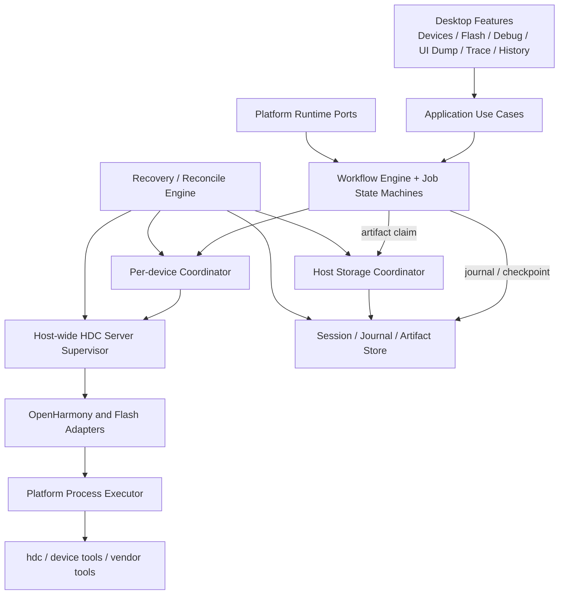

# Platform-Neutral System Architecture

> Status：review candidate  
> Baseline：CORE-1.0.0

## 边界

- UI 只消费 use case 和状态，不直接启动进程或拼接设备命令。
- Workflow 只组合 typed step，不知道平台进程 API。
- Device Coordinator 是 per-device lane；HDC Supervisor 和 Host Storage Coordinator 是 host-wide 共享资源。
- Adapter 负责工具能力、命令和输出语义；Core 不根据产品版本名猜测命令支持。
- Store 是 Job durable truth；ViewModel/Actor/进程内状态不是恢复依据。
- Runtime Ports 负责单实例、电源保持、时钟、文件授权、系统日志和 App 激活。
- Core 的跨语言物理形态与一致性机制见 `core-portability.md`；v1 使用共享 contracts/vectors，而不强制共享 runtime binary。

## 依赖方向

平台 UI 和 Adapter MAY 依赖 Core interfaces；Core SHALL NOT 依赖 SwiftUI、AppKit、WinUI、Windows App SDK、GTK/Qt、Gatekeeper、SmartScreen 或 Linux desktop 类型。共享 contract/vector tests SHALL 在所有声明平台运行。
