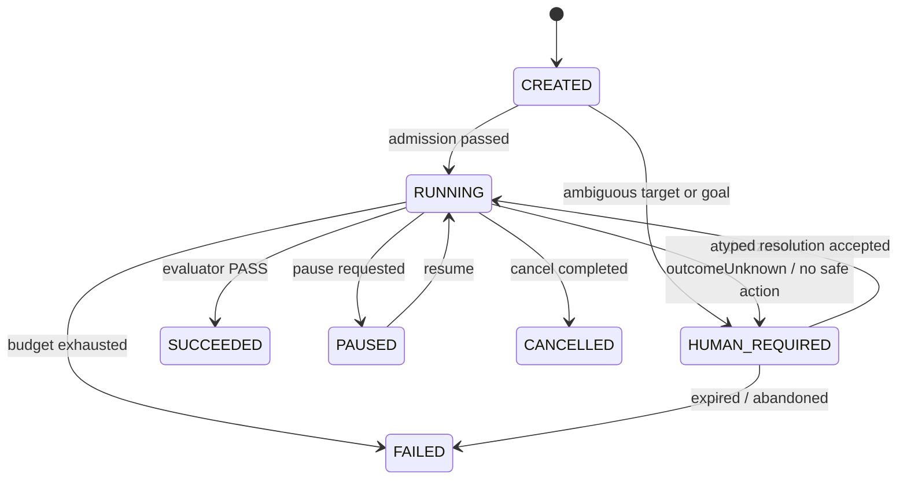

# Design — CHG-2026-054 Agent Harness Task Plane

> 本文件是设计与取舍记录,不是授权载体。与 `proposal.md` 冲突时以 proposal 为准;
> 与 Constitution / `PRODUCT-LOOP.md` 冲突时停手交维护者。

## 1. 分层:harness 是控制面,不是第二个 runtime

```text
Harness Task(HTASK-*)          多轮收敛:目标、预算、Memory、Evaluation、Recovery
    └── Runtime Job              一次 Typed Operation 的安全执行(既有)
          └── Workflow Step      send / capture / install / verify / cleanup(既有)
                └── Typed Action provider-owned lowering(既有)
                      └── HDC / build preset / analyzer
```

三条真相边界不合并:

| 真相 | 归属 |
| --- | --- |
| Task 状态、轮次、预算、判定 | Harness task store + task event log(新增) |
| Job 执行事实、step intent/outcome、certainty | 既有 durable journal(**不复制**) |
| Artifact 内容、hash、privacy、retention | 既有 `RuntimeArtifactStore`(**不复制**) |

harness 只保存**引用**。任何时候 harness 与 journal/artifact store 冲突,后两者胜;
harness 不得把 job outcome 复制成第二份真相。

## 2. 组件与职责边界

| 组件 | 负责 | 明确不负责 |
| --- | --- | --- |
| Task Manager | 建/读/暂停/恢复/取消 typed task | 不执行任何命令 |
| Task State Reducer | 校验 status/phase 迁移,写 task event | 不接受外部指定状态 |
| Reconciler | 比较 desired/observed,驱动至多一个下一步 | 不长期阻塞、不循环调用模型 |
| Observation Builder | 由 artifact 真实字节 + job evidence 构建 observed state | 不接受模型自述观测 |
| Evaluation Engine | 给 `PASS/FAIL/INCONCLUSIVE/ERROR` | 不接受"模型认为成功" |
| Policy & Budget Guard | operation/inputs/target/effect/budget/指纹校验 | 不依赖模型自律 |
| Decision Gateway | 组装有界 context、调用模型、严格解析 | 不执行、不改状态 |
| Memory | task/project/failure 三层事实库 | 不存聊天记录 |
| Recovery Manager | task 级恢复、重试判定、替代策略、人工升级 | 不盲目重放副作用 |
| 既有 Runtime | typed operation 安全执行 | 不做多轮问题求解 |

## 3. Typed Harness Task

自然语言只允许进 `intakeDescription`,执行前必须转成 typed 字段:

```text
htaskId(HTASK-*)          schemaVersion            type
projectRef                targetRef(+expected binding revision)
goal                      successCriteria[]        status / phase
desiredState              observedState            budgets / consumedBudget
policy(allowedOperations / fileGlobs / effectCeiling)
activeRound               activeJobId              artifactRefs[] / memoryRefs[]
result                    version(乐观锁)
```

第一批 task type 为**封闭实现**,每种一个 `TaskHandler`(允许的 phase、合法迁移、
可用 operation 集、observation 构建、默认 criteria、progress 计算、必须停止的条件):

- `DEBUG_CRASH`(首批唯一实现):crashSignature 消失 + N 次复验 + liveness + 无新 fatal;
- `DEPLOY` / `PERFORMANCE_ANALYSIS` / `REGRESSION`:模型与 criteria 形状先落,
  handler 在后续任务实现(不做 JSON DSL,不让用户动态编排工作流)。

## 4. 状态:两个正交维度

`status` = `CREATED | RUNNING | PAUSED | HUMAN_REQUIRED | SUCCEEDED | FAILED | CANCELLED`
`phase`(仅 RUNNING 内)= `INIT | DEVICE_READY | REPRODUCING | COLLECTING | ANALYZING |
PATCHING | BUILDING | DEPLOYING | VERIFYING`

`DONE`/`FAILED` 只属于 status,不进 phase。



每次迁移必须落 task event:`from`、`to`、`reasonCode`、`causation`(事件/jobId/
evaluationId)、`artifactRefs`、`consumedBudget`、`version`。reducer 之外无人可改状态。

## 5. Reconcile:一次唤醒,至多一个副作用

```text
唤醒(task 事件 / job 事件 / 定时 / daemon 重启)
  → 载入 task 快照
  → 恢复未完成 dispatch intent 与 active job
  → active job 未终态 ? 返回等待
  → 构建 observed state(artifact 真实字节 + job evidence)
  → evaluate
      PASS                     → SUCCEEDED
      预算/策略不允许继续        → FAILED
      需要人工                  → HUMAN_REQUIRED(结构化 HumanActionRequired)
      继续
  → 取 memory(task/project/failure,有界)
  → 组装 DecisionContext → 一个 decision
  → Policy Guard 校验(拒绝可恢复 → 换策略;无安全动作 → HUMAN_REQUIRED)
  → persist decision + dispatch intent
  → submit 一个 runtime operation
  → 返回
```

**禁止** `while true: ask → execute → ask → execute`。每次唤醒最多一次模型调用、
一个 decision、一个新 effectful job,然后返回。daemon 崩溃、设备断开、用户取消都落在
明确边界上。

### 5.1 dispatch 与恢复顺序(与引擎去重对齐)

```text
1. persist ActionDispatchIntent(含 round、decisionId、operationRef、inputs digest)
2. 生成稳定 requestID + idempotencyKey(由 htaskId + round + decisionId + inputs digest 派生)
3. submit RuntimeOperationRequest
4. 引擎返回 jobId(或 deduplicated 同 jobId)
5. persist TaskJobLink
```

3/4 之间崩溃 → 恢复时读回 intent,用**原 idempotencyKey** 重投,引擎去重返回原 jobId,
补齐 link。零重复副作用。`clientContext.provenance.harnessTaskId` 仅作 correlation。

## 6. Evaluation:唯一成功判定权

```text
artifact 真实字节 / job evidence → Observation Builder → Criteria Evaluator → verdict
```

criterion:`criterionId / metric / operator(EQ|LTE|GTE|ABSENT|MATCH) / expected /
minimumSamples / observationWindow / evidenceRequirements / mandatory / inconclusivePolicy`。

- 全部 mandatory `PASS` 才能 `SUCCEEDED`;
- `INCONCLUSIVE` 只能补采集、消耗下一轮,或在预算不足时 `HUMAN_REQUIRED`/`FAILED`;
- 证据缺失(声明的 artifact 不存在/为空/hash 不符)一律 fail closed,不得"看起来完整"
  (CHG-2026-049 已有教训:上游采集失败而下游发布成功)。

`DEBUG_CRASH` 首批 criteria:baseline 可复现 → 目标 signature 消失(N 次)→ liveness →
无新 fatal → build 通过 → 设备侧 artifact digest 与构建产物一致。

## 7. Decision 契约与出站边界

模型是**无状态决策函数**:`DecisionContext → HarnessDecision`。context 只带完成当前
决策所需内容(goal / status / phase / desired / observed / criteria 结果 / 最近若干轮
attempt 摘要 / 未解决 failure / 相关 memory / artifact 摘要与引用 / 当前可用 operation /
剩余预算 / capability 与 policy 边界 / workspace revision 与 patch 状态);**不带**全部
聊天记录、原始日志全文、不可执行的 operation、raw shell 示例。

decision 只允许四类,且只能携带 hypothesis / operationRef / typedInputs /
requiredArtifacts / expectedObservation / confidence / 简短 rationale。携带状态、
retry 计数、raw command 或成功结论 → 整条拒绝(HTP-INV-1)。

出站(HTP-INV-10):默认 deny。开启需项目级显式配置;开启后只允许脱敏、有界摘要 +
artifact 引用。**未开启时 harness 仍可用**——`DEBUG_CRASH` handler 内建确定性策略
(缺 baseline → 复现;缺证据 → 采集;有 signature 且无 patch → 请求人工/停止)足以跑
完整 E0 收敛闭环。这条设计让"模型可用性"与"闭环可用性"解耦,也让全部测试可离线跑。

## 8. 有界性:预算、指纹、无进展

预算:`maxRounds`、`maxWallClock`、`maxArtifactBytes`、`maxE1Mutations`、
`allowedOperations`、`stopOnRepeatedFailure`、`stopOnOutcomeUnknown`、
`stopOnHumanActionRequired`、`stopOnAuthorizationRequired`(§6 GJ-5 全量)。

失败指纹 = `operationRef + phase + provider + targetProfile + normalizedInputsHash +
errorClassification + semanticErrorCode + crashOrBuildSignature + patchRegionFingerprint`。

| 同指纹次数 | 行为 |
| --- | --- |
| 1 | 仅在 retry-safe 时允许原策略重试 |
| 2 | 拒绝完全相同的 decision,必须改变策略 |
| ≥3 | `HUMAN_REQUIRED` 或 `FAILED` |

"改变策略"必须至少改变 operation / typed inputs / 前置条件 / patch region / hypothesis /
artifact 来源 / target 或 build profile / recovery path 之一;只改自然语言说明不算。

Retry safety 由 harness 侧表(`retrySafety` ∈ `NEVER | READ_ONLY_SAFE |
REQUIRES_READBACK`,按 operation reference 与**实际选中步骤的最大 effect** 推导)
承载,**不改 catalog schema**——避免动到 stdout action 集的六处 lockstep;等有真实
需要再谈 descriptor 字段。

no-progress 向量:criteria delta、新证据数、已解决/新增 failure 数、build/deploy 阶段
delta、crash 数 delta、性能指标 delta。连续无进展超预算 → 要求替代策略 → 仍无 →
`HUMAN_REQUIRED`/`FAILED`。

## 9. Recovery:两层,不互相顶替

- **Job 级**:仍由既有 runtime 负责(原始 durable intent → 专用 readback →
  `COMPLETED / NOT_EXECUTED / STILL_UNKNOWN / PARTIALLY_COMPLETED / CLEANUP_REQUIRED`)。
  harness 不构造通用 observe 去代替原副作用的 reconcile(§15)。
- **Task 级**:daemon 重启后恢复 task、定位 active job、恢复未完成 dispatch intent、
  继续 evaluation、判断重试/替代/停止、产出 `HumanActionRequired`。

`HumanActionRequired` 直接复用既有 437 行模型:harness 是它在 **runtime 面的第一个
生产者**(既有生产者只有旧 `TrustedDeviceOperationHost`,不在 `job.*` 路径上)。
映射:E1/E2 授权缺失 → `impactApproval`;`outcomeUnknown` → `outcomeUnknownDecision`;
多设备歧义 → `ambiguousIdentity`;首次信任/系统权限 → `deviceTrustPrompt`/`osPermission`;
最终代码 review → `governanceApproval`。resume probe 用既有 `resumeProbeOperation` 语义,
不新增探测族。

## 10. Workspace provider(新 provider 面)

| Operation | 受控输入 | 效果等级 |
| --- | --- | --- |
| `workspace.inspectSource` | projectRef、symbol、fileScope | 只读 |
| `workspace.applyPatch` | patchArtifactRef、allowedFileGlobs | host 写入(声明 glob 内) |
| `workspace.buildOpenHarmony` | buildPresetRef | host 执行 |
| `workspace.runTests` | testPresetRef | host 执行 |
| `workspace.symbolizeCrash` | dumpArtifactRef、symbolPresetRef | 只读 |
| `workspace.revertPatch` | patchAttemptRef | host 写入(回滚) |

- preset 定义在 ProjectProfile(`presetId / projectRoot / productName / buildTarget /
  artifactOutputs / timeout / environmentProfile`),**由仓库管理**,不由模型拼参数;
- 执行经既有 `DescriptorBoundProcessDispatcher` 真 spawn(复用身份校验与超时/字节预算),
  不新增执行器;
- patch 路径:模型产出 patch proposal → 存为 patch artifact → Policy Guard 校验 glob 与
  大小 → `applyPatch` → 产出 applied-patch artifact(可 revert);
- 设备 effect 等级语义不外溢:workspace operation 不是 deviceMutation,不消耗 device
  capability,也不因此获得设备副作用许可。

## 11. 持久化布局(复用,不新增基础设施)

```text
<state-root>/harness/
  tasks/<htaskId>/task.json          # 当前快照(含 version)
  tasks/<htaskId>/events.jsonl       # 追加式 task event(状态迁移唯一来源)
  tasks/<htaskId>/rounds/<n>/decision.json
  tasks/<htaskId>/rounds/<n>/dispatch-intent.json
  tasks/<htaskId>/rounds/<n>/job-link.json
  tasks/<htaskId>/evaluations/<id>.json
  memory/task/<htaskId>.jsonl
  memory/project/<projectRef>.jsonl
  memory/failure/<fingerprint>.json
```

写入走 `ArkDeckStorage` 既有 durable 文件面(fsync + 原子替换 + StrictJSON),
与 journal 相同的耐久性保证,零新依赖。索引 = 文件名 + 指纹精确查找;
不引入 SQLite / FTS / 向量库(与输入设计文档的取舍差异见 §13)。

## 12. 测试策略(按 §11 优先级,先钉真实形态)

1. **argv/进程层**:`workspace.*` 的 lowering 逐 token 断言(preset → 完整 argv),
   与 GJ-1 的 `DeviceProviderArgvContractTests` 同一范式;
2. **契约层**:decision schema 负例集(raw argv/shell/远端路径/状态字段/成功结论/
   越界 glob/未声明 operation 全部拒绝);
3. **恢复层**:两窗口崩溃矩阵(persist intent 后 / submit 后 / 收到 jobId 前)断言
   零重复副作用、原 jobId 去重;
4. **有界性层**:预算耗尽、同指纹三次、无进展 N 轮的停止行为;
5. **离线端到端**:fake provider + 固定 artifact 样本驱动完整多轮收敛(零模型、
   零设备),断言 evaluator 才能置 `SUCCEEDED`;
6. **真机端到端**:TASK-HTP-006,已接管设备上一次 `task.submit` 自动收敛,
   人工步骤 = 0,证据如实分类。

fake 面一律不得只在 typed 层断言(§11 两次实证教训)。

## 13. 与输入架构文档的取舍差异(有意偏离)

| 输入文档 | 本设计 | 理由 |
| --- | --- | --- |
| Harness 元数据用 SQLite | 复用既有 durable file 面 | 新依赖 + 第二套持久化语义;当前规模用不上,§12 禁止无真实使用方的新抽象 |
| operation descriptor 增加 retry metadata | harness 侧 retry 表 | 避免动 stdout action 集六处 lockstep 与 catalog digest;等真实需要再入 descriptor |
| Memory 检索可后接 embedding | 明确不做 | 规模未到;§20 冻结无使用方的通用能力 |
| 新增 `HumanActionRequired` 结构 | 复用既有 437 行模型 | 仓内已有完整 typed 模型;缺的不是模型而是 runtime 面的生产者与消费者 |
| Task API 直接叫 `task.*` | 方法名保留 `task.*`,但实体是 `HTASK-*` 且与 Git `TASK-*` 显式区分 | 命名冲突会污染 §13 的 plane 分离,必须先钉死 |
| LLM 为决策必需 | 决策端口可替换,内建确定性策略为默认 | 出站默认 deny;闭环不得依赖外部服务可用性 |

## 14. 开工门与交付顺序

`PRODUCT-LOOP.md` §20 在 GJ-1/GJ-2 达 `REAL_DEVICE_PASS` 前是穷举允许清单,不含
harness。故实现门 = GJ-1 与 GJ-2 均 `REAL_DEVICE_PASS`;提前解冻的判断权在维护者
(proposal「交付顺序与 §20 冻结门」)。顺序:

```text
TASK-HTP-001 task plane 骨架(E0-only,零模型)
  → 002 evaluation(唯一成功判定权)
  → 003 policy/budget/failure memory/HumanActionRequired
  → 004 decision gateway(可替换端口 + 出站边界)
  → 005 workspace provider + workspace.*(新 provider 审批面)
  → 006 真机端到端 GJ-5 收敛(人工步骤 0)
```

001 落地后 GJ-5 即从 `NOT_STARTED` 进入 `IMPLEMENTING`;006 通过后才允许写
`REAL_DEVICE_PASS`,且必须在**当前 catalog digest** 上取得。
